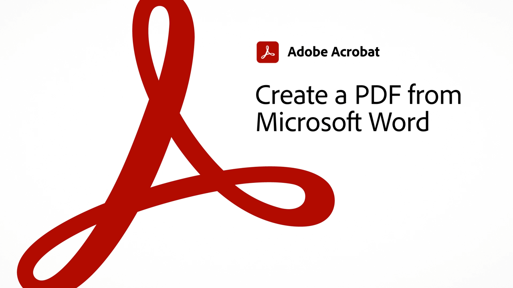

# Panoramica di Acrobat per 60 secondi

Acrobat di 60 secondi offre esercitazioni della dimensione di un morso per aiutarti a imparare un nuovo trucco in Acrobat in un minuto o meno. Questi suggerimenti basati sulle attività consentono di acquisire nuove competenze per lavorare con i file PDF sbloccando alcune delle perle nascoste di Acrobat. Potete guardarne uno per ottenere una risposta rapida, oppure guardarne cinque per aumentare la produttività del documento, pur avendo il tempo di assaporare la pausa caffè.

## Esercitazioni per Acrobat di 60 secondi

## Modifica

<table style="table-layout:fixed">
<tr>
   <td>
    
    

    <a href="edit.md"><strong>Modifica PDF con Acrobat Web</strong></a>
    

    <em>Apporta semplici modifiche a testo e immagini senza nemmeno scaricare PDF</em>
     
  </td>
  <td>
    
    

     <a href="textrecognition.md"><strong>Riconoscere il testo in un file PDF scansionato</strong></a>
    

    <em>Convertire un PDF scansionato in modo da potervi cercare del testo in PDF</em>
     
  </td>
  <td>
    
    

    <a href="combine-to-one-pdf.md"><strong>Combina più file in un unico PDF</strong></a>
    

    <em>Creazione rapida di un nuovo documento combinando diversi tipi di file in un unico PDF</em>
     
  </td>
   <td>
    
    

    <a href="organize.md"><strong>Organizzare le pagine in un attimo</strong></a>
    

    <em>Scopri come usare lo strumento Organizza pagine per ottenere una vista aerea del tuo PDF</em>
     
  </td>
</tr>
<tr>
  <td>
    
    

    <a href="editphoto.md"><strong>Modificare una foto nel PDF</strong></a>
    

    <em>Scoprite come apportare modifiche avanzate a una foto nel vostro PDF utilizzando Photoshop</em>
     
  </td>
  <td>
    
    

    <a href="editgraphic.md"><strong>Modificare un elemento grafico in PDF</strong></a>
    

    <em>Scoprite come apportare modifiche avanzate a un elemento grafico nel vostro PDF utilizzando Illustrator</em>
     
  </td>
  <td>
      
        

         
  </td>
  <td>
      
        

         
  </td>
</tr>
</table>

## Converti

<table style="table-layout:fixed">
<tr>
  <td>
    
    

    <a href="convert-pdf-word.md"><strong>Convertire un PDF in Word</strong></a>
    

    <em>Convertire un file PDF in un documento Microsoft Word completamente modificabile</em>
     
  </td>
 <td>
    
    

    <a href="convert-pdf-excel.md"><strong>Convertire un PDF in Excel</strong></a>
    

    <em>Convertire un file PDF in un documento Microsoft Excel completamente modificabile</em>
     
  </td>
  <td>
    
    

    <a href="convert-pdf-powerpoint.md"><strong>Convertire un PDF in PowerPoint</strong></a>
    

    <em>Convertire un file PDF in un documento Microsoft PowerPoint completamente modificabile</em>
     
  </td>
  <td>
    
    

    <a href="exportwordphone.md"><strong>Export PDF in Word dal telefono</strong></a>
    

    <em>Convertire un file PDF in un documento Microsoft Word completamente modificabile con l'app mobile Acrobat</em>
     
  </td>
</tr>
</table>

## Crea

<table style="table-layout:fixed">
<tr>
  <td>
    
    

     <a href="word-to-pdf.md"><strong>Creare un PDF da Microsoft Word</strong></a>
    

    <em>Creare un PDF da Microsoft Word</em>
     
  </td>
  <td>
    
    

     <a href="create-from-acrobat.md"><strong>Creazione di PDF da Acrobat</strong></a>
    

    <em>Creazione di PDF da file Microsoft 365 direttamente nell’app desktop Acrobat</em>
     
  </td>
  <td>
    
    

     <a href="wordform.md"><strong>Converti da Word a PDF inclusi i campi modulo</strong></a>
    

    <em>Convertire file e moduli di Word in PDF e creare automaticamente campi modulo</em>
     
  </td>
  <td>
      
      

      <a href="photo.md"><strong>Crea un PDF di foto in un istante</strong></a>
      

      <em>Scopri come trascinare alcuni JPG sull’icona di Acrobat per creare un PDF</em>
       
  </td>
</tr>
<tr>
  <td>
    
    

    <a href="phone.md"><strong>Converti un file PPT in PDF sul tuo telefono</strong></a>
    

    <em>Scopri come convertire un allegato e-mail di PowerPoint in PDF sul tuo telefono</em>
     
  </td>
  <td>
      
      

      <a href="optimize.md"><strong>Creare file PDF più efficienti in un attimo</strong></a>
      

      <em>Usate lo strumento di Optimize PDF per ridurre in modo significativo le dimensioni dei file PDF</em>
       
  </td>
  <td>
      
        

         
  </td>
  <td>
      
        

         
  </td>
</tr>
</table>

## Firmare

<table style="table-layout:fixed">
<tr>
  <td>
    
    

    <a href="sign.md"><strong>Firmare elettronicamente un documento cartaceo</strong></a>
    

    <em>Scopri come utilizzare Adobe Scan per firmare un modulo stampato</em>
     
  </td>
  <td>
      
        

         
  </td>
  <td>
      
        

         
  </td>
  <td>
      
        

         
  </td>
</tr>
</table>

## Proteggi

<table style="table-layout:fixed">
<tr>
  <td>
    
    

    <a href="protect.md"><strong>Protect i tuoi file PDF con una password</strong></a>
    

    <em>Protect a PDF: per aprire o modificare il PDF è necessaria una password.</em>
     
  </td>
  <td>
    
    

    <a href="redaction.md"><strong>Redazione: il modo giusto</strong></a>
    

    <em>Scopri il modo corretto per rimuovere le informazioni riservate da un PDF</em>
     
  </td>
  <td>
      
        

         
  </td>
  <td>
      
        

         
  </td>
</tr>
</table>

## Condividi e rivedi

<table style="table-layout:fixed">
<tr>
  <td>
    
    

    <a href="share-comment.md"><strong>Condividere un PDF per i commenti</strong></a>
    

    <em>Scopri come condividere un PDF per raccogliere rapidamente feedback da più persone in un singolo file</em>
     
  </td>
  <td>
    
    

    <a href="share-comment-teams.md"><strong>Condividere e commentare i file PDF in Teams</strong></a>
    

    <em>Scopri come collaborare in tempo reale su un file PDF in Microsoft Teams</em>
     
  </td>
  <td>
    
    

    <a href="summarize-comments.md"><strong>Commenti PDF in conflitto con Riepilogo</strong></a>
    

    <em>Scopri come creare un riepilogo di tutti i commenti e le marcature nel file PDF</em>
     
  </td>
   <td>
    
    

    <a href="indesign.md"><strong>Caricare i commenti PDF in InDesign</strong></a>
    

    <em>Scopri come caricare nuovamente i commenti PDF in InDesign dopo una revisione condivisa da Acrobat</em>
     
  </td>
</tr>
</table>

## Prepara

<table style="table-layout:fixed">
<tr>
  <td>
    
    

    <a href="accessible.md"><strong>Lascia che Acrobat ti aiuti a rendere accessibili i PDF</strong></a>
    

    <em>Verifica se un PDF è accessibile</em>
     
  </td>
 <td>
    
    

    <a href="conform.md"><strong>Conformare un PDF a un formato standard</strong></a>
    

    <em>Scopri come convalidare il contenuto di PDF in base ai criteri standard di PDF come PDF/X, PDF/A o PDF/E</em>
     
  </td>
  <td>
      
        

         
  </td>
  <td>
      
        

         
  </td>
</tr>
</table>

## Argomenti aggiuntivi

<table style="table-layout:fixed">
<tr>
  <td>
    
    

     <a href="compare.md"><strong>Individua le differenze con PDF Compare</strong></a>
    

    <em>Scopri come individuare le differenze tra due file PDF utilizzando lo strumento Confronta file in Acrobat</em>
     
  </td>
 <td>
    
    

     <a href="search.md"><strong>Cerca più file di PDF contemporaneamente</strong></a>
    

    <em>Avviare una ricerca in un file PDF, quindi aprire Ricerca avanzata ed eseguire la ricerca in un'intera cartella di file PDF</em>
     
  </td>
  <td>
      
        

         
  </td>
  <td>
      
        

         
  </td>
</tr>
</table>