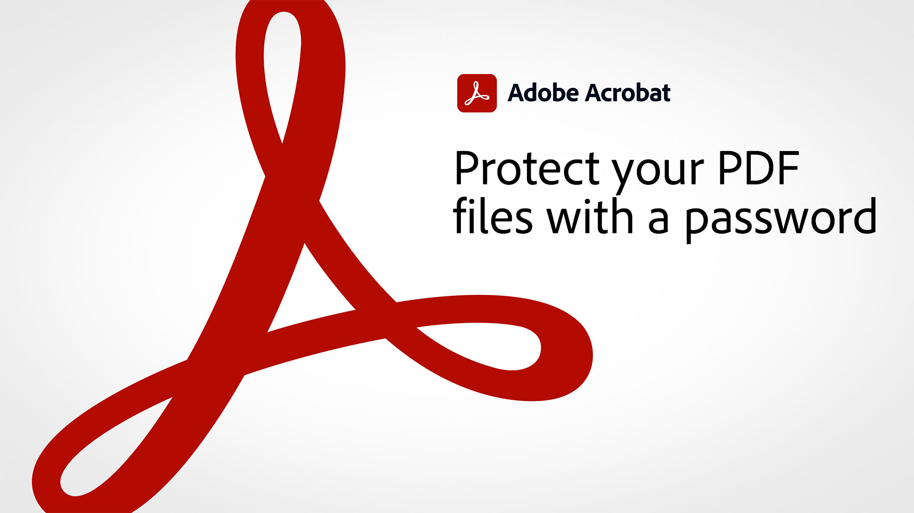

# Panoramica di Acrobat di 60 secondi

Acrobat di 60 secondi offre tutorial a grandezza naturale per imparare nuovi trucchi in Acrobat in un minuto o meno. Questi suggerimenti basati su attività consentono di acquisire nuove competenze per lavorare con i file PDF sbloccando alcune delle gemme nascoste di Acrobat. Puoi guardarne uno per ottenere una risposta rapida o guardarne cinque per aumentare la produttività dei documenti e avere comunque il tempo di godersi la pausa caffè.

## Esercitazioni di Acrobat di 60 secondi

## Modifica

<table style="table-layout:fixed">
<tr>
   <td>
    
    

    <a href="edit.md"><strong>Modifica PDF con Acrobat Web</strong></a>
    

    <em>Apporta semplici modifiche a testo e immagini senza nemmeno scaricare il PDF</em>
     
  </td>
  <td>
    
    

     <a href="textrecognition.md"><strong>Riconoscere il testo in un file PDF acquisito da scanner</strong></a>
    

    <em>Convertire un PDF acquisito mediante scansione per consentire la ricerca di testo nel PDF</em>
     
  </td>
  <td>
    
    

    <a href="combine-to-one-pdf.md"><strong>Combinare più file in un unico PDF</strong></a>
    

    <em>Creare rapidamente un nuovo documento combinando diversi tipi di file in un unico PDF</em>
     
  </td>
   <td>
    
    

    <a href="organize.md"><strong>Organizzazione rapida delle pagine</strong></a>
    

    <em>Scopri come utilizzare lo strumento Organizza pagine per ottenere una visione a volo d’uccello del tuo PDF</em>
     
  </td>
</tr>
<tr>
  <td>
    
    

    <a href="editphoto.md"><strong>Modificare una foto nel PDF</strong></a>
    

    <em>Scoprite come apportare modifiche avanzate a una foto nel PDF con Photoshop</em>
     
  </td>
  <td>
    
    

    <a href="editgraphic.md"><strong>Modificare un elemento grafico nel PDF</strong></a>
    

    <em>Scoprite come apportare modifiche avanzate a un elemento grafico del vostro PDF con Illustrator</em>
     
  </td>
  <td>
      
        

         
  </td>
  <td>
      
        

         
  </td>
</tr>
</table>

## Converti

<table style="table-layout:fixed">
<tr>
  <td>
    
    

    <a href="convert-pdf-word.md"><strong>Convertire un PDF in Word</strong></a>
    

    <em>Convertire un file PDF in un documento Microsoft Word completamente modificabile</em>
     
  </td>
 <td>
    
    

    <a href="convert-pdf-excel.md"><strong>Convertire un PDF in Excel</strong></a>
    

    <em>Convertire un file PDF in un documento Microsoft Excel completamente modificabile</em>
     
  </td>
  <td>
    
    

    <a href="convert-pdf-powerpoint.md"><strong>Convertire un PDF in PowerPoint</strong></a>
    

    <em>Convertire un file PDF in un documento Microsoft PowerPoint completamente modificabile</em>
     
  </td>
  <td>
    
    

    <a href="exportwordphone.md"><strong>Export PDF a Word dal telefono</strong></a>
    

    <em>Convertire un file PDF in un documento Microsoft Word completamente modificabile con l'app mobile Acrobat</em>
     
  </td>
</tr>
</table>

## Crea

<table style="table-layout:fixed">
<tr>
  <td>
    
    

     <a href="wordform.md"><strong>Convertire Word in PDF, inclusi i campi modulo</strong></a>
    

    <em>Converti file Word e moduli in PDF e crea automaticamente campi modulo</em>
     
  </td>
  <td>
      
      

      <a href="photo.md"><strong>Creazione immediata di un PDF di foto</strong></a>
      

      <em>Scopri come trascinare un gruppo di JPG sull’icona Acrobat per creare un PDF</em>
       
  </td>
  <td>
    
    

    <a href="phone.md"><strong>Convertire un file PPT in PDF sul telefono</strong></a>
    

    <em>Scopri come convertire un allegato PowerPoint e-mail in PDF sul telefono</em>
     
  </td>
  <td>
      
      

      <a href="optimize.md"><strong>Creazione immediata di file PDF più efficienti</strong></a>
      

      <em>Con lo strumento Optimize PDF puoi ridurre notevolmente le dimensioni dei file PDF</em>
       
  </td>
</tr>
</table>

## Firmare

<table style="table-layout:fixed">
<tr>
  <td>
    
    

    <a href="sign.md"><strong>Firma elettronica di un documento cartaceo</strong></a>
    

    <em>Scoprite come utilizzare Adobe Scan per firmare un modulo stampato</em>
     
  </td>
  <td>
      
        

         
  </td>
  <td>
      
        

         
  </td>
  <td>
      
        

         
  </td>
</tr>
</table>

## Proteggi

<table style="table-layout:fixed">
<tr>
  <td>
    
    

    <a href="protect.md"><strong>Protect i file PDF con una password</strong></a>
    

    <em>Protect un PDF in modo che sia necessaria una password per aprire o modificare il PDF</em>
     
  </td>
  <td>
    
    

    <a href="redaction.md"><strong>Redazione: Il modo giusto</strong></a>
    

    <em>Scopri il modo giusto per rimuovere informazioni riservate da un PDF</em>
     
  </td>
  <td>
      
        

         
  </td>
  <td>
      
        

         
  </td>
</tr>
</table>

## Condivisione e revisione

<table style="table-layout:fixed">
<tr>
  <td>
    
    

    <a href="share-comment.md"><strong>Condividere un PDF per la creazione di commenti</strong></a>
    

    <em>Scoprite come condividere un PDF per raccogliere rapidamente i commenti di più persone in un unico file</em>
     
  </td>
  <td>
    
    

    <a href="share-comment-teams.md"><strong>Condividere e commentare i file PDF in Teams</strong></a>
    

    <em>Scopri come collaborare in tempo reale su un file PDF in Microsoft Teams</em>
     
  </td>
  <td>
    
    

    <a href="summarize-comments.md"><strong>Commenti di Wrangling PDF con Riepiloga</strong></a>
    

    <em>Scopri come creare un riepilogo di tutti i commenti e le annotazioni nel file PDF</em>
     
  </td>
   <td>
    
    

    <a href="indesign.md"><strong>Caricare commenti di PDF in InDesign</strong></a>
    

    <em>Scoprite come caricare nuovamente i commenti di PDF in InDesign dopo una revisione condivisa di Acrobat</em>
     
  </td>
</tr>
</table>

## Prepara

<table style="table-layout:fixed">
<tr>
  <td>
    
    

    <a href="accessible.md"><strong>Consenti ad Acrobat di creare PDF accessibili</strong></a>
    

    <em>Verificare se un PDF è accessibile</em>
     
  </td>
 <td>
    
    

    <a href="conform.md"><strong>Conformare un PDF a un formato standard</strong></a>
    

    <em>Scoprite come convalidare il contenuto PDF in base a criteri standard PDF quali PDF/X, PDF/A o PDF/E</em>
     
  </td>
  <td>
      
        

         
  </td>
  <td>
      
        

         
  </td>
</tr>
</table>

## Altri argomenti

<table style="table-layout:fixed">
<tr>
  <td>
    
    

     <a href="search.md"><strong>Ricerca di più file PDF contemporaneamente</strong></a>
    

    <em>Avviare una ricerca in un file PDF, quindi aprire Ricerca avanzata e cercare un’intera cartella di file PDF</em>
     
  </td>
 <td>
      
        

         
  </td>
  <td>
      
        

         
  </td>
  <td>
      
        

         
  </td>
</tr>
</table>