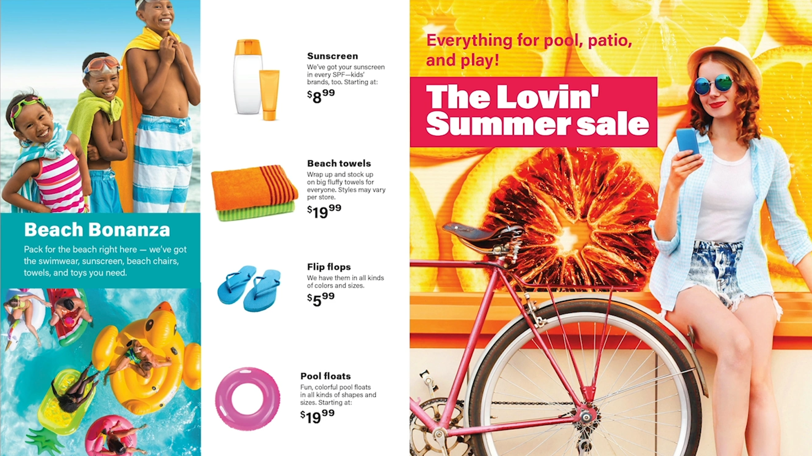
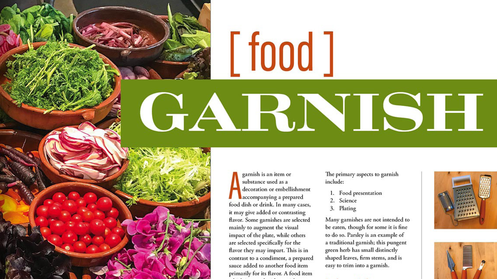

# Panoramica di Acrobat per 60 secondi

Acrobat di 60 secondi offre esercitazioni della dimensione di un morso per aiutarti a imparare un nuovo trucco in Acrobat in un minuto o meno. Questi suggerimenti basati sulle attività consentono di acquisire nuove competenze per lavorare con i file PDF sbloccando alcune delle perle nascoste di Acrobat. Potete guardarne uno per ottenere una risposta rapida, oppure guardarne cinque per aumentare la produttività del documento, pur avendo il tempo di assaporare la pausa caffè.

## Esercitazioni per Acrobat di 60 secondi

## Modifica

<table style="table-layout:fixed">
<tr>
   <td>
    
  </td>
  <td>
    
  </td>
  <td>
    
  </td>
   <td>
    
  </td>
</tr>
<tr>
  <td>
    
  </td>
  <td>
    
  </td>
  <td>
      
        

         
  </td>
  <td>
      
        

         
  </td>
</tr>
</table>

## Converti

<table style="table-layout:fixed">
<tr>
  <td>
    
  </td>
 <td>
    
  </td>
  <td>
    
  </td>
  <td>
    
  </td>
</tr>
</table>

## Crea

<table style="table-layout:fixed">
<tr>
  <td>
    
  </td>
  <td>
    
  <td>
    
  </td>
  <td>
      
  </td>
</tr>
<tr>
  <td>
    
  </td>
  <td>
      
  </td>
  <td>
      
        

         
  </td>
  <td>
      
        

         
  </td>
</tr>
</table>

## Firmare

<table style="table-layout:fixed">
<tr>
  <td>
    
  </td>
  <td>
      
        

         
  </td>
  <td>
      
        

         
  </td>
  <td>
      
        

         
  </td>
</tr>
</table>

## Proteggi

<table style="table-layout:fixed">
<tr>
  <td>
    
  </td>
  <td>
    
  </td>
  <td>
      
        

         
  </td>
  <td>
      
        

         
  </td>
</tr>
</table>

## Condividi e rivedi

<table style="table-layout:fixed">
<tr>
  <td>
    
  </td>
  <td>
    
  </td>
  <td>
    
  </td>
   <td>
    
  </td>
</tr>
</table>

## Prepara

<table style="table-layout:fixed">
<tr>
  <td>
    
  </td>
 <td>
    
  </td>
  <td>
      
        

         
  </td>
  <td>
      
        

         
  </td>
</tr>
</table>

## Argomenti aggiuntivi

<table style="table-layout:fixed">
<tr>
  <td>
    
  </td>
 <td>
    
  </td>
  <td>
      
        

         
  </td>
  <td>
      
        

         
  </td>
</tr>
</table>