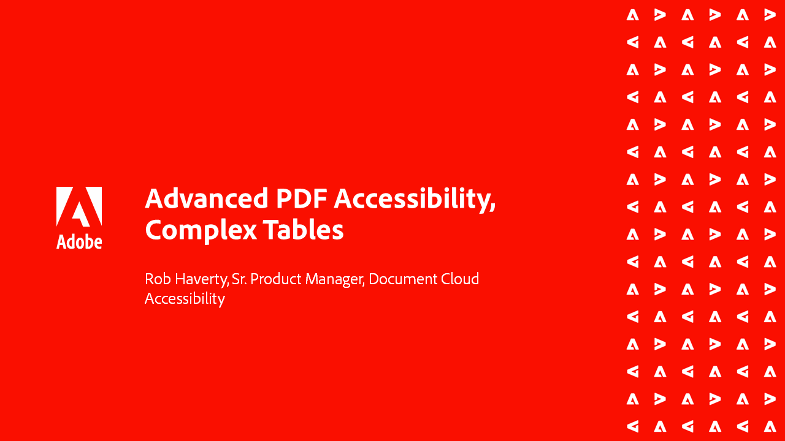

# Serie sull&#39;accessibilità di Acrobat

In questa serie di webinar in sei parti on-demand, passate dalle nozioni di base sull’accessibilità a un’immersione profonda nell’assegnazione di tag ai file PDF. Ogni sessione include dei file di esempio da seguire.

<table style="table-layout:fixed">
<tr>
  <td>
    
    

    <a href="accessibilitysession1.md"><strong>Introduzione all’accessibilità PDF</strong></a>
    

    <em>In questa sessione su richiesta, scoprite cosa significa rendere accessibile un PDF, come impostare Acrobat Pro per lavorare sui PDF per l'accessibilità e il processo di conversione da un documento di origine a un PDF</em>
     
  </td>
  <td>
    
    

    <a href="accessibilitysession2.md"><strong>Correzione di un PDF inaccessibile</strong></a>
    

    <em>In questa sessione on-demand, scopri il flusso di lavoro per convertire un documento Word e risolvere alcuni problemi di base relativi ai tag utilizzando gli strumenti Acrobat Pro mostrati nel webinar di introduzione</em>
     
  </td>  
  <td>
    
    

    <a href="accessibilitysession3.md"><strong>Tabelle complesse</strong></a>
    

    <em>Questa sessione on-demand risolve uno dei problemi più comuni e impegnativi relativi alla risoluzione di un PDF per l'accessibilità: le tabelle complesse</em>
     
  </td>
</tr>
<tr>
  <td>
    
    

    <a href="accessibilitysession4.md"><strong>Documenti scansionati ed elenchi complessi</strong></a>
    

    <em>Questa sessione on-demand risolve i problemi più complessi che si verificano frequentemente, come documenti scansionati ed elenchi complessi</em>
     
  </td>
  <td>
    
    

    <a href="accessibilitysession5.md"><strong>Aggiunta di campi modulo a un PDF con tag</strong></a>
    

    <em>Questa sessione su richiesta è incentrata sull’aggiunta di campi modulo a un PDF con tag precedente</em>
     
  </td>  
  <td>
    
    

    <a href="accessibilitysession6.md"><strong>Aggiunta di campi modulo a un PDF senza tag</strong></a>
    

    <em>Questa sessione su richiesta consente di creare campi modulo manuali e proprietà aggiuntive dei campi modulo.</em>
     
  </td> 
</tr>
</table>
