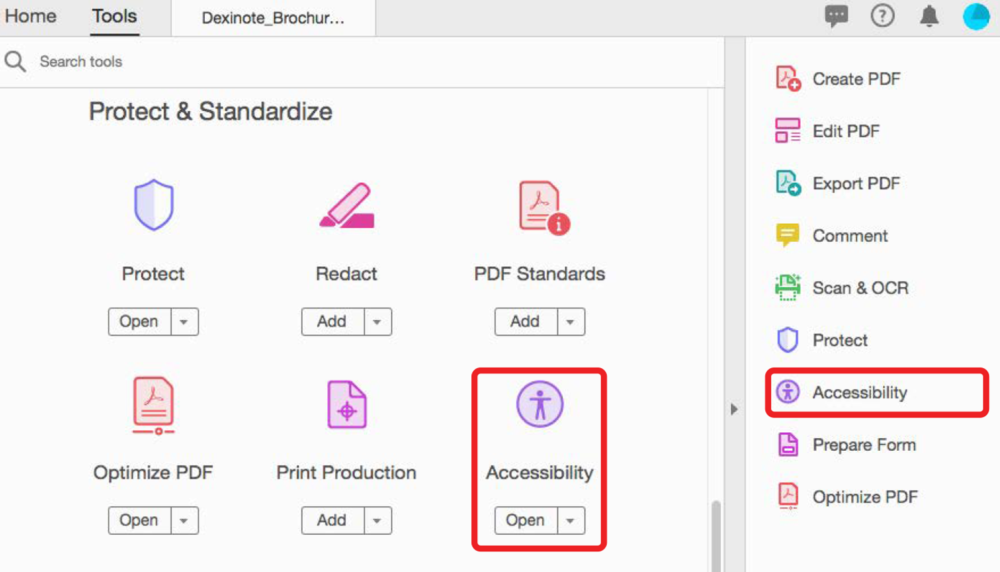

# Verifica accessibilità PDF

Scopri come verificare se il tuo PDF è universalmente accessibile alle persone diversamente abili. Ciò include l&#39;accesso da parte di persone che sono disabili della mobilità, cieche, ipovedenti, sorde, non udenti o che hanno deficit cognitivi.

>[!NOTE]
>
>Disponibile solo in Acrobat Pro DC.

## Controllo accessibilità

1. Seleziona **[!UICONTROL Accessibilità]** dal centro strumenti o dal riquadro a destra.

   

1. Seleziona **[!UICONTROL Controllo accessibilità]** nel riquadro a destra.

   

1. Seleziona una categoria dal menu a discesa e le voci dall’elenco di controllo.

   Lascia selezionata ogni casella per un rapporto completo.

1. Seleziona **[!UICONTROL Avvia controllo]** per iniziare il rapporto.

   

   Si apre il riquadro di navigazione a sinistra per visualizzare i risultati del rapporto. Espandete una sezione per visualizzarne i dettagli.

   

È anche possibile utilizzare il metodo [!UICONTROL Rendi accessibile] nel [Action Wizard](https://experienceleague.adobe.com/docs/document-cloud-learn/acrobat-learning/advanced-tasks/action.html) , che illustra una serie di passaggi di base per creare un PDF accessibile.

## Correzione dei problemi di accessibilità

Nella finestra del rapporto sull&#39;accessibilità, fate clic con il pulsante destro del mouse su una voce per visualizzare il menu di scelta rapida. Il menu di scelta rapida per qualsiasi voce che non ha superato il controllo di accessibilità offre l&#39;opzione per risolvere il problema.

>[!NOTE]
>
>Alcuni problemi non possono essere risolti automaticamente e richiedono l’intervento manuale per risolvere il problema. In questi casi, >Acrobat presenta una finestra di dialogo che indica cosa correggere.

Seleziona l&#39;icona PDF per scaricare il *Verifica accessibilità PDF* esercitazione.

.
