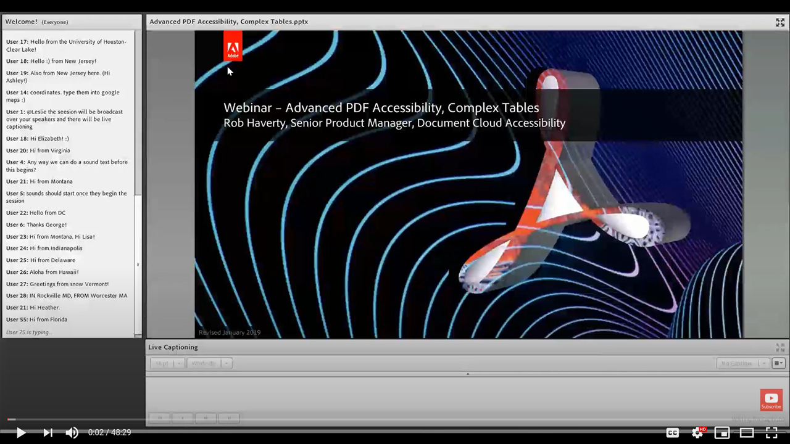

# Tabelle complesse

Questa sessione on-demand risolve uno dei problemi più comuni e impegnativi relativi alla risoluzione di un PDF per l&#39;accessibilità: le tabelle complesse.

Fai clic [qui](../assets/accessibilitysession3.zip) per scaricare un file zip dei file pratici per questa sessione.

Selezionate l&#39;immagine per visualizzare il video in una scheda separata del browser.

{target="_blank"}
