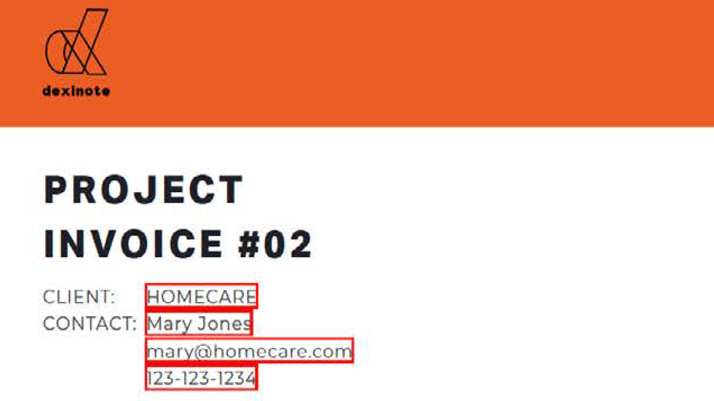

# Panoramica delle attività avanzate

Scopri le nozioni di base di questi strumenti avanzati di Acrobat. Scopri come creare un&#39;azione per ripetere attività ordinarie, rimuovere informazioni riservate, ridurre e ottimizzare i file di grandi dimensioni, raccogliere rapidamente i dati dei moduli e creare file PDF universalmente accessibili.

## Novità

* [Optimize PDF per SEO (ottimizzazione motore di ricerca)](optimizeseo.md)
Scopri come ottimizzare un PDF per una migliore individuabilità e classificazione dei motori di ricerca sul Web

## Esercitazioni attività avanzate

<table style="table-layout:fixed">
<tr>
  <td>
    
  </td>
  <td>
    
  </td>
  <td>
    
  </td>
  <td>
    
  </td>
</tr>
<tr>
 <td>
    
  </td>
  <td>
    
  </td>
  <td>
    
  </td>
 <td>
    
  </td>
</tr>
<tr>
  <td>
    
  </td>
  <td>
    
  </td>
 <td>
    
  </td>
  <td>
    
  </td>
</tr>
<tr>
 <td>
    
  </td>
 <td>
    
  </td>
  <td>
   
    

     
  </td> 
  <td>
   
    

     
  </td>  
</tr>
</table>
