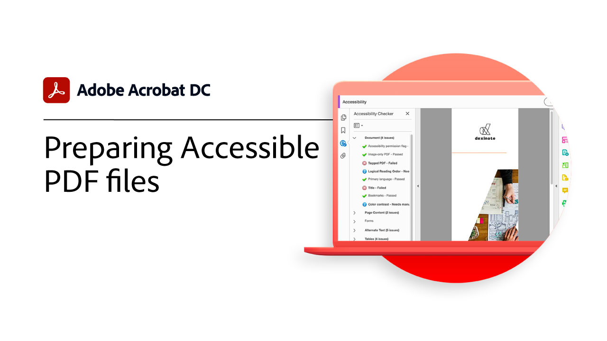

# Panoramica attività avanzate

Oltre le nozioni di base con questi strumenti avanzati in Acrobat DC. Informazioni su come creare un&#39;azione per ripetere attività ordinarie, rimuovere informazioni riservate, ridurre e ottimizzare i file di grandi dimensioni, raccogliere rapidamente i dati dei moduli e creare file PDF accessibili a tutti.

## Esercitazioni di Acrobat

<table style="table-layout:fixed">
<tr>
  <td>
    
    

    <a href="compare.md"><strong>Rileva differenze tra due PDF</strong></a>
    

    <em>Individuazione rapida e precisa delle differenze tra due file PDF per migliorare i flussi di lavoro di revisione dei documenti</em>
     
  </td>
  <td>
    
    

    <a href="action.md"><strong>Action Wizard</strong></a>
    

    <em>Creare un'azione per applicare automaticamente un insieme di comandi a uno o più file</em>
     
  </td>
  <td>
    
    

    <a href="redact.md"><strong>Riproduzione e pulizia</strong></a>
    

    <em>Rimuovere definitivamente le informazioni riservate o riservate dal PDF</em>
     
  </td>  
</tr>
<tr>
  <td>
    
    

    <a href="reduce.md"><strong>Ridurre le dimensioni e ottimizzare i file</strong></a>
    

    <em>Ridurre i file di grandi dimensioni e ottimizzare i PDF senza compromettere la qualità per la condivisione, la registrazione o l'archiviazione</em>
     
  </td>
  <td>
    
    

    <a href="formdata.md"><strong>Utilizzo dei dati del modulo</strong></a>
    

    <em>Compila dati modulo in un unico foglio di calcolo</em>
     
  </td>
  <td>
    
    

    <a href="accessibility.md"><strong>Preparazione dei file PDF accessibili</strong></a>
    

    <em>Crea file PDF universalmente accessibili</em>
     
  </td>
</tr>
<tr>
  <td>
    
    

    <a href="accessibility-series.md"><strong>Serie Acrobat Accessibility</strong></a>
    

    <em>In questa serie web a sei parti on demand, passare dalle basi dell'accessibilità a un'immersione profonda dei file PDF</em>
     
  </td>
  <td>
   
    

     
  </td>
  <td>
   
    

     
  </td>
</tr>
</table>
