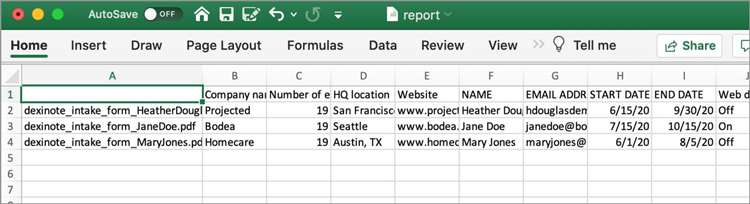

# Utilizzo dei dati dei moduli

Se disponi di un set di moduli completati e devi compilare i dati, puoi utilizzare Acrobat per unire le risposte in un unico foglio di calcolo.

1. Per iniziare, inserisci tutti i PDF forms completati in una cartella sul computer.

   

1. Apri uno dei file del modulo compilato, quindi seleziona **[!UICONTROL Prepare Form]** dal centro Strumenti o dal riquadro a destra.

   

1. Selezionare **[!UICONTROL Altro]** **>** **[!UICONTROL Unisci file di dati in foglio di calcolo]** nel riquadro a destra.

   

1. Selezionare la cartella creata con i moduli completati.

   Acrobat estrae i dati da ogni modulo e crea un foglio elettronico di tutti i dati.

   
