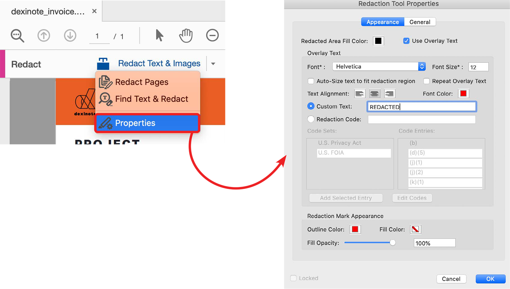

# Riproduzione e pulizia

Informazioni sull&#39;utilizzo dello strumento Redact per rimuovere in modo permanente le informazioni riservate o riservate dal PDF. Utilizzate lo strumento Pulisci (Sanitize) per rimuovere informazioni non visibili nel file, ad esempio commenti, metadati o livelli nascosti.

>[!NOTE]
>
>Disponibile solo in Acrobat Pro DC.

## Riproduzione di testo e immagini

1. In Acrobat Pro DC, selezionare **[!UICONTROL Redact]** dal centro o dal riquadro [!UICONTROL Strumenti].

   

1. Aprire **[!UICONTROL Proprietà]** per personalizzare l&#39;aspetto delle riproduzioni, incluso il colore delle rianimazioni o della sovrapposizione di testo.

   

1. Per reimpostare le informazioni, contrassegnare gli elementi per la rimozione, quindi applicare le reazioni.

   È possibile riprodurre intere pagine o contenuto selezionato.

1. Per riprodurre un&#39;intera pagina o pagine, selezionare **[!UICONTROL Riproduci pagine]**, selezionare la pagina o l&#39;intervallo di pagine che si desidera riprodurre, quindi fare clic su **[!UICONTROL OK]**.

   

1. Per trovare contenuto specifico da riprodurre, selezionare **[!UICONTROL Riproduci testo e immagini, Trova testo e Riproduci]**.

   Utilizzare il cursore per selezionare il contenuto da riprodurre e visualizzare un&#39;anteprima della riproduzione spostandosi sul contenuto selezionato.

   

   Utilizzare la casella di ricerca per cercare una parola o una frase specifica oppure selezionare **[!UICONTROL Motivo]** per trovare alcuni tipi di informazioni. Selezionare le caselle accanto agli elementi e fare clic su **[!UICONTROL Cerca e rimuovi testo]**.

   

1. Fare clic su **[!UICONTROL Applica]** nella barra dei menu [!UICONTROL Riproduci] per applicare le riproduzioni contrassegnate e salvare il file rifatto.

   

## Pulizia documento

1. Con la barra degli strumenti **[!UICONTROL Redact]** aperta, fare clic su **[!UICONTROL Pulisci documento]** nella barra dei menu superiore.

1. Fare clic su **OK** per confermare la rimozione di tutte le informazioni nascoste dal documento.

   In alternativa, fare clic per rimuovere selettivamente le informazioni nascoste, scegliere le informazioni che si desidera nascondere e fare clic su **[!UICONTROL Rimuovi]**.

   

>[!TIP]
>
>Per velocizzare il processo di reazione, selezionare la procedura guidata [Azione](../advanced-tasks/action.md).

Fare clic per scaricare un PDF dell&#39;esercitazione *Riesegui e inserisci*.

 Redact &amp; Sanitize.
