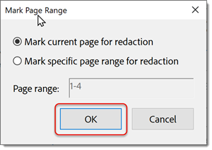

# Rimuovere le informazioni riservate

Scopri come utilizzare lo strumento Redigi per rimuovere in modo permanente informazioni private o riservate da un PDF, quindi rimuovi dal documento le informazioni che non sono visibili nel file, come commenti, metadati o livelli nascosti. La rimozione permanente di contenuti sensibili e dati nascosti è importante per evitare che le informazioni vengano passate durante la pubblicazione del PDF. Questo tutorial utilizza la [Nuova esperienza Acrobat](../getting-started/new-workspace.md).

>[!NOTE]
>
>Disponibile solo in Acrobat Pro, Premium o Studio.

[!BADGE Impatto sull&#39;organizzazione]
Protezione dei dati dei clienti, gestione dei rischi

## Come redigere le informazioni in Acrobat desktop

1. Apri un file e seleziona **[!UICONTROL Tutti gli strumenti]** dalla barra degli strumenti, quindi scegli **[!UICONTROL Redigi un PDF]**.
   

1. Selezionare **[!UICONTROL Imposta proprietà]** per personalizzare l&#39;aspetto delle redazioni, incluso il colore delle caselle di redazione o della sovrapposizione del testo.

   

   Per redigere le informazioni, contrassegnare prima gli elementi per la rimozione e quindi applicare le redazioni. Puoi redigere intere pagine o contenuti selezionati.

1. Seleziona **[!UICONTROL Redigi testo e immagini]** e usa il cursore per selezionare il contenuto da redigere.

   

   Per visualizzare un’anteprima della redazione, passa il cursore del mouse sul contenuto selezionato.

1. Selezionare **[!UICONTROL Trova testo e redigi]** per cercare una parola o frase specifica oppure cercare un motivo per trovare determinati tipi di informazioni. Impostate la ricerca e selezionate Cerca e rimuovi testo.

   

1. Nella finestra di dialogo dei risultati della ricerca, selezionare le caselle accanto agli elementi e selezionare **[!UICONTROL Contrassegna i risultati selezionati per la redazione]**.

   

1. Selezionare **[!UICONTROL Redigi pagine]** per contrassegnare intere pagine per la redazione.

   

1. Seleziona le pagine e scegli **[!UICONTROL OK]**.

   

1. Selezionate **[!UICONTROL Applica]** nel pannello Redigi un PDF per applicare le redazioni contrassegnate.

   

1. Selezionare **[!UICONTROL Continua]** per eliminare le informazioni nascoste.

   

Una volta confermata, le redazioni e le informazioni nascoste vengono rimosse definitivamente e salvate in un nuovo file.

>[!TIP]
>
>Per velocizzare il processo di redazione, consulta [Action Wizard](../advanced-tasks/action.md) in Acrobat Pro, Premium o Studio sul desktop.
