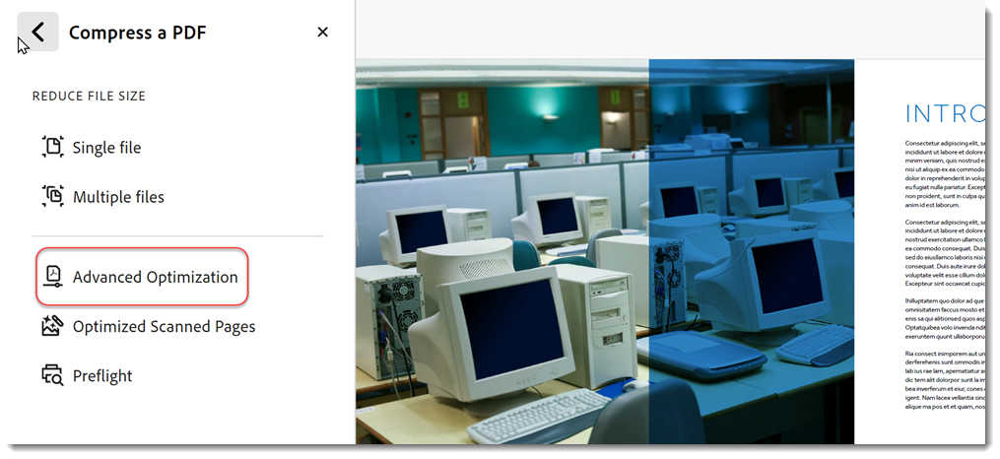

# Comprimere e ottimizzare un PDF

Scopri come comprimere e ottimizzare le dimensioni di un file PDF. La compressione di un PDF semplifica la condivisione tramite e-mail o il caricamento su siti Web con limitazioni della dimensione del file. È inoltre possibile migliorare l&#39;esperienza di visualizzazione e risparmiare sui costi di archiviazione ottimizzando le PDF.

## Come comprimere un PDF in Acrobat sul desktop

1. Apri un file e seleziona **[!UICONTROL Tutti gli strumenti]** dalla barra degli strumenti, quindi scegli **[!UICONTROL Comprimi un PDF]**.

   

1. Seleziona **[!UICONTROL File singoli]** o **[!UICONTROL Più file]** nel pannello **[!UICONTROL Comprimi un PDF]**.

   

1. Seleziona **[!UICONTROL Salva]**.

   

   Il file viene ridotto al minimo senza compromettere la qualità del documento.

## Come comprimere un PDF in Acrobat per il Web

1. Accedi a [acrobat.adobe.com](https://acrobat.adobe.com/it/it/) in un browser.

1. Seleziona **[!UICONTROL Converti > Comprimi un PDF]** dal menu superiore.

   

1. Scegli **[!UICONTROL Seleziona file]**, seleziona i tuoi file e scegli **[!UICONTROL Apri]**.

   

1. Seleziona un livello di compressione e scegli **[!UICONTROL Comprimi]**.

   

## Come ottimizzare un PDF in Acrobat per desktop

>[!NOTE]
>
>L’ottimizzazione di un PDF è disponibile solo in Acrobat Pro per desktop.

1. Apri un file e seleziona **[!UICONTROL Tutti gli strumenti]** dalla barra degli strumenti, quindi scegli **[!UICONTROL Comprimi un PDF]**.

   

1. Selezionate **[!UICONTROL Ottimizzazione avanzata]** dal pannello **[!UICONTROL Comprimi un PDF]**.

   

   Per impostazione predefinita, **Standard** è selezionato nel menu **Impostazioni**. Se modificate le impostazioni nella finestra di dialogo Ottimizzatore PDF, il menu **Impostazioni** passa automaticamente a **Personalizzato**.

1. Dal menu a discesa **Rendi compatibile con**, scegli **Mantieni esistente** per mantenere la versione di PDF corrente o scegli una versione di Acrobat. Seleziona la casella di controllo accanto a un pannello (ad esempio, Immagini, Font, Trasparenza), quindi seleziona le opzioni in tale pannello, scegli **[!UICONTROL OK]** e salva il file.

   

   Per impedire l’esecuzione di tutte le opzioni di un pannello durante l’ottimizzazione, deselezionate la casella di controllo relativa a tale pannello.

1. (Facoltativo) Per salvare le impostazioni personalizzate, seleziona **[!UICONTROL Salva]** e assegna un nome alle impostazioni. Per eliminare un&#39;impostazione salvata, sceglierla nel menu **Impostazioni** e selezionare **[!UICONTROL Elimina]**.

   

>[!TIP]
>
>Per ottimizzare più file PDF, prova a utilizzare l&#39;[Action Wizard](../advanced-tasks/action.md).

<table style="table-layout:fixed">
  <td>
    
    

    <a href="reduce.md"><strong>Comprimere e ottimizzare un PDF</strong></a>
    

    <em>Ridurre i file di grandi dimensioni e ottimizzare i PDF senza compromettere la qualità della condivisione, della pubblicazione o dell'archiviazione</em>
     
  </td>
  <td>
        
        

         
      </td>
    <td>
        
        

         
    </td>
    <td>
        
        

         
    </td>
</tr>
</table>