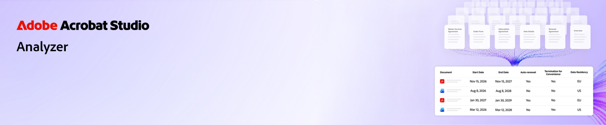
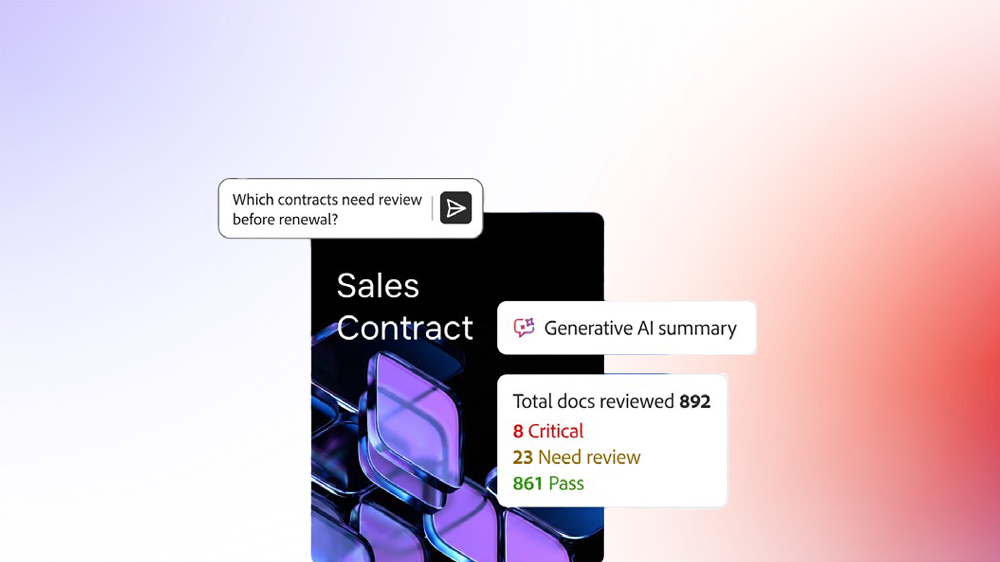

# Panoramica di Analyzer in Acrobat Studio

Scopri come utilizzare Analyzer in Acrobat Studio per trasformare documenti complessi in informazioni dettagliate. Questi brevi tutorial ti aiutano a iniziare, esplorare le funzionalità avanzate e visualizzare casi d&#39;uso reali.

[!BADGE Informativo]{type=Watch overview video url="https://video.tv.adobe.com/v/3503972"}

## Novità

>[!BEGINTABS]

>[!TAB Introduzione]

[Introduzione](get-started.md) per imparare a estrarre dati strutturati e citati da grandi volumi di documenti.

>[!TAB Usa raccolte]

Scopri come creare [raccolte](collections.md) manuali e collegate, applicare attributi e organizzare i documenti in base alla crescita del contenuto.

>[!TAB Utilizzo degli attributi]

Scopri come creare, testare e perfezionare [Attributi](attributes.md) con Analyzer in Acrobat Studio.

>[!TAB Esplorazione delle funzionalità avanzate]

Scopri come [esportare i dati estratti, condividere una raccolta, confrontare due documenti e utilizzare l&#39;Assistente AI](advanced.md) per domande rapide e ad hoc.

>[!TAB Casi d&#39;uso in azione]

Scopri i [casi d&#39;uso](use-cases/use-case-overview.md) reali e come diversi team utilizzano Analyzer in Acrobat Studio per lavorare in modo più intelligente e veloce.

>[!ENDTABS]

## Essenziali

Introduzione alle nozioni di base. Scopri come utilizzare Analyzer in Acrobat Studio per comprendere, riepilogare e interagire rapidamente con i documenti.

<table style="table-layout:fixed">
<tr>
  <td>
    
    

    <a href="get-started.md"><strong>Introduzione</strong></a>
    

    Scopri come Analyzer in Acrobat Studio consente di estrarre dati strutturati e citati da grandi volumi di documenti
     
  </td>
  <td>
    
    

    <a href="collections.md"><strong>Usa raccolte</strong></a>
    

    Scoprite come creare raccolte manuali e collegate, applicare attributi e mantenere i documenti organizzati in base alla crescita del contenuto
     
  </td>
  <td>
    
    

    <a href="attributes.md"><strong>Utilizzo degli attributi</strong></a>
    

    Scopri come creare, testare e perfezionare gli attributi con Analyzer in Acrobat Studio
     
  </td>
  <td>
    
    

    <a href="advanced.md"><strong>Esplorazione delle funzionalità avanzate</strong></a>
    

    Scoprite come esportare i dati estratti, condividere una raccolta, confrontare due documenti e utilizzare l'Assistente all'intelligenza artificiale per domande rapide e ad hoc
     
  </td>
</tr>
</table>

## Casi d&#39;uso in azione

Visualizza scenari reali. Scopri come diversi team utilizzano Analyzer in Acrobat Studio per lavorare in modo più intelligente e veloce.

<table style="table-layout:fixed">
<tr>
  <td>
    
    

    <a href="use-cases/m-and-a-post-audit.md"><strong>M&amp;A: audit dei contratti dopo un'acquisizione</strong></a>
    

    Scopri come i team di M&amp;A possono analizzare grandi set di contratti per identificare obblighi chiave, termini e rischi potenziali in pochi minuti invece che in settimane
     
  </td>
  <td>
    
    

    <a href="use-cases/accelerate-revenue.md"><strong>Finanza: verifica dei contratti per il riconoscimento dei ricavi e gli audit</strong></a>
    

    Scopri come i team finanziari possono prepararsi per gli audit, supportare il riconoscimento dei ricavi e identificare più rapidamente i rischi contabili
     
  </td>
  <td>
    
    

    <a href="use-cases/data-privacy-risk.md"><strong>Privacy e sicurezza delle informazioni: consulta le informative sulla privacy</strong></a>
    

    Scoprite come i team per la sicurezza della privacy e delle informazioni possono identificare le lacune nella conformità e convalidare gli obblighi con risultati tracciabili
     
  </td>
  <td>
    
    

    <a href="use-cases/identify-margin-erosion.md"><strong>Costruzione: individuazione dei rischi di margine nei contratti secondari</strong></a>
    

    Scoprite come i team di costruzione e progetto possono trovare gli ordini di modifica mancanti, le richieste di informazioni sullo scadenzario e le lacune nelle protezioni per i subcontratti prima che influiscano sui margini
     
  </td>
<tr>
<td>
    
    

    <a href="use-cases/vendor-risk.md"><strong>Controllo della sicurezza delle informazioni: identificazione del rischio del fornitore</strong></a>
    

    Come identificare in modo proattivo i rischi per la sicurezza delle informazioni derivanti dai contratti con i fornitori
     
  </td>
  <td>
    
    

     
  </td>
  <td>
    
    

     
  </td>
  <td>
    
    

     
  </td>
</tr>
</tr>
</table>