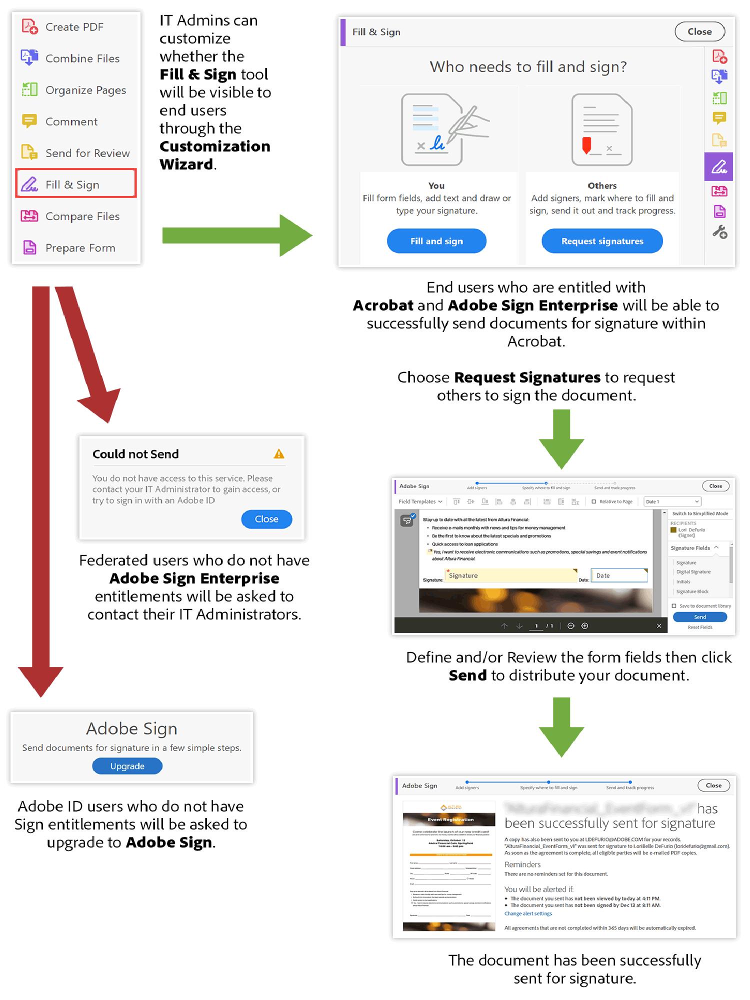

# Aggiornamenti di prodotto Acrobat DC importanti per i clienti ETLA

Il provisioning di [!DNL Adobe Sign Individual] (noto anche come Adobe Sign Pro) da tutte le autorizzazioni Acrobat DC incluse nelle offerte ETLA (Enterprise Term License Agreement) verrà eseguito solo a partire da agosto 2020 e continuerà fino al 20 novembre 2020. [!DNL Adobe Sign Individual] non fornisce funzionalità di livello Enterprise e deve essere sostituito con i clienti Adobe Sign Enterprise for enterprise. Questo include Acrobat DC concesso in licenza come app autonoma e Acrobat DC concesso in licenza come parte di Creative Cloud for enterprise - Tutte le applicazioni.

L&#39;accesso a [!DNL Adobe Sign Individual] è disponibile in Acrobat tramite lo strumento **Adobe Sign** o **Fill &amp; Sign** ([Richiedi firme](https://www.adobe.com/it/acrobat/online/request-signature.html){target="_blank"}).

Accesso a ![[!DNL Adobe Sign Individual] in Acrobat DC](../assets/Deploy_SignEntitle1.png)

Se non hai aggiornato Acrobat DC alla versione più recente, lo strumento potrebbe essere etichettato come &quot;Send for Signature&quot;.

## Perché stiamo smantellando questo sistema?

[A ottobre 2018 è stato rilasciato un nuovo Acrobat DC](https://news.adobe.com/news/news-details/2018/Adobe-Redefines-What-Is-Possible-With-PDF-With-All-New-Acrobat-DC). Questa versione più recente include nuovi strumenti e funzionalità per lavorare meglio con i PDF su dispositivi mobili, Web e desktop, oltre a tutti i nuovi strumenti di collaborazione. In qualità di abbonato ad Acrobat DC, dovresti avere già a disposizione queste straordinarie funzionalità. Un altro aggiornamento importante che abbiamo rilasciato è stato la soluzione di firma elettronica Adobe Sign.

Prima della versione di ottobre 2018, gli utenti di Acrobat DC sono stati in grado di inviare documenti per la firma elettronica utilizzando gli strumenti di Acrobat etichettati &quot;Fill &amp; Sign&quot; (o &quot;Adobe Sign&quot; o &quot;Send for Signature&quot;) a cui era stata fornita l&#39;autorizzazione a [!DNL Adobe Sign Individual].

Sebbene questa opzione abbia fornito un ottimo modo per acquisire le firme elettroniche, stiamo eseguendo il deprovisioning di [!DNL Adobe Sign Individual] perché non fornisce la funzionalità di livello Enterprise disponibile tramite Adobe Sign Enterprise, ad esempio:

* Possibilità di gestire centralmente gli utenti che dispongono dell’autorizzazione per inviare accordi o firmare
* Consentire agli amministratori di gestire gli accordi inviati e utilizzati in tutta l’organizzazione
* Fornire controlli granulari per gestire le firme elettroniche all’interno dell’organizzazione

Inoltre, Adobe Sign Enterprise offre più funzionalità rispetto a quelle disponibili nell&#39;autorizzazione a [!DNL Adobe Sign Individual], tra cui, a titolo esemplificativo:

* Amministrazione
   * Single Sign-On
   * Delega account
* Integrazioni
   * Integrazioni aziendali predefinite con Dropbox, Salesforce, Workday, ecc.
   * Adobe Sign è la soluzione di firma elettronica preferita per il portfolio aziendale [Microsoft](https://acrobat.adobe.com/us/en/business/integrations/microsoft.html), inclusi Office 365, SharePoint, Dynamics, Teams e Flow
* Personalizzazione e ottimizzazione
   * Autenticazione della firma elettronica migliorata, verifica avanzata dell’identità dei firmatari basata su ID, progettazione di flussi di lavoro, supporto linguistico avanzato, ecc.

Adobe Sign è la soluzione leader del settore riconosciuta a livello globale per l’acquisizione di firme legalmente conformi. Adobe Sign è stato progettato appositamente per soddisfare le esigenze di firma elettronica della tua organizzazione. Gli strumenti di facile utilizzo per gli amministratori IT garantiscono che tu e i tuoi utenti utilizziate firme elettroniche conformi alle varie normative regionali e di settore in materia di firme elettroniche. Per ulteriori informazioni sulla gestione di Sign tramite [Adobe Admin Console](https://helpx.adobe.com/it/enterprise/using/admin-console.html), visita [qui](https://helpx.adobe.com/it/enterprise/using/adobe-sign-for-enterprise.html).

Contatta il tuo referente Adobe per valutare come continuare a fornire le funzionalità di firma elettronica della tua organizzazione tramite la più ampia piattaforma di documenti digitali che include Acrobat DC e Adobe Sign Enterprise.

## Accesso agli accordi esistenti

Gli utenti potranno comunque accedere agli accordi inviati prima di questa azione tramite Adobe Document Cloud, effettuando l’accesso con il proprio Adobe ID all’indirizzo https://documentcloud.adobe.com. Se questo utente è pianificato per la migrazione a Sign Enterprise, dovrà seguire queste [istruzioni](https://helpx.adobe.com/it/sign/kb/how-to-download-signed-documents---adobe-sign.html).

## Esperienza Acrobat DC senza autorizzazione per [!DNL Sign Individual]

Gli utenti che dispongono di autorizzazioni Adobe Sign Enterprise potranno inviare gli accordi in Acrobat utilizzando lo strumento Adobe Sign o [!UICONTROL Fill &amp; Sign] (Richiedi firme).
Gli utenti che non dispongono di autorizzazioni Adobe Sign Enterprise non potranno inviare nuovi accordi e riceveranno un messaggio di errore. L&#39;immagine seguente illustra i possibili risultati.

## Esperienza Web di Adobe Document Cloud senza autorizzazione Sign Individual

Gli utenti potranno accedere ad https://documentcloud.adobe.com/ per scaricare tutti gli accordi inviati prima della disattivazione della licenza Adobe Sign Individual.

## Per ulteriori informazioni, visitate le pagine seguenti:

* [Accesso ad Adobe Document Cloud](https://helpx.adobe.com/document-cloud/help/sign-in.html)
* [Gestione dei file (Dove sono i miei file?)](https://helpx.adobe.com/document-cloud/help/manage-files.html)
* [Utilizzo di [!UICONTROL Acrobat Customization Wizard] per la configurazione](https://www.adobe.com/devnet-docs/acrobatetk/tools/Wizard/WizardDC/index.html)
* [Panoramica dell&#39;[!UICONTROL Admin Console]](https://helpx.adobe.com/it/enterprise/using/admin-console.html)
* [Gestione di Adobe Sign nell&#39;[!UICONTROL Admin Console]](https://helpx.adobe.com/it/enterprise/using/adobe-sign-for-enterprise.html)

**Revisioni** 20 maggio 2020; post originale - agosto 2019
