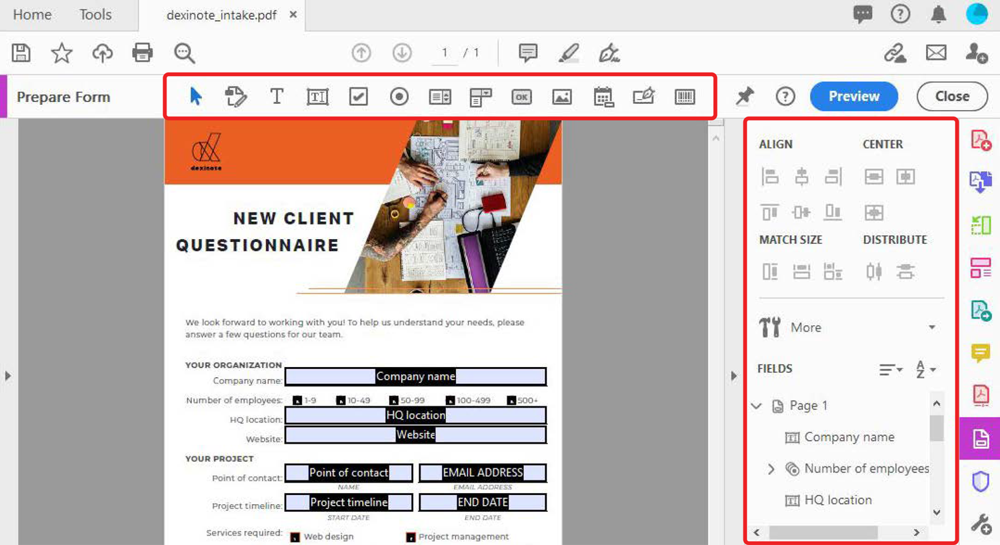

# Creare moduli compilabili

Trasforma un modulo cartaceo scansionato o un documento creato in InDesign, Microsoft Word, Excel o altre applicazioni in un [modulo di PDF compilabile](https://www.adobe.com/it/acrobat/online/sign-pdf.html).

1. Seleziona **[!UICONTROL Prepare Form]** dal [!UICONTROL Strumenti] riquadro centrale o destro.

   

1. Selezionare un documento esistente da utilizzare come modulo (ad esempio, un file Word, Excel, InDesign o PDF) e selezionare **Inizio**.

   

   Se [!UICONTROL Rilevamento automatico dei campi modulo] è **ON**, i campi modulo vengono rilevati automaticamente nel file PDF. Controllare due volte la posizione dei campi modulo.

   Trascina i campi dal menu superiore e modifica i dettagli dei campi modulo nel riquadro a destra.

1. Seleziona **[!UICONTROL Anteprima]** per visualizzare il modulo.

   

1. Seleziona **[!UICONTROL Modifica]** per continuare il lavoro o selezionare **[!UICONTROL File]** **>** **[!UICONTROL Salva con nome]** per salvare il modulo di PDF.

   

>[!TIP]
>
>Studia più a fondo la creazione di moduli con questi [tecniche avanzate](../advanced-tasks/advancedforms.md).