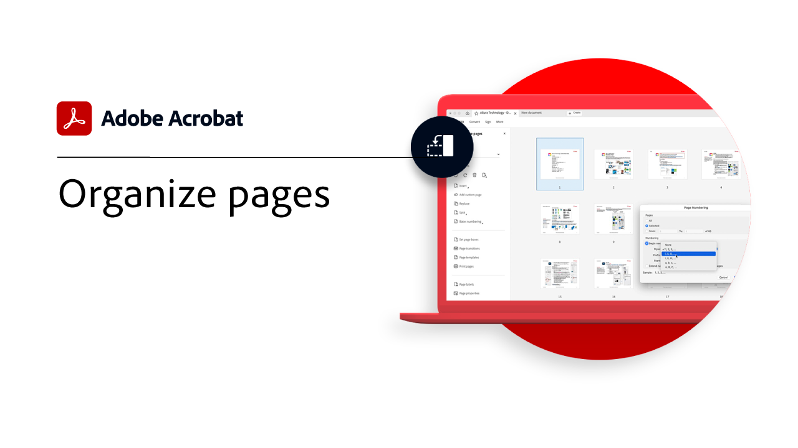
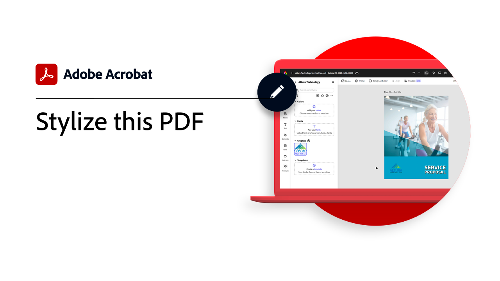

# Panoramica della Guida introduttiva

Scopri come iniziare a utilizzare Adobe Acrobat tramite queste brevi esercitazioni dettagliate. Dalla creazione di un documento alla protezione o [modifica dei file PDF](https://www.adobe.com/it/acrobat/online/pdf-editor.html){target="_blank"}, questo contenuto è progettato per semplificare i flussi di lavoro PDF.

## Novità

* [Stilizza questo PDF](stylize-this-PDF.md)
Scoprite come creare PDF dall&#39;aspetto professionale con gli strumenti di progettazione integrati facili da usare in Adobi Express
* [Lavora ovunque ti trovi con Acrobat Web](acrobatweb.md)
Scopri come gestire le richieste di documenti aziendali ovunque ti trovi utilizzando gli strumenti Web di Acrobat nel tuo browser

## Esercitazioni introduttive

<table style="table-layout:fixed">
<tr>
  <td>
    
    

    <a href="get-to-know-the-acrobat-dc-interface.md"><strong>Nozioni di base sull'area di lavoro</strong></a>
    

    <em>Scopri come l’area di lavoro di Acrobat semplifica l’accesso a file e strumenti da desktop, Web e dispositivi mobili</em>
     
  </td>
  <td>
    
    

    <a href="new-workspace.md"><strong>Nuova esperienza area di lavoro</strong></a>
    

    <em>Scopri la nuova esperienza dell’area di lavoro che puoi attivare in Acrobat</em>
     
  </td>
  <td>
    
    

    <a href="acrobatweb.md"><strong>Lavora ovunque ti trovi con Acrobat Web</strong></a>
    

    <em>Scopri come gestire le richieste di documenti aziendali ovunque ti trovi utilizzando gli strumenti Web di Acrobat nel tuo browser</em>
     
  </td>
  <td>
    
    

     <a href="productivity.md"><strong>Produttività ovunque ti trovi</strong></a>
    

    <em>Fai di più direttamente dal tuo tablet o cellulare con l'app mobile Acrobat Reader</em>
     
  </td>
</tr>
<tr>
    <td>
      
      

      <a href="../integrate/integrate-overview.md#microsoft"><strong>Utilizzo di Microsoft 365</strong></a>
      

      <em>Aumenta la produttività e i flussi di lavoro dei documenti aziendali con Acrobat e [!DNL Microsoft 365]</em>
       
    </td>
    <td>
      
      

      <a href="where-do-pdfs-come-from.md"><strong>Da dove vengono i PDF?</strong></a>
      

      <em>Comprendere da dove provengono i PDF e i loro usi</em>
       
    </td>
    <td>
    
      

       
    </td>
    <td>
    
      

       
    </td>
  </tr>
  </table>

## Creazione, combinazione e organizzazione di esercitazioni

<table style="table-layout:fixed">
  <tr>
    <td>
      
      

      <a href="create-pdf.md"><strong>Creazione di un PDF</strong></a>
      

      <em>Creare PDF da tutti i tipi di documenti</em>
       
    </td>
    <td>
      
      

      <a href="combine-to-pdf.md"><strong>Combinare file in PDF</strong></a>
      

      <em>Combina molti tipi diversi di file in un unico PDF</em>
       
    </td>
    <td>
      
      

      <a href="organize.md"><strong>Organizza pagine</strong></a>
      

      <em>Aggiungi, sostituisci, estrai, ruota, elimina e ridisponi le pagine nel tuo PDF</em>
       
    </td>
    <td>
      
      

      <a href="add-custom-page.md"><strong>Aggiungi pagina personalizzata</strong></a>
      

      <em>Scopri come aggiungere pagine personalizzate al tuo PDF utilizzando l’app di Adobe Express integrata</em>
       
    </td>
  </tr>
  </table>

## Modifica ed esportazione delle esercitazioni

<table style="table-layout:fixed">
  <tr>
    <td>
      
      

      <a href="edit-pdf.md"><strong>Modificare un PDF</strong></a>
      

      <em>Modificare testo e immagini nei file PDF</em>
       
    </td>
    <td>
      
      

      <a href="stylize-this-PDF.md"><strong>Stilizza questo PDF</strong></a>
      

      <em>Scopri la nuova modalità di modifica per la regolazione automatica dei contenuti</em>
       
    </td>
   <td>
      
      

      <a href="auto-adjust-layout.md"><strong>Adatta layout</strong></a>
      

      <em>Scopri la nuova modalità di modifica per la regolazione automatica dei contenuti</em>
       
    </td>
    <td>
      
      

      <a href="export-pdf.md"><strong>Esportare un PDF in formati modificabili</strong></a>
      

      <em>Scopri come esportare i file PDF in formati modificabili</em>
       
    </td>
  </tr>
  </table>

## Esercitazioni per la collaborazione

<table style="table-layout:fixed">
  <tr>
    <td>
      
      

      <a href="collaborate.md"><strong>Collabora in tempo reale</strong></a>
      

      <em>Porta avanti i tuoi progetti raccogliendo commenti, collaborando sulle risposte e monitorando l'avanzamento dei tuoi documenti, tutto in tempo reale, da qualsiasi luogo</em>
       
    </td>
    <td>
      
      

      <a href="comment-on-pdf-files.md"><strong>Commentare un PDF</strong></a>
      

      <em>Aggiungere commenti a un file PDF e condividerlo con altri utenti</em>
       
    </td>
    <td>
    
      

       
    </td>
    <td>
    
      

       
    </td>
</tr>
</table>

## Esercitazioni aggiuntive

<table style="table-layout:fixed">
<tr>
  <td>
    
    

    <a href="create-fillable-forms.md"><strong>Creare moduli compilabili</strong></a>
    

    <em>Trasformare un documento creato in un’altra applicazione in un modulo PDF compilabile</em>
     
  </td>
  <td>
    
    

    <a href="fill-and-sign.md"><strong>Fill &amp; Sign PDF forms</strong></a>
    

    <em>Compilare e firmare rapidamente un modulo PDF</em>
     
  </td>
  <td>
    
    

    <a href="scan-and-ocr.md"><strong>Scansione e OCR</strong></a>
    

    <em>Riduzione dei file di grandi dimensioni e ottimizzazione dei PDF senza compromettere la qualità della condivisione, della pubblicazione o dell'archiviazione</em>
     
  </td>
  <td>
    
    

    <a href="password-protect.md"><strong>Protect un file PDF con una password</strong></a>
    

    <em>Aggiungi una password al tuo PDF per evitare che altri aprano o modifichino il file</em>
     
  </td>
</tr>
<tr>
  <td>
    
    

    <a href="signatures.md"><strong>Ottieni firme</strong></a>
    

    <em>Fai progredire le attività aziendali raccogliendo firme elettroniche legalmente vincolanti da altri utenti, da qualsiasi luogo</em>
     
  </td>
  <td>
    
    

    <a href="track.md"><strong>Tenere traccia dei documenti</strong></a>
    

    <em>Scopri sempre quali file sono in attesa di firma e quali sono stati firmati</em>
     
  </td>
  <td>
   
    

     
  </td>
  <td>
   
    

     
  </td>
</tr>
</table>
