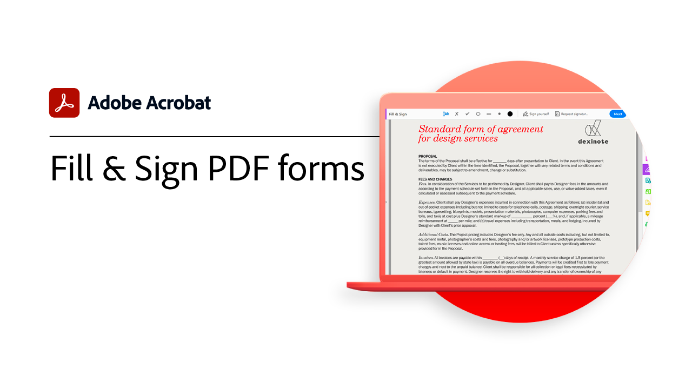

# Panoramica introduttiva

Scoprite come iniziare a utilizzare Adobe Acrobat attraverso questi brevi tutorial passo passo. Dalla creazione di un documento alla protezione dei file di PDF, questo contenuto è progettato per facilitare l’accesso ai flussi di lavoro di PDF.

## Esercitazioni su Acrobat

<table style="table-layout:fixed">
<tr>
  <td>
    
    

    <a href="get-to-know-the-acrobat-dc-interface.md"><strong>Nozioni di base sull’area di lavoro</strong></a>
    

    <em>Scoprite come l'area di lavoro di Acrobat semplifica l'accesso a file e strumenti da computer desktop, Web e dispositivi mobili</em>
     
  </td>
  <td>
    
    

    <a href="new-workspace.md"><strong>Nuova esperienza dell’area di lavoro</strong></a>
    

    <em>Scopri la nuova esperienza dell’area di lavoro che puoi attivare in Acrobat</em>
     
  </td>
  <td>
    
    

    <a href="acrobatweb.md"><strong>Lavora ovunque con Acrobat web</strong></a>
    

    <em>Scopri come gestire le richieste di documenti aziendali ovunque ti trovi utilizzando gli strumenti Web di Acrobat nel tuo browser</em>
     
  </td>
</tr>
<tr>
   <td>
    
    

     <a href="productivity.md"><strong>Produttività in mobilità</strong></a>
    

    <em>Ottieni di più direttamente dal tuo tablet o smartphone con l'app mobile Acrobat Reader</em>
     
  </td>
  <td>
    
    

     <a href="../integrate/integrate-overview.md#microsoft"><strong>Utilizzo di Microsoft 365</strong></a>
    

    <em>Aumenta la produttività e i flussi di lavoro basati su documenti aziendali con Acrobat e [!DNL Microsoft 365]</em>
     
  </td>
  <td>
    
    

     <a href="collaborate.md"><strong>Collaborare in tempo reale</strong></a>
    

    <em>Porta avanti i tuoi progetti raccogliendo commenti, collaborando alle risposte e monitorando lo stato di avanzamento dei tuoi documenti in tempo reale, ovunque ti trovi</em>
     
  </td>
</tr>
<tr>
  <td>
    
    

     <a href="combine-to-pdf.md"><strong>Combinare file in PDF</strong></a>
    

    <em>Combinare diversi tipi di file in un unico PDF</em>
     
  </td>
 <td>
    
    

    <a href="create-pdf.md"><strong>Creare un file PDF</strong></a>
    

    <em>Creare PDF da tutti i tipi di documenti</em>
     
  </td>
 <td>
    
    

    <a href="comment-on-pdf-files.md"><strong>Commento su un PDF</strong></a>
    

    <em>Aggiungere commenti a un file PDF e condividerlo con altri utenti</em>
     
  </td>
</tr>
<tr>
  <td>
    
    

    <a href="edit-pdf.md"><strong>Modifica un PDF</strong></a>
    

    <em>Modificare testo e immagini nei file PDF</em>
     
  </td>
  <td>
    
    

    <a href="export-pdf.md"><strong>Esportare un PDF in formati modificabili</strong></a>
    

    <em>Scoprite come esportare i file PDF in formati modificabili</em>
     
  </td>
  <td>
    
    

    <a href="create-fillable-forms.md"><strong>Creare moduli compilabili</strong></a>
    

    <em>Trasformare un documento creato in un’altra applicazione in un modulo di PDF compilabile</em>
     
  </td>
</tr>
<tr>
 <td>
    
    

    <a href="scan-and-ocr.md"><strong>Scansione e OCR</strong></a>
    

    <em>Riduci i file di grandi dimensioni e ottimizza i tuoi PDF senza compromettere la qualità per la condivisione, la pubblicazione o l'archiviazione</em>
     
  </td>
  <td>
    
    

    <a href="organize.md"><strong>Organizza pagine</strong></a>
    

    <em>Aggiungere, sostituire, estrarre, ruotare, eliminare e spostare le pagine nel PDF</em>
     
  </td>
  <td>
    
    

    <a href="password-protect.md"><strong>Protect un file PDF con una password</strong></a>
    

    <em>Aggiungere una password al PDF per proteggere gli altri utenti dall'apertura o dalla modifica del file</em>
     
  </td>
</tr>
<tr>
  <td>
    
    

    <a href="fill-and-sign.md"><strong>Fill &amp; Sign PDF forms</strong></a>
    

    <em>Compilare e firmare rapidamente un modulo di PDF</em>
     
  </td>
  <td>
    
    

    <a href="signatures.md"><strong>Raccogli firme</strong></a>
    

    <em>Manda avanti la tua attività raccogliendo firme elettroniche legalmente vincolanti da altri utenti, ovunque si trovino</em>
     
  </td>
  <td>
    
    

    <a href="track.md"><strong>Monitorare i documenti</strong></a>
    

    <em>Scopri sempre quali file sono in attesa di firma e quali sono stati firmati</em>
     
  </td>
</tr>
<tr>
  <td>
    
    

    <a href="where-do-pdfs-come-from.md"><strong>Da dove vengono i PDF?</strong></a>
    

    <em>Comprendere da dove provengono i PDF e i loro usi</em>
     
  </td>
  </td>
  <td>
   
    

     
  </td>
  </td>
  <td>
   
    

     
  </td>
</tr>
</table>
