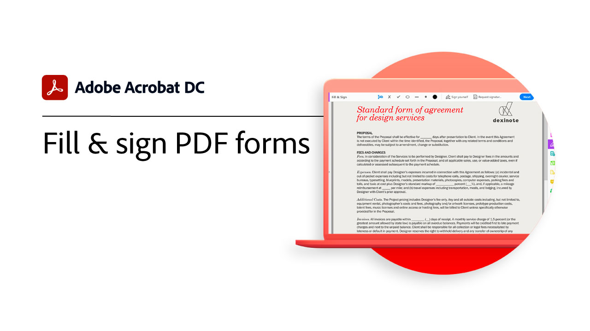

# Introduzione alla panoramica

Informazioni su come iniziare a utilizzare Adobe Acrobat attraverso queste brevi esercitazioni passo per passo (1-2 min). Dalla creazione di un documento alla protezione dei file PDF, questo contenuto è progettato per facilitare l&#39;accesso ai flussi di lavoro PDF.

## Esercitazioni di Acrobat

<table style="table-layout:fixed">
<tr>
  <td>
    
    

    <a href="get-to-know-the-acrobat-dc-interface.md"><strong>Scoprire l’interfaccia di Acrobat DC</strong></a>
    

    <em>Scoprite come l'interfaccia Adobe Acrobat DC facilita l'accesso a file e strumenti tra desktop, Web e dispositivi mobili</em>
     
  </td>
  <td>
    
    

    <a href="acrobatweb.md"><strong>Lavorare ovunque con Acrobat Web</strong></a>
    

    <em>Informazioni su come gestire le richieste di documenti aziendali da qualsiasi postazione utilizzando gli strumenti Web Acrobat nel browser</em>
     
  </td>
  <td>
    
    

     <a href="combine-to-pdf.md"><strong>Combina file in PDF</strong></a>
    

    <em>Combinazione di diversi tipi di file in un singolo PDF</em>
     
  </td>
</tr>
<tr>
  <td>
    
    

    <a href="create-pdf.md"><strong>Creare file PDF</strong></a>
    

    <em>Crea PDF da tutti i diversi tipi di documenti</em>
     
  </td>
  <td>
    
    

    <a href="comment-on-pdf-files.md"><strong>Commento sui file PDF in Acrobat DC</strong></a>
    

    <em>Aggiungere commenti a un file PDF e condividerli con altri utenti</em>
     
  </td>  
  <td>
    
    

    <a href="edit-pdf.md"><strong>Modificare un PDF in Acrobat DC</strong></a>
    

    <em>Modifica testo e immagini nei file PDF</em>
     
  </td>
</tr>
<tr>
  <td>
    
    

    <a href="export-pdf.md"><strong>Esporta un PDF in formati modificabili</strong></a>
    

    <em>Informazioni su come esportare i file PDF in formati modificabili</em>
     
  </td>
  <td>
    
    

    <a href="create-fillable-forms.md"><strong>Crea moduli riempibili</strong></a>
    

    <em>Trasformare un documento creato in un'altra applicazione in un modulo PDF compilabile</em>
     
  </td>  
  <td>
    
    

    <a href="scan-and-ocr.md"><strong>Scansione e OCR</strong></a>
    

    <em>Ridurre i file di grandi dimensioni e ottimizzare i PDF senza compromettere la qualità per la condivisione, la registrazione o l'archiviazione</em>
     
  </td>
</tr>
<tr>
  <td>
    
    

    <a href="organize.md"><strong>Organizza pagine</strong></a>
    

    <em>Aggiungere, sostituire, estrarre, ruotare, eliminare e spostare le pagine nel PDF</em>
     
  </td>
  <td>
    
    

    <a href="password-protect.md"><strong>Proteggere un file PDF con una password</strong></a>
    

    <em>Aggiungere una password al PDF per proteggere altri utenti dall'apertura o dalla modifica del file</em>
     
  </td>
  <td>
    
    

    <a href="fill-and-sign.md"><strong>Compilare e firmare un modulo PDF</strong></a>
    

    <em>Eseguire rapidamente il riempimento e la firma di un modulo PDF</em>
     
  </td>
</tr>
<tr>
  <td>
    
    

    <a href="where-do-pdfs-come-from.md"><strong>Da dove vengono i PDF?</strong></a>
    

    <em>Comprendere da dove provengono i PDF e i relativi utilizzi</em>
     
  </td>
  <td>
   
    

     
  </td>
  <td>
   
    

     
  </td>
</tr>
</table>
