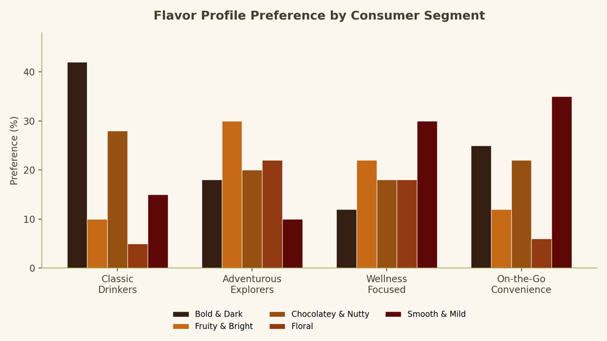

# Creare un podcast

Scopri come creare podcast generati dall&#39;intelligenza artificiale da documenti e materiali di ricerca utilizzando Acrobat Studio. Scopri come i podcast possono riepilogare le informazioni chiave, evidenziare le informazioni importanti e semplificare l&#39;utilizzo dei contenuti in mobilità. Scoprirai inoltre come personalizzare l’output del podcast per il tuo pubblico e aggiornare i podcast man mano che vengono aggiunte nuove informazioni al progetto.

>[!VIDEO](https://video.tv.adobe.com/v/3503840?enablevpops&quality=12&learn=on&hidetitle=true)

<table style="table-layout:fixed">
<tr>
  <td>
    
    

    <a href="podcast.md"><strong>Creare un podcast</strong></a>
    

    Scopri come creare podcast generati dall'intelligenza artificiale da documenti e materiali di ricerca
     
  </td>
  <td>
    
    

     
  </td>
  <td>
    
    

     
  </td>
  <td>
    
    

     
  </td>
</tr>
</table>