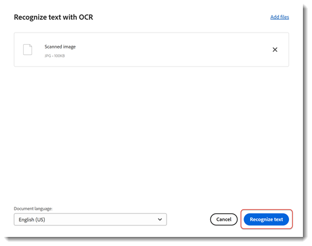
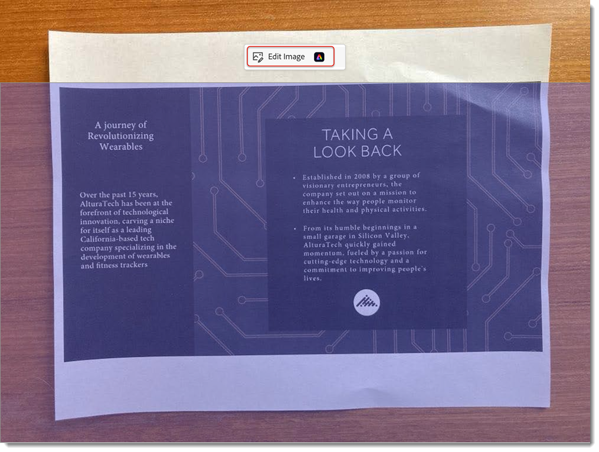

# Da carta a PDF

Scopri come acquisire (o scattare una foto) un documento cartaceo e trasformarlo in un [file PDF modificabile](https://www.adobe.com/it/acrobat/online/pdf-editor.html){target="_blank"} ricercabile. La conversione di documenti cartacei in PDF aumenta la capacità di trovare rapidamente le informazioni e di renderle accessibili agli utenti con disabilità.

## Come trasformare la carta in PDF in Acrobat per desktop

1. Apri una foto o un’immagine acquisita da scanner di un documento. In alternativa, puoi creare un nuovo file utilizzando uno scanner connesso o utilizzare l&#39;[app mobile Adobe Scan](https://adobescan.app.link/GpBqG8Bkoeb) gratuita.

1. Seleziona **[!UICONTROL Tutti gli strumenti]** dalla barra degli strumenti e scegli **[!UICONTROL Scansione e OCR]** nel riquadro a sinistra.

   

1. Scegli **[!UICONTROL Migliora immagine acquisita]** o **[!UICONTROL Migliora immagine acquisita]** in base al tipo di file.

   

1. Trascina le maniglie per regolare i bordi della pagina e seleziona **[!UICONTROL Migliora]**.

   

   Acrobat pulisce e raddrizza automaticamente l’immagine.

1. Seleziona **[!UICONTROL In questo file]** e scegli **[!UICONTROL Riconosci testo]** per rendere il testo ricercabile e modificabile.

   

Il file è ora un file PDF ricercabile e modificabile.

## Come trasformare la carta in un PDF in Acrobat Web

1. Accedi a [acrobat.adobe.com](https://acrobat.adobe.com/it/it/) in un browser.

1. Seleziona **[!UICONTROL Converti > Riconosci testo con OCR]** dal menu superiore.

   

1. Scegliere **[!UICONTROL Seleziona file]**, scegliere il file e selezionare **[!UICONTROL Apri]**.

   

1. Selezionare **[!UICONTROL Riconosci testo]**.

   

   Il testo nel file è ora ricercabile e modificabile.

1. Per rimuovere lo sfondo, seleziona l&#39;immagine e scegli **[!UICONTROL Modifica immagine]**.

   

1. Seleziona **[!UICONTROL Rimuovi sfondo]** dall&#39;editor Adobe Express.

   

1. Trascina le maniglie per regolare i bordi della pagina e seleziona **[!UICONTROL Applica]**.

   

>[!TIP]
>
>Per sottoporre a OCR più file PDF, prova a utilizzare l&#39;[Action Wizard](../advanced-tasks/action.md) in Acrobat Pro sul desktop.

<table style="table-layout:fixed">
<tr>
  <td>
    
    

    <a href="scan-and-ocr.md"><strong>Da carta a PDF</strong></a>
    

    <em>Informazioni su come trasformare un documento cartaceo in un file PDF avanzato, ricercabile e modificabile</em>
     
  </td>
  <td>
      
      

       
  </td>
  <td>
      
      

       
  </td>
  <td>
      
      

       
  </td>
</tr>
</table>