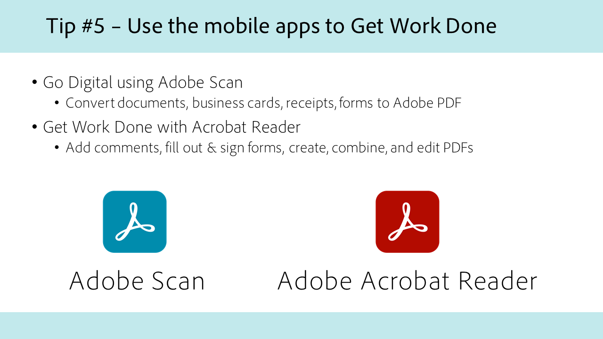

# Acrobat per la Pubblica Amministrazione

Esplora i nostri tutorial su Acrobat progettati specificamente per le amministrazioni federali, statali e locali.

## 5 suggerimenti per lavorare ovunque con Acrobat

<table style="table-layout:fixed">
<tr>
  <td>
    
    

    <a href="5-tips-for-working-anywhere-with-acrobat-dc-for-government.md"><strong>5 suggerimenti per lavorare ovunque con Acrobat (completo 15:12)</strong></a>
    

    <em>Scopri come ottenere e utilizzare gli strumenti in Acrobat e nelle app per dispositivi mobili complementari per lavorare ovunque ti trovi</em>
     
  </td>
  <td>
    
    

    <a href="get-your-tools.md"><strong>Suggerimento 1: scarica gli strumenti</strong></a>
    

    <em>Il primo passo per iniziare a lavorare ovunque ti trovi è ottenere gli strumenti Acrobat e le app mobili complementari</em>
     
  </td>  
  <td>
    
    

    <a href="collaborate-on-documents.md"><strong>Suggerimento 2: collaborazione sui documenti</strong></a>
    

    <em>Creare flussi di lavoro semplici e facili per la collaborazione sui documenti</em>
     
  </td>
  <td>
    
    

    <a href="protect-digital-documents.md"><strong>Suggerimento 3: documenti digitali Protect</strong></a>
    

    <em>Aggiungere una password al PDF per impedire la copia, la modifica o la stampa</em>
     
  </td>
</tr>
  <td>
    
    

    <a href="work-with-forms-and-signatures.md"><strong>Suggerimento 4: utilizzare moduli e firme</strong></a>
    

    <em>Informazioni su come rimanere digitali durante la compilazione dei moduli</em>
     
  </td>
  <td>
    
    

    <a href="scan-and-edit-on-mobile.md"><strong>Suggerimento 5: scansiona e modifica su dispositivi mobili</strong></a>
    

    <em>Scopri come utilizzare le app per dispositivi mobili Adobe Scan e Acrobat Reader per lavorare ovunque ti trovi</em>
     
  </td>
  <td>
   
    

     
  </td>
  <td>
   
    

     
  </td>
</tr>
</table>

## Accessibilità

<table>
<tr>
  <td>
    
    

    <a href="making-pdfs-accessible.md"><strong>Rendere Accessibili I PDF (Completato Alle 14:11)</strong></a>
    

    <em>Informazioni sul flusso di lavoro ottimale per la creazione di file PDF accessibili</em>
     
  </td>
  <td>
    
    

    <a href="understanding-accessibility.md"><strong>Accessibilità Dei PDF: Informazioni Sull'Accessibilità</strong></a>
    

    <em>Scopri cosa significa rendere un PDF accessibile agli utenti con disabilità</em>
     
  </td>  
  <td>
    
    

    <a href="collaborate-on-documents.md"><strong>Rendere accessibili i PDF: creazione in Word</strong></a>
    

    <em>Scopri le procedure consigliate per la creazione di file PDF creati in [!DNL Microsoft Word]</em>
     
  </td>
   <td>
    
    

    <a href="finishing-in-acrobat.md"><strong>Accessibilità dei PDF: completamento in Acrobat</strong></a>
    

    <em>Scopri come completare l'accessibilità del file PDF utilizzando gli strumenti di Acrobat Pro</em>
     
  </td>
</tr>
<tr>
  <td>
    
    

    <a href="making-pdf-ballots-accessible.md"><strong>Rendere più accessibili le schede PDF</strong></a>
    

    <em>Questo webinar tratta le aree chiave dell'accessibilità PDF necessarie per consentire agli utenti di tecnologie assistive, come gli assistenti vocali, di leggere e completare le schede elettorali</em>
     
  </td>  
  <td>
   
    

     
  </td>
  <td>
   
    

     
  </td>
  <td>
   
    

     
  </td>
</tr>
</table>
