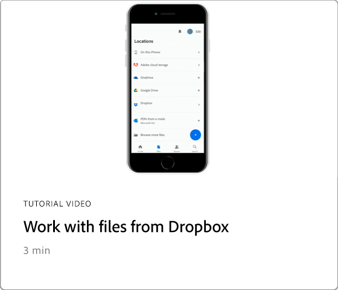

# Panoramica sulle integrazioni

Integra Acrobat con [!DNL Box], [!DNL Dropbox], [!DNL Google Drive], [!DNL OneDrive] e [!DNL Microsoft] app.

## Microsoft

Scopri come tutti i membri del tuo team possono lavorare senza problemi con i file PDF, direttamente in [Microsoft 365](https://www.adobe.com/documentcloud/integrations/microsoft-office-365.html).

<table style="table-layout:fixed">
<tr>
  <td>
    
  </td>
  <td>
    
  </td> 
  <td>
    
  </td>
  <td>
    
  </td>
</tr>
<tr>
  <td>
    
  </td>
  <td>
    
  </td>
  <td>
    
  </td>
  <td>
   
    

     
  </td>
</tr>
</table>

## Google Drive

Scopri come fare di più in meno tempo con gli strumenti essenziali per PDF e firma elettronica in [!DNL Google Drive].

<table style="table-layout:fixed">
<tr>
  <td>
    
  </td>
  <td>
   
    

     
  </td>
  <td>
   
    

     
  </td>
  <td>
   
    

     
  </td>
</tr>
</table>

## Dropbox

Scopri quanto è facile accedere e lavorare con i file archiviati in [!DNL Dropbox].

<table style="table-layout:fixed">
<tr>
  <td>
    
  </td>
  <td>
   
    

     
  </td>
  <td>
   
    

     
  </td>
  <td>
   
    

     
  </td>
</tr>
</table>

## Box

Scopri in che modo Acrobat e [Box](https://www.adobe.com/documentcloud/integrations/box.html){target="_blank"} semplificano il passaggio delle attività aziendali a tutti i membri della tua organizzazione.
