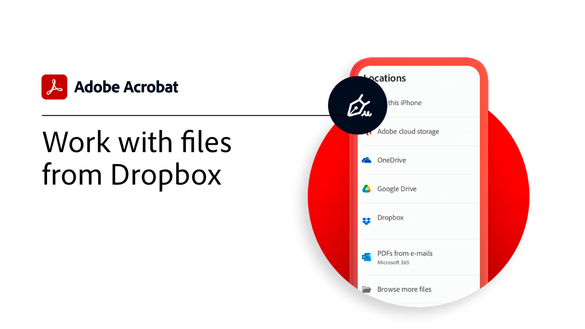

# Panoramica sulle integrazioni

Integrazione di Acrobat con [!DNL Box], [!DNL Dropbox], [!DNL Google Drive], [!DNL OneDrive]e [!DNL Microsoft] app.

## Microsoft

Scopri come tutti i membri del tuo team possono lavorare senza interruzioni con i file PDF, direttamente dall’interno [Microsoft 365](https://www.adobe.com/documentcloud/integrations/microsoft-office-365.html).

<table style="table-layout:fixed">
<tr>
  <td>
    
    

    <a href="createfromword.md"><strong>Crea file PDF da [!DNL Microsoft Word]</strong></a>
    

    <em>Creazione di file PDF avanzati con sommari e rimandi, segnalibri e anche allegati con collegamento ipertestuale direttamente da [!DNL Microsoft Word]</em>
     
  </td>
  <td>
    
    

    <a href="createofficeweb.md"><strong>Crea PDF in [!DNL Office] per il Web</strong></a>
    

    <em>Scopri come creare file PDF senza mai uscire dal tuo [!DNL Microsoft Office] per le web app</em>
     
  </td> 
  <td>
    
    

    <a href="acrobatandsp.md"><strong>Lavora con il tuo [!DNL SharePoint] file</strong></a>
    

    <em>Semplifica i flussi di lavoro dei documenti con [!DNL SharePoint] e ACROBAT</em>
     
  </td>
  <td>
    
    

    <a href="acrobatandteams.md"><strong>Collaborazione PDF in [!DNL Microsoft Teams]</strong></a>
    

    <em>Collabora e collabora con i colleghi visualizzando, annotando e rivedendo i PDF senza mai uscire [!DNL Microsoft Teams]</em>
     
  </td>
</tr>
<tr>
  <td>
    
    

    <a href="outlook.md"><strong>Convertire messaggi e allegati di posta elettronica in PDF in [!DNL Outlook]</strong></a>
    

    <em>Scoprite come fornire informazioni in modo più professionale e sicuro all'interno di [!DNL Outlook]</em>
     
  </td>
  <td>
    
    

    <a href="edge.md"><strong>Creazione di contenuti PDF durante la navigazione con [!DNL Microsoft Edge]</strong></a>
    

    <em>Scopri come archiviare rapidamente le pagine Web in PDF con l’estensione Adobe Acrobat per [!DNL Microsoft Edge]</em>
     
  </td>
  <td>
    
    

    <a href="microsoftsensitivitylabels.md"><strong>Protect PDF con [!DNL Microsoft Purview Information] etichette di riservatezza</strong></a>
    

    <em>Scopri come proteggere i PDF aggiungendo, modificando, personalizzando ed eliminando [!DNL Microsoft Purview] etichette di riservatezza direttamente in Acrobat</em>
     
  </td>
  <td>
   
    

     
  </td>
</tr>
</table>

## Google Drive

Scopri come ottenere di più in meno tempo con gli strumenti essenziali per PDF e firma elettronica all’interno [!DNL Google Drive].

<table style="table-layout:fixed">
<tr>
  <td>
    
    

    <a href="acrobatandgoogle.md"><strong>Adobe Acrobat per [!DNL Google Drive]</strong></a>
    

    <em>Accedi a strumenti PDF e flussi di lavoro per firma elettronica che consentono di risparmiare tempo direttamente all’interno del [!DNL Google Drive] app</em>
     
  </td>
  <td>
   
    

     
  </td>
  <td>
   
    

     
  </td>
  <td>
   
    

     
  </td>
</tr>
</table>

## Dropbox

Scoprite quanto è facile accedere e lavorare con i file archiviati in [!DNL Dropbox].

<table style="table-layout:fixed">
<tr>
  <td>
    
    

    <a href="acrobat-dropbox.md"><strong>Operazioni con i file da [!DNL Dropbox]</strong></a>
    

    <em>Scopri come aprire, creare, modificare, firmare e salvare le modifiche alle [!DNL Dropbox] file da Acrobat</em>
     
  </td>
  <td>
   
    

     
  </td>
  <td>
   
    

     
  </td>
  <td>
   
    

     
  </td>
</tr>
</table>

## Box

Scopri come Acrobat e [Riquadro](https://www.adobe.com/documentcloud/integrations/box.html){target="_blank"} per consentire a tutti gli utenti dell&#39;organizzazione di continuare a lavorare in modo più semplice.
