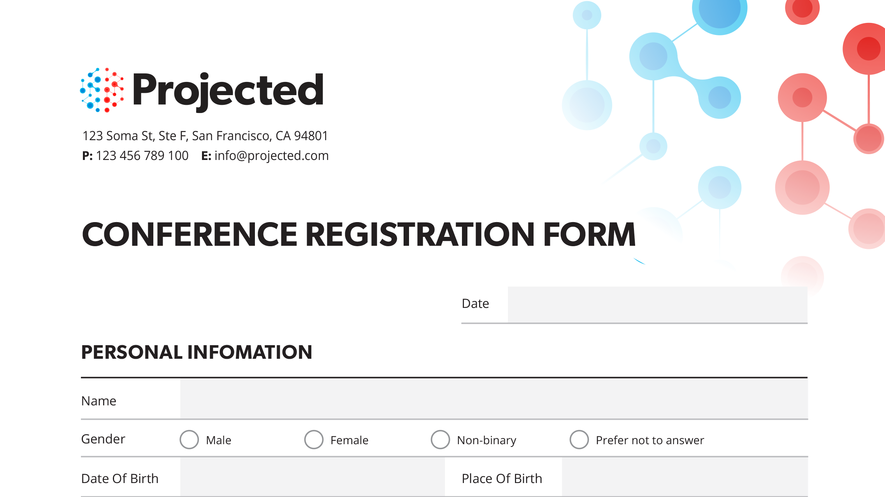

# Panoramica sulle integrazioni

Integra Acrobat con [!DNL Box], [!DNL Dropbox], [!DNL Google Drive], [!DNL OneDrive] e [!DNL Microsoft] app.

## Microsoft

Scopri come tutti i membri del tuo team possono lavorare senza problemi con i file PDF, direttamente in [Microsoft 365](https://www.adobe.com/documentcloud/integrations/microsoft-office-365.html). Scopri questa [playlist](https://experienceleague.adobe.com/en/playlists/acrobat-integrate-microsoft-365) esperta sulle integrazioni Acrobat e Microsoft 365.

<table style="table-layout:fixed">
<tr>
  <td>
    
    

    <a href="createfromword.md"><strong>Creazione di file PDF da Microsoft Word</strong></a>
    

    Scopri come creare file PDF avanzati e affidabili direttamente da Microsoft Word
     
  </td>
  <td>
    
    

    <a href="createofficeweb.md"><strong>Creazione di PDF in [!DNL Office] per il Web</strong></a>
    

    Scopri come creare file PDF avanzati e affidabili direttamente da Microsoft Word
     
  </td> 
  <td>
    
    

    <a href="acrobatandsp.md"><strong>Lavora con [!DNL SharePoint] file</strong></a>
    

    Semplifica i flussi di lavoro dei documenti con [!DNL SharePoint] e Acrobat
     
  </td>
  <td>
    
    

    <a href="acrobatandteams.md"><strong>Collaborazione PDF in [!DNL Microsoft Teams]</strong></a>
    

    Collabora e collabora con i colleghi visualizzando, annotando e rivedendo i PDF senza mai uscire da [!DNL Microsoft Teams]
     
  </td>
</tr>
<tr>
  <td>
    
    

    <a href="outlook.md"><strong>Convertire messaggi e allegati di posta elettronica in PDF in Outlook</strong></a>
    

    Scopri come fornire informazioni in modo più professionale e sicuro all'interno di [!DNL Outlook]
     
  </td>
  <td>
    
    

    <a href="edge.md"><strong>Crea contenuto PDF durante la navigazione con [!DNL Microsoft Edge]</strong></a>
    

    Scopri come trasformare rapidamente le pagine Web in PDF con l'estensione Adobe Acrobat per [!DNL Microsoft Edge]
     
  </td>
  <td>
    
    

    <a href="microsoftsensitivitylabels.md"><strong>PDF Protect che utilizzano [!DNL Microsoft Purview Information] etichette di riservatezza</strong></a>
    

    Scopri come proteggere i PDF aggiungendo, modificando, personalizzando ed eliminando le etichette di riservatezza di Microsoft Purview Information direttamente in Acrobat
     
  </td>
  <td>
   
    

     
  </td>
</tr>
</table>

## Google Drive

Scopri come fare di più in meno tempo con gli strumenti essenziali per PDF e firma elettronica in [!DNL Google Drive].

<table style="table-layout:fixed">
<tr>
  <td>
    
    

    <a href="acrobatandgoogle.md"><strong>Adobe Acrobat per Google Drive</strong></a>
    

    Scopri come accedere a strumenti PDF e flussi di lavoro per firma elettronica che consentono di risparmiare tempo direttamente nell'app [!DNL Google Drive]
     
  </td>
  <td>
   
    

     
  </td>
  <td>
   
    

     
  </td>
  <td>
   
    

     
  </td>
</tr>
</table>

## Dropbox

Scopri quanto è facile accedere e lavorare con i file archiviati in [!DNL Dropbox].

<table style="table-layout:fixed">
<tr>
  <td>
    
    

    <a href="acrobat-dropbox.md"><strong>Utilizzare i file di [!DNL Dropbox]</strong></a>
    

    Scopri come aprire, creare, modificare, firmare e salvare le modifiche ai tuoi file [!DNL Dropbox] da Acrobat
     
  </td>
  <td>
   
    

     
  </td>
  <td>
   
    

     
  </td>
  <td>
   
    

     
  </td>
</tr>
</table>

## Box

Scopri in che modo Acrobat e [Box](https://www.adobe.com/documentcloud/integrations/box.html){target="_blank"} semplificano il passaggio delle attività aziendali a tutti i membri della tua organizzazione.
