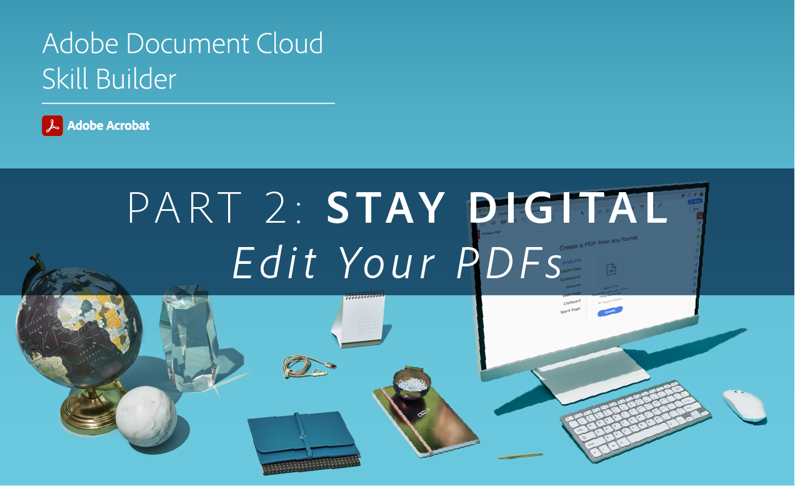

# Acrobat Skill builder

Aggiornate su Acrobat DC con questi sviluppatori interattivi di competenze. In alternativa, partecipare a una [sessione live mensile](skill-builder-webinars.md).

## Vai digitale

<table style="table-layout:fixed">
<tr>
  <td>
    
    

    <a href="https://doccloud.adobeconnect.com/paperpdf/" target="_blank"><strong>Passa da carta a PDF</strong></a>
    

    <em>Trasforma digitalmente qualsiasi documento cartaceo in PDF</em>
     
  </td>
  <td>
    
    

    <a href="https://doccloud.adobeconnect.com/skillbuilder-sigforms/" target="_blank"><strong>Prepara per la firma</strong></a>
    

    <em>Crea PDF con campi firma elettronica</em>
     
  </td>
  <td>
    
    

     
  </td>
</tr>
</table>

## Resta digitale

<table style="table-layout:fixed">
<tr>
 <td>
    
    

    <a href="https://doccloud.adobeconnect.com/createpdfs/" target="_blank"><strong>Crea e organizza PDF</strong></a>
    

    <em>Crea e organizza PDF a partire da qualsiasi tipo di file</em>
     
  </td>
  <td>
    
    

    <a href="https://doccloud.adobeconnect.com/micro/" target="_blank"><strong>Acrobat e Microsoft 101</strong></a>
    

    <em>Creare e gestire i PDF direttamente in SharePoint</em>
     
  </td>
  <td>
    
    

    <a href="https://doccloud.adobeconnect.com/editpdf/" target="_blank"><strong>Modifica i PDF</strong></a>
    

    <em>Aggiungere testo, immagini, collegamenti e filigrane al PDF</em>
     
  </td>
</tr>
<tr>
  <td>
    
    

    <a href="https://doccloud.adobeconnect.com/sign/" target="_blank"><strong>Firma il tuo lavoro</strong></a>
    

    <em>Firma documenti direttamente in Microsoft Outlook</em>
     
  </td>
  <td>
    
    

    <a href="https://doccloud.adobeconnect.com/convertpdfs/" target="_blank"><strong>Convertire i PDF</strong></a>
    

    <em>Converti PDF in Word, Excel e PowerPoint</em>
     
  </td>
  <td>
    
    

    <a href="https://doccloud.adobeconnect.com/fillsign/" target="_blank"><strong>Riempimento e firma ovunque</strong></a>
    

    <em>Riempire, firmare e inviare moduli per via elettronica su qualsiasi dispositivo</em>
     
  </td>
</tr>
<tr>
  <td>
    
    

    <a href="https://doccloud.adobeconnect.com/optimizepdfs/" target="_blank"><strong>Ottimizzare i PDF</strong></a>
    

    <em>Prepara PDF per la distribuzione</em>
     
  </td>
  <td>
   
    

     
  </td>
  <td>
   
    

     
  </td>
</tr>
</table>

## Ottieni lavoro completato

<table style="table-layout:fixed">
<tr>
  <td>
    
    

    <a href="https://doccloud.adobeconnect.com/skillbuilder-share/" target="_blank"><strong>Condividi e raccogli commenti e suggerimenti</strong></a>
    

    <em>Raccogliere e ricevere commenti sui PDF</em>
     
  </td>
  <td>
    
    

    <a href="https://doccloud.adobeconnect.com/securepdfs/" target="_blank"><strong>Protezione dei PDF</strong></a>
    

    <em>Riproduzione e protezione delle informazioni riservate nei PDF</em>
     
  </td>
  <td>
   
    

     
  </td>
</tr>
</table>
