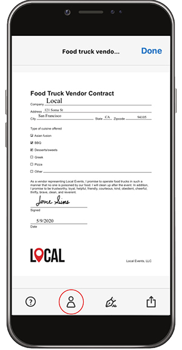

# Compila e firma qualsiasi modulo su desktop o mobile

Compila, firma e invia rapidamente i moduli dal desktop, dal browser o dall&#39;app mobile. Adobe Sensei riconosce e salva i dati utilizzati più di frequente per utilizzarli in un modulo PDF. Crea una firma disegnando, importando una scansione o digitando il tuo nome, quindi applicalo in modo sicuro a un documento.

In questo esercizio potrai importare, compilare, firmare e inviare un documento da un dispositivo mobile.

Ecco il [file demo](assets/03_FillSignScan.zip) per questo esercizio.

**Passaggio 1:** Scarica il [!DNL Adobe Fill & Sign] dell&#39;applicazione [!DNL Apple App] o [!DNL Google Play].

**Passaggio 2:** Apri l’app, tocca **[!UICONTROL Selezionare un modulo da compilare]**.

**Passaggio 3:** Scegliete una delle opzioni di importazione. Per questo esercizio, faremo una foto.

**Passaggio 4:** Usa il pulsante bianco per scattare una foto, quindi tocca **[!UICONTROL Usa foto]**. Tocca **[!UICONTROL Fine]** nell&#39;angolo superiore destro.

**Passaggio 5:** Nella parte inferiore dell&#39;app, toccate il **[!UICONTROL Ritaglio]** e utilizzare le guide per [ritagliare l’immagine](https://www.adobe.com/acrobat/online/crop-pdf.html). Tocca **[!UICONTROL Fine]** al termine.

**Passaggio 6:** Se necessario, usate lo strumento bacchetta magica per pulire l’immagine. Tocca **[!UICONTROL Fine]** al termine.

**Passaggio 7:** Tocca un punto qualsiasi della pagina per creare un campo e aggiungere le informazioni necessarie al documento. Selezionate l’ellisse per visualizzare altre opzioni.

**Passaggio 8:** Tocca il **[!UICONTROL Firma]** nella parte inferiore dell&#39;app per aggiungere la firma.

**Passaggio 9:** Usa uno stilo o un dito per accedere al campo firma. Spostare e inserire il campo firma.

**Passaggio 10:** Tocca il **[!UICONTROL Profilo]** nella parte inferiore dell&#39;app per ottenere valori precompilati, quali il nome e la data. Devi solo compilare queste informazioni una volta, e poi puoi usarle in tutti i moduli futuri che completerai con l&#39;app Fill &amp; Sign.

**Passaggio 11:** Al termine del modulo, tocca il pulsante Condividi nell’angolo in basso a destra per inviare un’e-mail.

## Ricapitolazione:

* Apri un file da un’e-mail o scatta una foto di un modulo cartaceo con la fotocamera del dispositivo.

* Toccate per immettere testo o segni di spunta nei campi modulo. E per velocizzare, usa le voci di autocompilazione personalizzate.

* Crea la tua firma usando il dito o lo stilo. Quindi applicalo al modulo o aggiungi le tue iniziali ovunque sia necessario.
