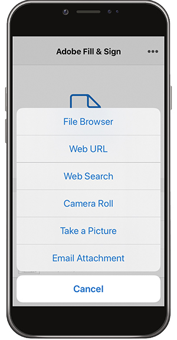
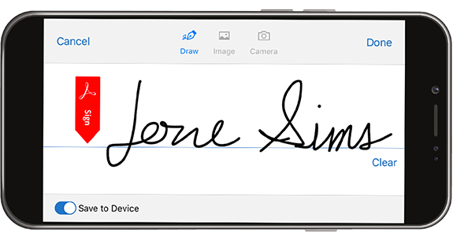

# Compila e firma qualsiasi modulo su desktop o dispositivo mobile

Compila, firma e invia rapidamente moduli da desktop, browser o app mobile. Adobe Sensei riconosce e salva i dati di uso comune per utilizzarli in un modulo PDF. Crea una firma disegnando, importando una scansione o digitando il tuo nome, quindi applicala in modo sicuro a un documento.

In questo esercizio importerai, compilerai, firmerai e invierai un da utilizzando il tuo dispositivo mobile.

Ecco le [file demo](assets/03_FillSignScan.zip) per questo esercizio.

**Passaggio 1:** Scarica il [!DNL Adobe Fill & Sign] dall&#39;app [!DNL Apple App] archiviare o [!DNL Google Play].

**Passaggio 2:** Apri l’app, tocca **[!UICONTROL Seleziona un modulo da compilare]**.

**Passaggio 3:** Scegliete una delle opzioni di importazione. In questo esercizio verrà eseguita una foto.

**Passaggio 4:** Usa il pulsante bianco per scattare una foto, quindi tocca **[!UICONTROL Usa foto]**. Tocca **[!UICONTROL Fine]** nell&#39;angolo superiore destro.

**Passaggio 5:** Nella parte inferiore dell’app, tocca il **[!UICONTROL Ritaglio]** e utilizzare le guide per [ritaglia l’immagine](https://www.adobe.com/acrobat/online/crop-pdf.html). Tocca **[!UICONTROL Fine]** al termine.

**Passaggio 6:** Se necessario, utilizzate lo strumento Bacchetta magica per pulire l’immagine. Tocca **[!UICONTROL Fine]** al termine.

**Passaggio 7:** Tocca in un punto qualsiasi della pagina per creare un campo e aggiungere le informazioni necessarie al documento. Seleziona l&#39;ellisse per visualizzare altre opzioni.

**Passaggio 8:** Toccate il pulsante **[!UICONTROL Firma]** nella parte inferiore dell’app per aggiungere la tua firma.

**Passaggio 9:** Usa uno stilo o il dito per firmare nel campo firma. Spostare e posizionare il campo firma.

**Passaggio 10:** Toccate il pulsante **[!UICONTROL Profilo]** nella parte inferiore dell’app per ottenere valori precompilati quali nome e data. Devi solo compilare queste informazioni una volta e poi puoi usarle in tutti i moduli futuri completati con l&#39;app Fill &amp; Sign.

**Passaggio 11:** Una volta completato il modulo, tocca il pulsante Condividi nell’angolo in basso a destra per inviare un’e-mail.

## Ricapitolazione:

* Apri un file da un’e-mail o scatta l’immagine di un modulo cartaceo con la fotocamera del dispositivo.

* Tocca per inserire testo o segni di spunta nei campi modulo. E per maggiore velocità, utilizza voci di riempimento automatico personalizzate.

* Crea la firma con il dito o lo stilo. Quindi, applicalo al modulo o aggiungi le tue iniziali dove necessario.
