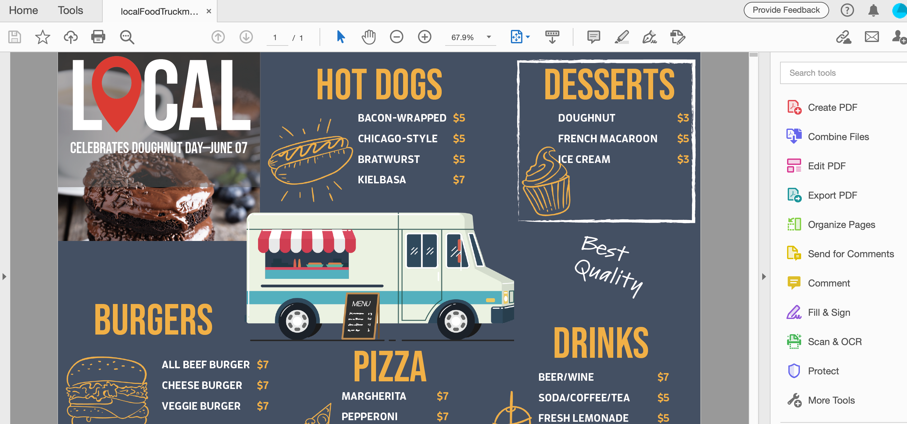

# Condividere i file PDF e rivederli online

Utilizza il servizio di revisione Adobe Document Cloud per condividere facilmente i file PDF per la revisione dall’applicazione desktop Acrobat, dal Web di Document Cloud o dall’app mobile Acrobat Reader. Quando i revisori fanno clic sull&#39;URL nell&#39;e-mail di invito dal computer, possono facilmente fornire il loro feedback in un browser senza dover accedere o installare alcun software aggiuntivo.

In questo esercizio verrà descritto come eseguire le operazioni seguenti:

* Inviare inviti personalizzati per i commenti
* Inviare un link anonimo o pubblico tramite e-mail

Di seguito sono riportati i [file demo](assets/01_Review.zip) per questo esercizio.

## Inviare inviti personalizzati per i commenti

**Passaggio 1:** aprite il file `localFoodTruckmenu_start.pdf` in Adobe Acrobat.

**Passaggio 2:** Fate clic su **[!UICONTROL Send for Comments]** nel pannello a destra o sull&#39;icona **[!UICONTROL Condividi questo file con altri]**  nell&#39;angolo in alto a destra.

**Passaggio 3:** Immetti gli indirizzi e-mail dei destinatari. È possibile immettere un messaggio per i destinatari o aggiungere una scadenza per la revisione.

Una volta che i destinatari avranno visualizzato il file, riceverai un avviso e-mail.

## Esperienza del revisore

I revisori ricevono un invito e-mail contenente un link per il PDF di revisione. Quando l&#39;utente fa clic sul collegamento o sul pulsante **[!UICONTROL Revisione]** nell&#39;invito, PDF si apre in un browser Web. Possono utilizzare gli strumenti di creazione dei commenti per aggiungere i loro commenti al PDF. Possono anche utilizzare le applicazioni desktop Acrobat Reader o Acrobat per aggiungere commenti.

## Inviare un link anonimo o pubblico tramite e-mail

**Passaggio 1:** aprite il file `localFoodTruckmenu_start.pdf` in Adobe Acrobat.

**Passaggio 2:** Fai Clic Su **[!UICONTROL Condividi Un Collegamento]** . Il collegamento condiviso viene generato immediatamente; non dovrai attendere che il file venga caricato nel cloud. Per impostazione predefinita, l&#39;opzione [!UICONTROL Consenti commenti] è attivata.

**Passaggio 3:** Fai clic su **[!UICONTROL Copia collegamento]** e condividilo con i destinatari.

## Creazione di commenti

**Passaggio 1:** Fai clic sul **[!UICONTROL Commento]** nel pannello a destra.

**Passaggio 2:** utilizzate gli strumenti della barra multifunzione superiore per aggiungere commenti al documento e/o digitare un commento.

I commenti vengono salvati automaticamente e possono essere visualizzati da altri utenti.

## Importa commenti PDF in InDesign

InDesign CC 2019 consente di importare i commenti direttamente dai file PDF. Puoi importare, accettare e applicare le modifiche con un solo clic. Quando si seleziona un commento nel nuovo pannello Commenti PDF, il commento viene individuato ed evidenziato nel file InDesign.

**Passaggio 1:** Scaricare il file PDF contenente i commenti.

**Passaggio 2:** aprite il file InDesign.

**Passaggio 3:** Fai clic su **[!UICONTROL File]** dal menu superiore.

**Passaggio 4:** Fai clic su **[!UICONTROL Importa commenti PDF]** dal menu a discesa.

**Passaggio 5:** aprite il PDF che contiene i commenti.

I commenti vengono visualizzati nell’interfaccia utente.

## Ricapitolazione:

Rivedi e condividi le versioni di progettazione con Acrobat. Acrobat consente di:

* Invia un collegamento a un PDF per consentire ad altri di rivederlo.
* Verifica ovunque: desktop, browser, dispositivi mobili.
* Raccogli in un singolo documento.
* Gestisci i feedback in un unico luogo organizzato.
* Tutto ciò di cui hai bisogno è un browser.

È facile inviare commenti e tenerne traccia, tutto in un unico posto. I destinatari possono visualizzare anche se non dispongono di Acrobat. Puoi invitare qualcuno a commentare tramite un browser. Risparmia tempo e fatica.
