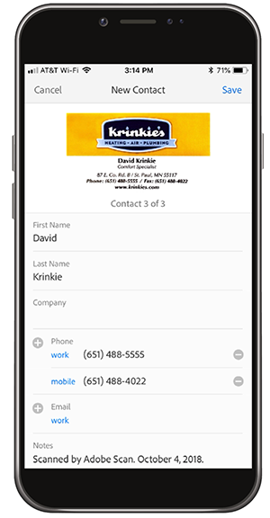

# Passa al digitale con Adobe Scan

Riorganizzate, condividete o disordinate! Non c&#39;è bisogno di tenere pile di carta sulla scrivania o di mettere le ricevute nel portafoglio. L’app mobile Adobe Scan esegue la scansione dei documenti cartacei direttamente in PDF e riconosce automaticamente il testo.

In questo esercizio, carichi i contenuti di un biglietto da visita direttamente nei tuoi contatti. Acquisisci e archivia una ricevuta.

Raccogli un biglietto da visita, una ricevuta o qualche altro articolo cartaceo con cui desideri lavorare.

## Acquisire un biglietto da visita

**Passaggio 1:** Scarica l’app Adobe Scan dall’App Store o da Google Play di Apple.

**Passaggio 2:** Apri l’app Adobe Scan.

**Passaggio 3:** Dall’app, scatta una foto del biglietto da visita contenente le informazioni di contatto che desideri salvare sul telefono.

**Passaggio 4:** Una volta completata la scansione, apporta le regolazioni necessarie per garantire che la scheda sia all’interno del riquadro di delimitazione.

**Passaggio 5:** Tocca **[!UICONTROL Salva PDF]** nell&#39;angolo superiore destro. Quindi, toccate **[!UICONTROL Salva contatto]**.

**Passaggio 6:** Apporta le modifiche o le aggiunte desiderate alle informazioni di contatto prima di archiviarle nel telefono. Tocca di nuovo Salva per completare il salvataggio dei contatti.

## Acquisire e archiviare una ricevuta

L&#39;app Adobe Scan può anche essere utile per acquisire e archiviare una ricevuta di cui avrai bisogno in seguito (ad esempio, un resoconto delle spese o altri rimborsi).

**Passaggio 1:** Con l’app Adobe Scan aperta, scatta una foto della ricevuta che desideri archiviare.

**Passaggio 2:** L’app rileva automaticamente la ricevuta e ne acquisisce il contenuto.

**Passaggio 3:** Tocca **[!UICONTROL Salva PDF]** nell&#39;angolo in alto a destra per memorizzare la ricevuta nel telefono.

## Ricapitolazione:

* Acquisisci documenti cartacei e moduli da PDF.
* Converti immagini JPG in PDF.
* Modifica direttamente sul tuo dispositivo.
* Aggiungi i dati del biglietto da visita direttamente ai tuoi contatti.

Dica il foglio!
