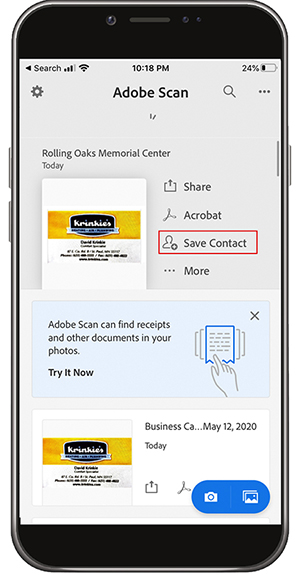

# Digitale con Adobe Scan

Disconfondere, organizzare o condividere! Non c&#39;è bisogno di tenere pile di carta sulla tua scrivania o delle ricevute di roba nel tuo portafoglio. L&#39;app mobile Adobe Scan esegue la scansione dei documenti cartacei direttamente in PDF e riconosce automaticamente il testo.

In questo esercizio si carica il contenuto da un biglietto da visita direttamente nei contatti. Analizza e memorizza una ricevuta.

Raccogliere un biglietto da visita, una ricevuta o un altro articolo cartaceo con cui si desidera lavorare.

## Analizza una scheda aziendale

**Passaggio 1:** Scaricare l&#39;app Adobe Scan dall&#39;Apple App Store o da Google Play.

**Passaggio 2:** Aprire l&#39;app Adobe Scan.

**Passaggio 3:** Dall&#39;app scattare una foto del biglietto da visita contenente le informazioni di contatto che si desidera salvare sul telefono.

**Passaggio 4:** Al termine dell&#39;analisi, eseguire le regolazioni per assicurarsi che la scheda si trovi all&#39;interno del riquadro di delimitazione.

**Passaggio 5:** Toccare  **[!UICONTROL Salva]** PDF nell&#39;angolo superiore destro. Toccare quindi **[!UICONTROL Salva contatto]**.

**Passaggio 6:** Apportare le modifiche o le aggiunte desiderate alle informazioni sul contatto prima di memorizzare il telefono. Toccare &quot;Salva&quot; ancora una volta per completare il salvataggio nei contatti.

## Analizza e archivia una ricevuta

L&#39;app Adobe Scan può anche essere utile per eseguire la scansione e memorizzare una ricevuta di cui avrai bisogno in un secondo momento (ad esempio, una nota spese o altri rimborsi).

**Passaggio 1:** Con l&#39;app Adobe Scan aperta, scattare una foto della ricevuta che si desidera memorizzare.

**Passaggio 2:** Osservare come l&#39;app rileva automaticamente la ricevuta e ne acquisisce il contenuto.

**Passaggio 3:** Toccare  **[!UICONTROL Salva]** PDF nell&#39;angolo superiore destro per memorizzare la ricevuta nel telefono.

## Ricezione:

* Analizza documenti cartacei e moduli in PDF.
* Convertire le immagini JPG in PDF.
* Modifica a destra sul dispositivo.
* Aggiungi informazioni sul biglietto da visita direttamente ai contatti.

Spegni la carta!
