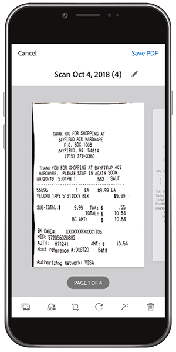

# Passa al digitale con Adobe Scan

Riduzione degli ingombri, organizzazione o condivisione. Non c&#39;è bisogno di tenere pile di carta sulla tua scrivania o roba ricevute nel tuo portafoglio. L’app mobile Adobe Scan scansiona i documenti cartacei direttamente in PDF e riconosce automaticamente il testo.

In questo esercizio verrà caricato il contenuto di un biglietto da visita direttamente nei contatti. Scansiona e archivia una ricevuta.

Raccogliere un biglietto da visita, una ricevuta o un altro elemento di carta con cui si desidera lavorare.

## Scansiona un biglietto da visita

**Passaggio 1:** Scarica l’app Adobe Scan dall’App Store Apple o da Google Play.

**Passaggio 2:** Apri l’app Adobe Scan.

**Passaggio 3:** Dall&#39;app, scatta una foto del biglietto da visita contenente le informazioni di contatto che desideri salvare sul telefono.

**Passaggio 4:** Una volta completata la scansione, effettua le regolazioni necessarie per assicurarti che la scheda rientri nel rettangolo di selezione.

**Passaggio 5:** Tocca **[!UICONTROL Salva PDF]** nell’angolo in alto a destra. Quindi, tocca **[!UICONTROL Salva contatto]**.

**Passaggio 6:** Apporta le modifiche o le aggiunte desiderate alle informazioni di contatto prima di archiviarle nel telefono. Tocca &quot;Salva&quot; ancora una volta per finalizzare il salvataggio nei contatti.

## Scansiona e archivia una ricevuta

L’app Adobe Scan può essere utile anche per acquisire e archiviare una ricevuta di cui avrai bisogno in un secondo momento (ad esempio, una nota spese o altri rimborsi).

**Passaggio 1:** Con l’app Adobe Scan aperta, scatta una foto della ricevuta che desideri archiviare.

**Passaggio 2:** Osserva come l’app rileva automaticamente la ricevuta e ne acquisisce il contenuto.

**Passaggio 3:** Tocca **[!UICONTROL Salva PDF]** nell&#39;angolo in alto a destra per memorizzare la ricevuta nel telefono.

## Ricapitolazione:

* Acquisire documenti cartacei e moduli in PDF.
* Convertire le immagini JPG in PDF.
* Modifica direttamente sul tuo dispositivo.
* Aggiungi informazioni sul biglietto da visita direttamente ai tuoi contatti.

Piantala con la carta!
