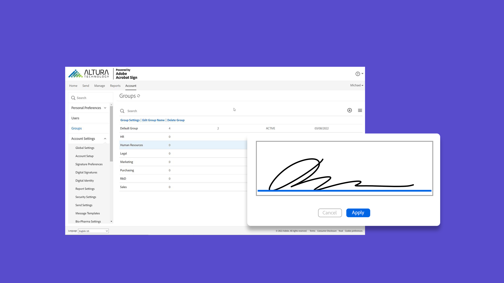

# Panoramica sugli amministratori

Scopri come aggiungere utenti all’account, configurare gruppi, condividere l’accesso e configurare un flusso di lavoro, un archivio esterno ed eventi e avvisi condivisi. Queste esercitazioni sono progettate per gli amministratori che hanno superato la fase di installazione e sono pronti per iniziare ad amministrare Acrobat Sign. Le attività avanzate includono argomenti che si estendono oltre la configurazione dell&#39;amministratore e passano alla definizione delle impostazioni globali, all&#39;accesso e alla condivisione dell&#39;account e all&#39;assegnazione di tag di testo.

## Novità

>[!BEGINTABS]

>[!TAB Creare un flusso di lavoro personalizzato]

Scopri come creare e utilizzare [flussi di lavoro personalizzati](building-a-custom-workflow.md) per velocizzare il processo di creazione e invio di un accordo.

>[!TAB Creare un modello riutilizzabile]

Scopri come creare un [modello di documento riutilizzabile](../sign-advanced-users/create-a-template.md).

>[!TAB Abilita regole di assegnazione automatica degli utenti]

Scopri come impostare [le regole di assegnazione automatica](automatic-assignment-rules.md) che consentono agli utenti di accedere ad Acrobat Sign nell&#39;Admin Console.

>[!TAB Migrazione dei modelli Docusign]

Scopri come [migrare facilmente i modelli Docusign](docusign-templates.md) e i flussi di lavoro in tre semplici passaggi.

>[!ENDTABS]

## Introduzione

<table style="table-layout:fixed">
<tr>
  <td>
    
    

    <a href="get-started-admin.md"><strong>Guida introduttiva per nuovi amministratori</strong></a>
    

    <em>In questa guida video completa, scoprite tutti gli strumenti necessari per rendere operativa l'organizzazione con Acrobat Sign</em>
     
  </td>
  <td>
    
    

    <a href="up-and-running-admin.md"><strong>Attivo e in esecuzione per gli amministratori</strong></a>
    

    <em>Panoramica di 7 aree chiave per consentire agli amministratori di essere subito operativi in Acrobat Sign</em>
     
  </td>
  <td>
    
    

    <a href="docusign-templates.md"><strong>Migrazione dei modelli Docusign</strong></a>
    

    <em>Scopri come migrare facilmente modelli e flussi di lavoro Docusign</em>
     
  </td>
  <td>
    
    

    <a href="add-users-to-your-account.md"><strong>Aggiungi nuovo utente</strong></a>
    

    <em>Scopri come aggiungere nuovi utenti ad Acrobat Sign</em>
     
  </td>
</tr>
<tr>
  <td>
    
    

    <a href="automatic-assignment-rules.md"><strong>Abilita regole di assegnazione automatica degli utenti</strong></a>
    

    <em>Scopri come impostare le regole di assegnazione automatica che consentono agli utenti di accedere ad Acrobat Sign nell'Admin Console</em>
     
  </td>
  <td>
    
    

    <a href="add-admin.md"><strong>Aggiungere un nuovo amministratore dell'account</strong></a>
    

    <em>Scopri come creare un nuovo utente o promuovere un utente esistente al ruolo di amministratore di Acrobat Sign</em>
     
  </td>
    <td>
      
      

      <a href="promote-admin.md"><strong>Assegnazione dei ruoli di amministratore di prodotto e supporto</strong></a>
      

      <em>Scopri come assegnare un ruolo di amministratore del prodotto e amministratore del supporto per un utente Acrobat Sign nell'Admin Console</em>
       
    </td>
    <td>
      
      

      <a href="create-and-manage-groups.md"><strong>Creazione e gestione dei gruppi</strong></a>
      

      <em>Creare gruppi, aggiungere utenti ai gruppi e modificare le impostazioni dei gruppi</em>
       
    </td>
</tr>
<tr>
 <td>
      
      

      <a href="set-up-your-external-archive.md"><strong>Configurazione di un archivio esterno</strong></a>
      

      <em>Crea un archivio esterno per il backup delle copie degli accordi firmati</em>
       
    </td>
  <td>
    
    

    <a href="../sign-advanced-users/create-a-template.md"><strong>Creare un modello riutilizzabile</strong></a>
    

    <em>Crea un modello di documento riutilizzabile per velocità e coerenza</em>
     
  </td>
  <td>
    
    

    <a href="../sign-advanced-users/creating-a-report.md"><strong>Segnalazione e utilizzo delle transazioni</strong></a>
    

    <em>Informazioni sulla generazione di report e sull'utilizzo delle transazioni</em>
     
  </td>
  <td>
    
    

    <a href="report-options.md"><strong>Opzioni report per gli utenti</strong></a>
    

    <em>Informazioni sulla configurazione delle opzioni di report per gli utenti</em>
     
  </td>
</tr>  
<tr>
   <td>
    
    

    <a href="../sign-advanced-users/webform.md"><strong>Creazione di un modulo Web</strong></a>
    

    <em>Crea un documento che può essere firmato elettronicamente direttamente sul tuo sito Web</em>
     
  </td>
  <td>
    
    

    <a href="../sign-advanced-users/modify-webform.md"><strong>Modificare un modulo Web esistente</strong></a>
    

    <em>Scopri come disattivare, modificare e riattivare un modulo Web esistente</em>
     
  </td>
  <td>
    
    

    <a href="../sign-advanced-users/megasign.md"><strong>Invia in modalità collettiva</strong></a>
    

    <em>Raccogli migliaia di firme contemporaneamente per qualsiasi documento</em>
     
  </td>
  <td>
    
    

    <a href="building-a-custom-workflow.md"><strong>Creare un flusso di lavoro personalizzato</strong></a>
    

    <em>Scopri come creare e utilizzare flussi di lavoro personalizzati per accelerare il processo di creazione e invio di un accordo</em>
     
  </td>
</tr>
<tr>
     <td>
    
    

    <a href="audit-reports.md"><strong>Report di audit</strong></a>
    

    <em>Informazioni su come accedere, utilizzare e configurare i report di audit</em>
     
    </td>
    <td>
      
      

      <a href="set-up-shared-events-and-alert.md"><strong>Configurare le notifiche per eventi e avvisi</strong></a>
      

      <em>Configurare le notifiche per eventi e avvisi per l'account</em>
       
    </td>
    <td>
      
      

       
    </td>
    <td>
      
      

       
    </td>
</tr>    
</table>

## Attività avanzate

<table style="table-layout:fixed">
<tr>
  <td>
    
    

    <a href="learn-about-global-settings.md"><strong>Impostazioni globali</strong></a>
    

    <em>Modifica le impostazioni del prodotto a livello globale per l'intera organizzazione o per gruppi specifici</em>
     
  </td>
  <td>
      
    

    <a href="share-account-access.md"><strong>Accesso all'account condiviso</strong></a>
    

    <em>Configurare l'accesso di sola visualizzazione alle transazioni nell'account di un altro utente</em>
     
  </td>
  <td>
    
    

    <a href="advanced-account-sharing.md"><strong>Condivisione account avanzata</strong></a>
    

    <em>Configurare la condivisione dell'account per consentire agli amministratori e agli utenti di delegare le autorizzazioni di invio, modifica e visualizzazione</em>
     
  </td>
  <td>
    
    

    <a href="bulk-download-tool.md"><strong>Strumento di download in blocco</strong></a>
    

    <em>Scopri come utilizzare lo strumento di download in blocco per scaricare rapidamente tutti gli accordi firmati</em>
     
  </td> 
</tr>
<tr>
   <td>
     
    

    <a href="../sign-advanced-users/adobe-sign-text-tagging.md"><strong>Tag di testo Acrobat Sign</strong></a>
    

    <em>Compilare i campi modulo di Acrobat Sign tramite tag di testo con Adobe Acrobat</em>
     
  </td>
  <td>
    
    

    <a href="use-bio-pharma-settings.md"><strong>Utilizzo delle impostazioni Bio-Pharma</strong></a>
    

    <em>Configurare le impostazioni Bio-Pharma che consentono di soddisfare i requisiti FDA 21 CFR Part 11</em>
     
  </td>
  <td>
    
    

    <a href="privacy.md"><strong>Come configurare gli amministratori della privacy</strong></a>
    

    <em>Informazioni su come configurare e utilizzare gli amministratori della privacy</em>
     
  </td>
  <td>
    
    

     
  </td>
</tr>
</table>
