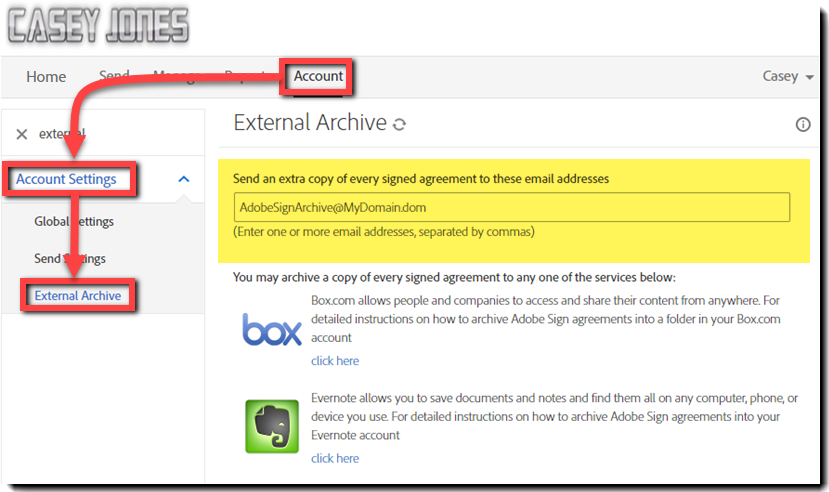

# Configurazione di un archivio esterno

Scopri come creare un archivio esterno per il backup delle copie degli accordi che sono stati inviati. Puoi archiviare le copie degli accordi firmati in qualsiasi indirizzo e-mail o in Box ed Evernote. Una copia dell’e-mail Firmato e archiviato viene inviata all’indirizzo e-mail o al servizio configurato.

## Archivio esterno: indirizzo e-mail

1. Accedi come amministratore dell’account.

1. Fai clic su **[!UICONTROL Impostazioni account]** > **[!UICONTROL Archivio esterno]** sotto il [!UICONTROL Account] tab.

   

1. Immetti l’indirizzo e-mail dell’archivio e fai clic su **[!UICONTROL Salva modifiche]**.

   

## Archivio esterno: Box.com

1. Accedi come amministratore dell’account.

1. Fai clic su **[!UICONTROL Impostazioni account]** > **[!UICONTROL Archivio esterno]** sotto il [!UICONTROL Account] tab.

1. Selezionate la proprietà [!UICONTROL fai clic qui] a destra del logo Box.

   

1. Segui le istruzioni specifiche per Box riportate nella finestra a comparsa.

   

## Archivio esterno: Evernote

1. Accedi come amministratore dell’account.

1. Fai clic su **[!UICONTROL Impostazioni account]** > **[!UICONTROL Archivio esterno]** sotto il [!UICONTROL Account] tab.

1. Selezionate la proprietà **[!UICONTROL fai clic qui]** a destra del logo Evernote.

   

1. Segui le istruzioni specifiche per Evernote riportate nella finestra a comparsa.

   
