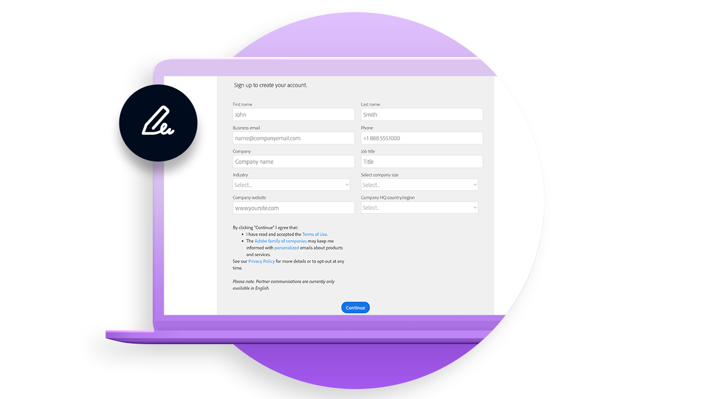
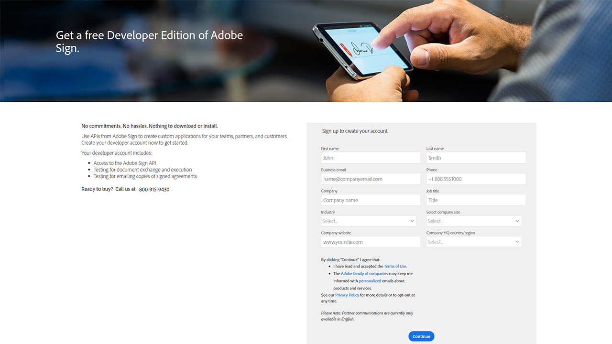

# Panoramica sullo sviluppo

Il 40% degli accordi in Acrobat Sign viene creato utilizzando le API. Utilizza le API per creare applicazioni personalizzate per team, partner e clienti.

<table style="table-layout:fixed">
<tr>
  <td>
    
    

    <a href="https://www.adobe.io/apis/documentcloud/sign.html" target="_blank"><strong>Creare un account sviluppatore</strong></a>
    

    <em>Scopri come iniziare con un account sviluppatore</em>
     
  </td>
  <td>
    
    

    <a href="https://www.adobe.io/apis/documentcloud/sign/docs.html" target="_blank"><strong>Scopri cosa puoi fare</strong></a>
    

    <em>Scopri come incorporare la funzionalità di Acrobat Sign in qualsiasi applicazione esterna</em>
     
  </td>  
  <td>
    
    

    <a href="gigasign.md"><strong>Raccogliere documenti con grandi volumi con GigaSign</strong></a>
    

    <em>Inviare, raccogliere e monitorare i documenti da firmare a migliaia di persone allo stesso tempo</em>
     
  </td>
   <td>
    
    

    <a href="embeddedesignature.md"><strong>Creare esperienze incorporate di firma elettronica e di creazione di documenti</strong></a>
    

    <em>Scopri come utilizzare le API di Acrobat Sign per incorporare esperienze di firma elettronica e di gestione dei documenti in piattaforme Web e sistemi di gestione di contenuti e documenti</em>
     
  </td>
</tr>
</table>
