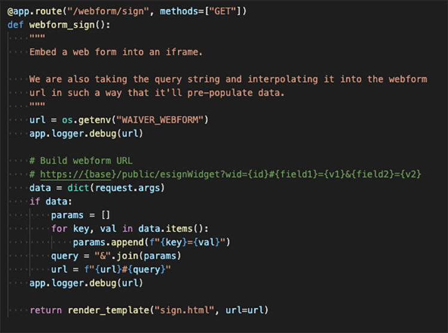
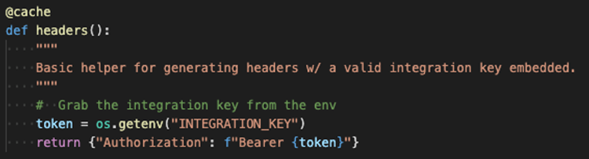
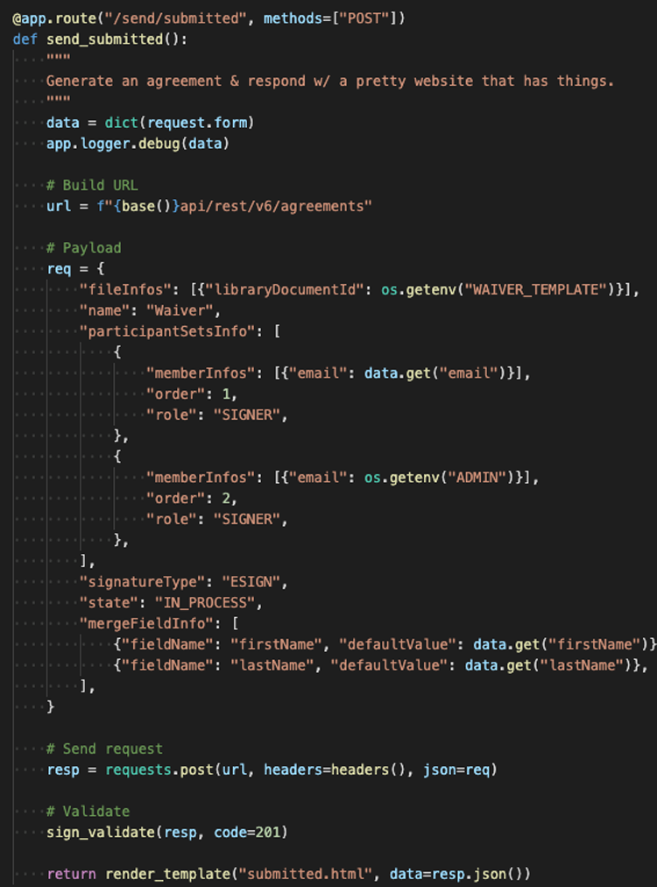
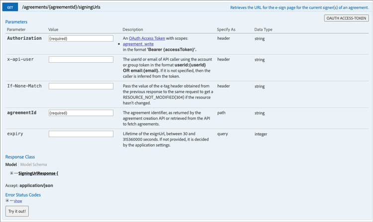

# Creare esperienze incorporate di firma elettronica e di creazione di documenti

Scopri come utilizzare le API di Acrobat Sign per incorporare esperienze di firma elettronica e di gestione dei documenti nelle piattaforme Web e nei sistemi di gestione dei contenuti e dei documenti. Questo tutorial pratico si articola in quattro parti.

## Parte 1: Cosa serve

Nella parte 1, scopri come iniziare con tutto ciò di cui hai bisogno per le parti 2-4. Iniziamo con il recupero delle credenziali API.

+++Visualizza dettagli su come ottenere le credenziali API

* [Account per sviluppatori Acrobat Sign](https://acrobat.adobe.com/it/it/sign/developer-form.html)
* [Codice Starter](https://github.com/benvanderberg/adobe-sign-api-tutorial)
* [Codice VS (o editor di tua scelta)](https://code.visualstudio.com)
* Python 3.x
   * Mac - Homebrew
   * Linux - Programma di installazione integrato
   * Windows - Chocolatey
   * Tutti - https://www.python.org/downloads/

+++

## Parte 2: Codice basso/nessun — la potenza dei moduli web

Nella parte 2, esplora l’opzione &quot;low/no code&quot; per l’utilizzo dei moduli web. È sempre una buona idea vedere se è possibile evitare di scrivere codice all&#39;inizio.

+++Visualizzare i dettagli sulla creazione di un modulo Web

1. Accedi ad Acrobat Sign con il tuo account sviluppatore.

1. Seleziona **Pubblicare un modulo Web** nella home page.

   

1. Crea l’accordo.

   

1. Incorpora l’accordo in una pagina HTML piatta.

1. Sperimentare l&#39;aggiunta dinamica dei parametri di query.

   

+++

## Parte 3: Inviare un accordo con un modulo e unire i dati

Nella parte 3, crea dinamicamente gli accordi.

+++Visualizza dettagli su come creare dinamicamente gli accordi

In primo luogo, è necessario stabilire l&#39;accesso. Con Acrobat Sign, sono disponibili due modi per connettersi tramite API. Token OAuth e chiavi di integrazione. A meno che tu non abbia un motivo molto specifico per utilizzare OAuth con la tua applicazione, dovresti prima esplorare le Chiavi di integrazione.

1. Seleziona **Chiave di integrazione** sul **Informazioni API** menu sotto **Account** in Acrobat Sign.

   

Ora che hai accesso e puoi interagire con l’API, scopri cosa puoi fare con l’API.

1. Passare alla [Metodi API REST versione 6 per Acrobat Sign](http://adobesign.com/public/docs/restapi/v6).

   

1. Utilizza il token come valore &quot;al portatore&quot;.

   

Per inviare il primo accordo, è meglio comprendere come utilizzare l’API.

1. Crea un documento transitorio e invialo.

>[!NOTE]
>
>Le chiamate di richiesta basate su JSON dispongono di un&#39;opzione &quot;Modello&quot; e di uno &quot;Schema modello minimo&quot;. Questo fornisce le specifiche e un set di payload minimo.

Dopo aver inviato un accordo per la prima volta, puoi aggiungere la logica. È sempre una buona idea stabilire degli assistenti per ridurre al minimo le ripetizioni. Di seguito sono riportati alcuni esempi:

**Convalida**

**Intestazioni/Autenticazione**

**URI di base**

Tieni presente dove atterrano i documenti transitori all’interno del sistema complessivo dell’ecosistema Sign.
Transitorio -> Accordo Transitorio -> Modello -> Accordo Transitorio -> Widget -> Accordo

In questo esempio viene utilizzato un modello come origine del documento. Questa è in genere la procedura migliore, a meno che non si abbia una ragione valida per generare dinamicamente i documenti per la firma (ad esempio, per generare codice legacy o documenti).

Il codice è abbastanza semplice; utilizza un documento libreria (modello) per l&#39;origine del documento. Il primo e il secondo firmatario vengono assegnati in modo dinamico. La `IN_PROCESS` state indica che il documento viene inviato immediatamente. Inoltre, `mergeFieldInfo` viene utilizzato per compilare dinamicamente i campi.

+++

## Parte 4: incorpora esperienza di firma, reindirizzamenti e altro ancora

In molti casi può essere utile consentire al partecipante che esegue l’attivazione di firmare immediatamente un accordo. Questa funzione è utile per le applicazioni e i chioschi rivolti ai clienti.

+++Visualizza i dettagli su come incorporare l’esperienza di firma

Se non desideri che venga attivato il primo invio di e-mail, un modo semplice consiste nel gestire il comportamento modificando la chiamata API.

Ecco come controllare il reindirizzamento post-firma:

Dopo aver aggiornato il processo di creazione dell’accordo, il passaggio finale genera l’URL di firma. Anche questa chiamata è piuttosto semplice e genera un URL che un firmatario può utilizzare per accedere alla propria parte del processo di firma.

>[!NOTE]
>
>Tieni presente che la chiamata per la creazione dell’accordo è tecnicamente asincrona. Ciò significa che è possibile effettuare una chiamata all’accordo &quot;POST&quot;, ma l’accordo non è ancora pronto. È consigliabile stabilire un ciclo di tentativi. Utilizza un nuovo tentativo o qualsiasi altra procedura consigliata per il tuo ambiente.

Quando si assembla tutto, la soluzione è piuttosto semplice. Stai creando un accordo e quindi generando un URL di firma in cui il firmatario può fare clic per iniziare il rituale di firma.

+++

## Argomenti aggiuntivi

* [Eventi JS](https://www.adobe.io/apis/documentcloud/sign/docs.html#!adobedocs/adobe-sign/master/events.md)
* Eventi webhook
   * [API REST](https://sign-acs.na1.echosign.com/public/docs/restapi/v6#!/webhooks/createWebhook)
   * [Webhook in Acrobat Sign v6](https://www.adobe.io/apis/documentcloud/sign/docs.html#!adobedocs/adobe-sign/master/webhooks.md)
* [Riattiva e-mail di richiesta (con eventi)](https://sign-acs.na1.echosign.com/public/docs/restapi/v6#!/agreements/updateAgreement)
* [Sostituisci timeout con un nuovo tentativo](https://stackoverflow.com/questions/23267409/how-to-implement-retry-mechanism-into-python-requests-library)
* Promemoria personalizzati
   * Con la creazione iniziale

     

   * Oppure aggiungetene uno [in volo](https://sign-acs.na1.echosign.com/public/docs/restapi/v6#!/agreements/createReminderOnParticipant)
