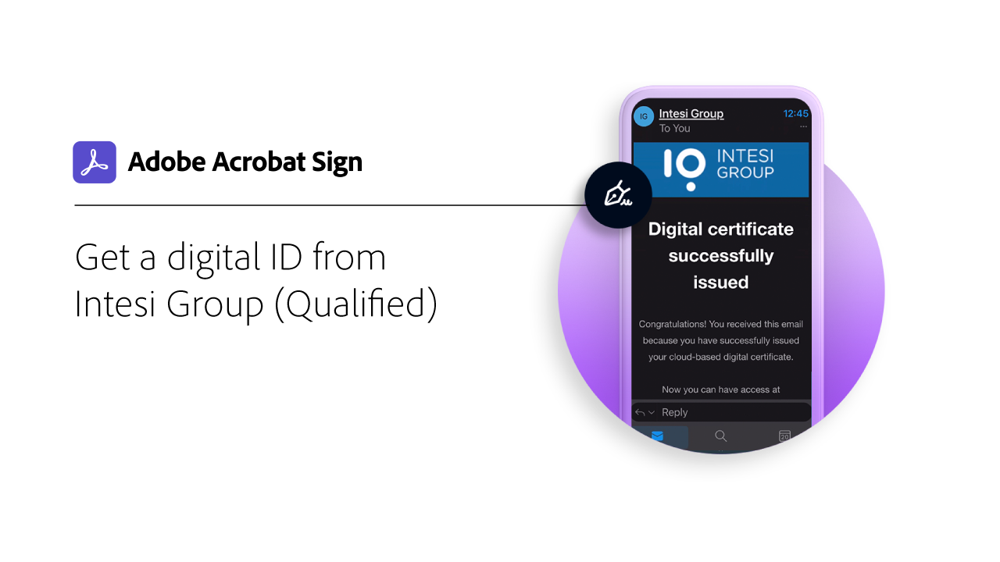

# Panoramica dell’ID digitale

Analogamente al passaporto in formato elettronico, un’identità digitale (ID digitale) consente di dimostrare in modo sicuro di essere chi si dice di essere. Inoltre, quando si esegue la firma elettronica in Acrobat Sign, l’utilizzo di un ID digitale garantisce un livello di sicurezza più elevato in merito all’autorizzazione della firma elettronica per quel documento specifico. Le seguenti esercitazioni mostrano come utilizzare gli ID digitali di tutto il mondo con Acrobat Sign.

>[!NOTE]
>
>Prima di poter utilizzare un ID digitale con firma cloud, verifica con l’amministratore della tua organizzazione che la soluzione del provider sia abilitata in Acrobat Sign.

## Novità

>[!BEGINTABS]

>[!TAB Registrati e firma con Digidentity]

Scopri come registrare e utilizzare l&#39;ID digitale [[!DNL Digidentity]](digidentity-sign.md) con Acrobat Sign.

>[!TAB Registrati e firma utilizzando D-Trust]

Scopri come registrare la tua identità con [[!DNL D-Trust]](d-trust.md) e quindi utilizzare la firma digitale di [!DNL D-Trust] in un documento in Acrobat Sign.

>[!ENDTABS]

## [!DNL Aadhaar]

<table style="table-layout:fixed">
<tr>
 <td>
    
    

    <a href="aadhaar-sign.md"><strong>Firma con [!DNL Aadhaar]</strong></a>
    

    <em>Scopri come utilizzare l'ID digitale [!DNL Aadhaar] con Acrobat Sign</em>
     
  </td>
  <td>
    
    

     
  </td>
  <td>
    
    

     
  </td>
  <td>
    
    

     
  </td>
</tr>
</table>

## [!DNL Digidentity]

<table style="table-layout:fixed">
<tr>
  <td>
    
    

    <a href="digidentity-sign.md"><strong>Registrati e firma con [!DNL Digidentity]</strong></a>
    

    <em>Scopri come registrare e utilizzare il tuo ID digitale [!DNL Digidentity] con Acrobat Sign</em>
     
  </td>
  <td>
    
    

     
  </td>
  <td>
    
    

     
  </td>
  <td>
    
    

     
  </td>
</tr>
</table>

## [!DNL D-Trust]

<table style="table-layout:fixed">
<tr>
  <td>
    
    

    <a href="d-trust.md"><strong>Registrati e firma utilizzando D-Trust</strong></a>
    

    <em>Scopri come registrare la tua identità con [!DNL D-Trust] e quindi utilizzare la firma digitale di [!DNL D-Trust] in un documento in Acrobat Sign</em>
     
  </td>
  <td>
    
    

     
  </td>
  <td>
    
    

     
  </td>
  <td>
    
    

     
  </td>
  </tr>
  </table>

## [!DNL Intesi Group]

<table style="table-layout:fixed">
<tr>
  <td>
    
    

    <a href="intesi-advanced.md"><strong>Ottenere un ID digitale da [!DNL Intesi Group] (Avanzate)</strong></a>
    

    <em>Informazioni su come ottenere un certificato di firma digitale avanzata da [!DNL Intesi Group]</em>
     
  </td>
  <td>
    
    

    <a href="intesi-qualified.md"><strong>Ottenere un ID digitale da [!DNL Intesi Group] (Qualificato)</strong></a>
    

    <em>Informazioni su come ottenere un certificato di firma digitale qualificata da [!DNL Intesi Group]</em>
     
  </td>
  <td>
    
    

    <a href="intesi-sign.md"><strong>Firma con [!DNL Intesi Group]</strong></a>
    

    <em>Scopri come utilizzare l'ID digitale [!DNL Intesi Group] con Acrobat Sign</em>
     
  </td>
  <td>
    
    

     
  </td>
</tr>
</table>
