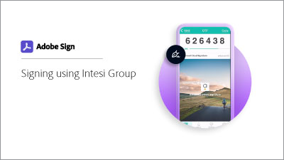

# Ottieni un ID digitale da [!DNL Intesi Group] (qualificato)

Scopri come ottenere un certificato di firma digitale qualificato da [!DNL Intesi Group]. Una volta effettuata la registrazione e verificata la tua identità, [!DNL Intesi Group] problemi con un ID digitale utilizzato per applicare una firma cloud di Adobe Sign.

>[!VIDEO](https://video.tv.adobe.com/v/337064?hidetitle=true)

  

**Seleziona l&#39;immagine seguente per scoprire come utilizzare i tuoi [!DNL Intesi Group] ID digitale in Adobe Sign.**

