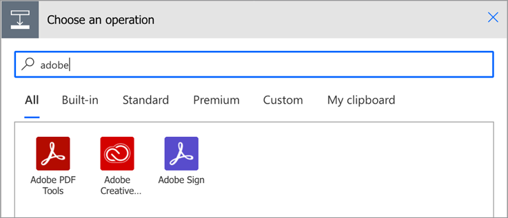
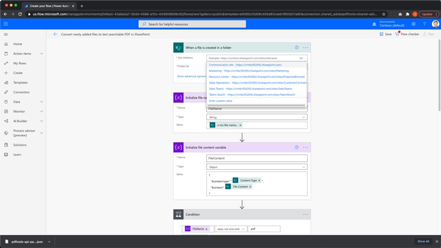
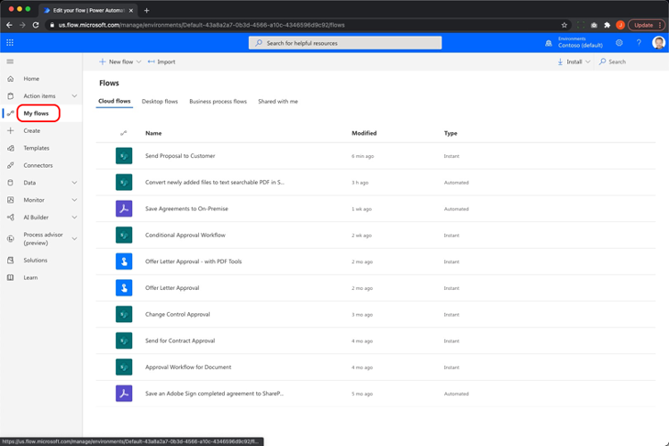
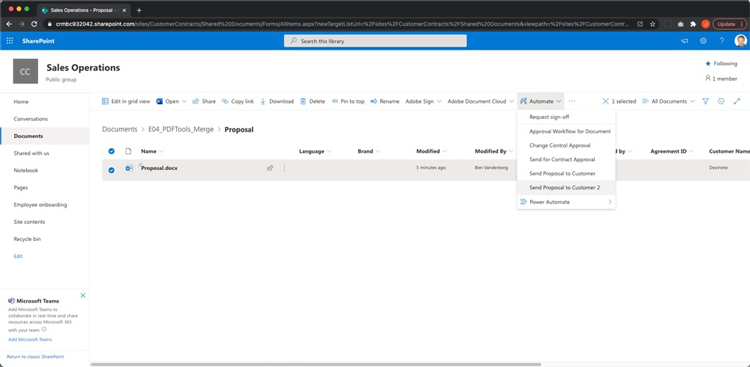

# Automazione dei documenti con Acrobat Sign per Microsoft Power Platform

Scopri come attivare e utilizzare i connettori Acrobat Sign e Adobe PDF Tools per Microsoft Power Apps. Creazione di flussi di lavoro che automatizzano i processi di approvazione e firma aziendali in modo rapido e sicuro, senza dover ricorrere a codice. Questo tutorial pratico è suddiviso in quattro parti, descritte nei collegamenti seguenti:

<table style="table-layout:fixed">
<tr>
  <td>
    
    

    <a href="documentautomation.md#part1"><strong>Parte 1: Archiviare gli accordi firmati in SharePoint con Acrobat Sign</strong></a>
    

  </td>
  <td>
    
    

    <a href="documentautomation.md#part2"><strong>Parte 2: processo di approvazione automatizzato per ottenere la firma elettronica con Acrobat Sign</strong></a>
    

  </td>
  <td>
   
    

    <a href="documentautomation.md#part3"><strong>Parte 3: OCR automatico dei documenti con gli strumenti Adobe PDF</strong></a>
    

  </td>
  <td>
   
    

    <a href="documentautomation.md#part4"><strong>Parte 4: assemblaggio automatizzato dei documenti con Adobe PDF Tools</strong></a>
    

  </td>
</tr>
</table>

## Prerequisiti

* Familiarità con Microsoft 365 e Power Automate
* Conoscenza di Acrobat Sign
* Account Microsoft 365 con accesso a SharePoint e Power Automate (Basic per Acrobat Sign, Premium per Adobe PDF Tools)
* Account per sviluppatori Acrobat Sign for enterprise o Acrobat Sign

**Esercizi 1 e 2**

* Account Acrobat Sign con accesso all’API. Un account sviluppatore o un account Enterprise.
* Sito SharePoint accessibile da Power Automate per il quale disponi delle autorizzazioni di modifica. È consigliato l&#39;accesso completo da parte dell&#39;amministratore.
* Esempio di documento per la richiesta di approvazione e firma della firma.

**Esercizi 3 e 4**

Scarica i materiali [qui](https://github.com/benvanderberg/adobe-sign-pdftools-powerautomate-tutorial)

## Parte 1: Archiviare gli accordi firmati in SharePoint con Acrobat Sign {#part1}

Nella prima parte, utilizzerai un modello di flusso di lavoro Power Automate per impostare un flusso di lavoro automatizzato in cui verranno salvati tutti gli accordi firmati nel tuo sito SharePoint.

1. Seleziona Power Automate.
1. Cerca Acrobat Sign.

   

1. Scegli **Salva un accordo Acrobat Sign completato nella libreria SharePoint**.

   

1. Esaminare la schermata e configurare eventuali connessioni necessarie. Abilita la connessione Acrobat Sign.
1. Fai clic sul simbolo `+` blu.

   

1. Immetti l’indirizzo e-mail del tuo account Acrobat Sign e fai clic sul campo Password nella nuova finestra.

   

   Attendi un momento per Adobe per controllare il tuo account.

   >[!NOTE]
   >
   >Questo controllo ti indirizzerà all&#39;accesso appropriato se stai utilizzando un Adobe ID o il nostro SSO aziendale.

1. Completa l&#39;accesso.
1. Fai clic su **Continua** per accedere alla schermata di modifica del flusso.
1. Assegna un nome al trigger.

   

1. Configura le impostazioni di SharePoint.

   

   **Indirizzo del sito:** Il tuo sito SharePoint
   **Percorso cartella:** Percorso dei documenti condivisi che si desidera utilizzare
   **Nome file:** Accettare l&#39;impostazione predefinita
   **Contenuto file:** Accettare l&#39;impostazione predefinita

1. Salva il flusso.

   

1. Passare alla schermata di panoramica del flusso con la freccia posteriore blu. Verificherete questo flusso nella parte 2.

   

Questo flusso verrà testato nella parte successiva.

## Parte 2: Procedura di approvazione automatizzata per ottenere la firma elettronica con Acrobat Sign {#part2}

Nella seconda parte, costruiamo la prima parte con un Flusso più robusto e testiamo entrambi i Flussi per vederli in azione.

1. Seleziona **Modelli** sul lato sinistro dall’interfaccia di Power Automate.

   

1. Cerca &quot;approvazione del manager&quot;.
1. Selezionare **Approvazione di Gestione richieste per un file selezionato**.

   

   Verifica le connessioni e aggiungi quelle mancanti.

   >[!NOTE]
   >
   >Se si tratta del primo flusso eseguito con le approvazioni, queste verranno configurate completamente durante l&#39;esecuzione del flusso.

1. Fai clic su **Continua** per accedere alla schermata di modifica del flusso.

   Questo flusso include molti passaggi preconfigurati, tra cui il controllo degli errori e i passaggi condizionali nidificati.

1. Configura **per un file selezionato** nel modo seguente:
   **Indirizzo sito:** Il tuo sito SharePoint
   **Nome libreria:** Archivio documenti
1. Aggiungi un input nel modo seguente:
   **Tipo**: e-mail
   **Nome**: E-mail firmatario

   

1. Configurare **Ottieni proprietà file:** nel modo seguente:
   **Indirizzo sito:** Il tuo sito SharePoint
   **Nome libreria:** Archivio documenti

1. Scorri verso il basso e cerca **In caso affermativo**.

   

1. Fai clic su **Aggiungi un&#39;azione** nella casella **In caso affermativo** (non nella parte inferiore) per aggiungere i passaggi da inviare per la firma.

   

1. Cercate **SharePoint per ottenere il contenuto del file** e scegliete **Ottieni il contenuto del file**.

   

1. Configurare **Ottieni contenuto file** nel modo seguente:

   

   **Indirizzo sito:** Il tuo sito SharePoint.
   **Identificatore file:** Cercare &quot;identificatore&quot; e scegliere Identificatore dal passaggio **Ottieni proprietà file**.
1. Cerca &quot;Adobe&quot; e scegli **Acrobat Sign** per aggiungere un&#39;altra azione.

   

1. Immetti &quot;upload&quot; nella casella di ricerca di Acrobat Sign e seleziona **Carica un documento e ottieni l&#39;ID documento**.
1. Cercare la variabile dinamica **Name** per ottenere il nome dell&#39;elemento o del documento selezionato nel trigger in **File Name**.
1. Fare clic su **Espressione** nell&#39;Assistente variabili in **Contenuto file**.

   

1. Aggiungete un singolo apostrofo, quindi fate clic nuovamente su **Contenuto dinamico**, eliminate l&#39;apostrofo, selezionate **Contenuto file** e fate clic su **OK**.

   Assicurati che non siano presenti apostrofi aggiuntivi e che il risultato sia simile a quello illustrato nell’esempio seguente.

   

1. Nell’area di ricerca di Acrobat Sign, cerca &quot;crea&quot; per aggiungere un’altra azione Acrobat Sign.
1. Seleziona **Crea un accordo da un documento caricato e invialo per la firma**.

   

1. Configura le informazioni richieste:
Scegli **Nome** dall&#39;assistente della variabile dinamica in **Nome accordo**.
Scegliete **ID documento** dall&#39;assistente della variabile dinamica in **ID documento**.
Scegli **E-mail firmatario** dall’assistente variabile dinamico in **E-mail partecipante**.
Immetti &quot;1&quot; in **Ordine partecipanti**.
Scegli **Firmatario** dal menu a discesa in **Ruolo partecipante**.

   

1. **Salva** il flusso.

### Prova del flusso

Accedere al repository dei documenti del sito SharePoint per verificarne il funzionamento.

1. Seleziona il documento e scegli **Automatizza** e il **Flusso** che hai appena creato.

   

1. Avviare il flusso per convalidare le connessioni (solo prima esecuzione del flusso).
1. Immetti un bel messaggio per l&#39;approvatore in **Messaggio**.
1. Immetti l’indirizzo e-mail del firmatario del documento nell&#39;**E-mail firmatario**.
1. Fai clic su **Esegui flusso**.

L’approvatore configurato per l’utente che avvia il flusso riceverà una richiesta di approvazione. Puoi approvare tramite e-mail o tramite il menu delle azioni di Power Automate.
Una volta approvato, firma il documento. A seconda dell’utente e del fatto che abbia effettuato l’accesso a Sign, potrebbe essere necessario aprire le finestre di firma in un browser privato.

Completa la procedura di firma, quindi riprova nella cartella SharePoint.

## Parte 3: OCR automatizzato dei documenti con Adobe PDF Tools {#part3}

Nella terza parte imparerai come automatizzare l’OCR nei PDF quando vengono importati in Microsoft SharePoint. Questo risolve un problema che si verifica con i documenti PDF scansionati che non sono ricercabili in SharePoint.

### Impostare una cartella in SharePoint

Accedete a Microsoft SharePoint in cui desiderate archiviare i documenti.

1. Fare clic su **+ Nuovo** per creare una nuova cartella denominata &quot;Contratti elaborati&quot;.
1. Fare clic su **+ Nuovo** per creare una nuova cartella denominata &quot;Contratti precedenti&quot;.

   

A queste cartelle viene ora fatto riferimento come parte del flusso di Power Automate.

### Creare un flusso da un modello

1. Accedi a https://flow.microsoft.com.
1. Fai clic su **Modelli** nella barra laterale.

   

1. Seleziona **Converti i file appena aggiunti in PDF per la ricerca di testo in SharePoint**.
1. Fai clic sul simbolo **+** accanto a Strumenti Adobe PDF.

   

1. Passa a https://www.adobe.com/go/powerautomate_getstarted_it in una nuova scheda.
1. Fai clic su **Guida introduttiva**.

   

1. Accedi con l’Adobe ID.

   

1. Immetti il nome e la descrizione delle credenziali e fai clic su **Crea credenziali**.

   

   Mantenere aperta la finestra con le credenziali. Sarà necessario inserirli in Microsoft Power Automate.

   

1. Immetti le credenziali e fai clic su **Crea in Microsoft Power Automate**.

   

1. Fai clic su **Continua**.

   

   Ora puoi vedere una vista del flusso di lavoro e dovrai configurarlo per il tuo ambiente.

1. Seleziona il campo Indirizzo sito e scegli il sito SharePoint che stai utilizzando nel trigger **Quando viene creato un file in una cartella**.

   

1. Fare clic sull&#39;icona della cartella per passare alla cartella Contratti precedenti che si trova in ID cartella.

   

1. Modifica l&#39;azione **Crea file** nella parte inferiore del flusso:

   Modifica **Indirizzo sito** nell&#39;indirizzo del sito.
Specificare il percorso della cartella Contratti elaborati nel percorso della cartella.

1. Fai clic su **Salva** nell&#39;angolo in alto a destra.
1. Fai clic su **Test**.
1. Seleziona **Manualmente**.
1. Fai clic su **Test**.

   

### Prova il nuovo flusso

1. Passa alla cartella Contratti precedenti in SharePoint.
1. Accedere a E03/Old Contracts nei file di esercizi scaricati.
1. Copiare i file ReleaseFormXX.pdf nella cartella Vecchi contratti in SharePoint.

   

Ora, se si passa alla cartella Contratti elaborati, è possibile visualizzare i PDF disponibili dopo che il flusso è stato eseguito. Se apri i PDF, puoi vedere che il testo è selezionabile.
Inoltre, SharePoint indicizza il documento, consentendovi di effettuare una ricerca nel contenuto dei documenti dalla barra di ricerca in SharePoint.

## Parte 4: Assemblaggio automatico di documenti con Adobe PDF Tools {#part4}

Nella quarta parte imparerai come unire più documenti in base alle informazioni fornite durante la selezione e l’avvio di un flusso da Microsoft SharePoint. In questo scenario, il flusso:

* Chiedi informazioni per scegliere cosa includere in un pacchetto per un cliente.
* In base alle informazioni fornite, unisce molti documenti. Questi documenti includono una copertina e white paper opzionali.
* Il documento di unione viene salvato in SharePoint.

### Importare file di esercizi in SharePoint

1. Aprire la cartella E04 nei file dell&#39;esercizio.
1. Importa in SharePoint le cartelle Proposta, Modelli e Documenti generati.

   

Queste cartelle verranno utilizzate come riferimento. In particolare, per la proposta verrà utilizzato il file Proposal.docx.

Nella cartella Modelli è presente una cartella Copertine che include progettazioni di frontespizi per diverse città. È inoltre disponibile una cartella Whitepapers che contiene white paper aggiuntivi opzionali che, se selezionati, verranno allegati alla fine.

### Importare il flusso in Microsoft Power Automate

1. Accedi a Microsoft Power Automate (https://flow.microsoft.com).
1. Fai clic su **I miei flussi**.

   

1. Fai clic su **Importa**.

   

1. Fai clic su **Carica** e scegli la cartella GenerateProposal_20210311231623.zip in E04/Flows/.

   

1. Fai clic su **Importa**.

1. Fare clic sull&#39;icona della chiave inglese in Azione accanto a **Invia proposta al cliente**.

   

1. Selezionare **Crea come nuovo** in Installazione.
1. Impostare il nome del flusso in Nome risorsa.
1. Fai clic su **Salva**.

   Ripeti questa operazione per le altre risorse correlate e seleziona la connessione.

   

1. Dopo aver effettuato tutte le connessioni, fai clic su **Importa**.

### Imposta per un file selezionato

Dopo aver creato il flusso, effettua le operazioni riportate di seguito:

1. Fate clic su **Modifica**.

   

1. Selezionare il trigger **Per un file selezionato**.

   Aggiungi il tuo sito SharePoint all&#39;indirizzo del sito.
Aggiungi la tua libreria nella libreria.

   

### Imposta templateFolderPath

1. Fare clic sulla variabile templateFolderPath.
1. Impostate il percorso della cartella Modelli all&#39;interno del sito di SharePoint importato.

### Imposta Copertina Ottieni Contenuto File

1. Fai clic sull&#39;azione **Copertina**, che espande l&#39;ambito.
1. Espandi **Copertina: Ottieni Contenuto File**.

   Imposta l&#39;indirizzo del sito sul sito SharePoint.

   

### Imposta file selezionato

1. Espandere l&#39;azione dell&#39;ambito **File selezionato**.

   Modificate l&#39;indirizzo del sito e il nome della libreria rispettivamente in Sito di SharePoint e Libreria in **Ottieni proprietà file**.
SharePoint Cambia l&#39;indirizzo del sito in **Ottieni contenuto file**.

   

### Imposta white paper

1. Fai clic sull&#39;azione **White paper**.
1. Espandere **Condizione: Aggiungi white paper**.

   

1. Espandi **White paper 1: ottieni il contenuto del file utilizzando il percorso**.
Modifica l&#39;indirizzo del sito nel sito SharePoint specificato.

Ripetere gli stessi passaggi per **Condizione: Aggiungi white paper 2**.

### Imposta Crea file

1. Espandere **Crea file**.

   Modificare l&#39;indirizzo del sito e il percorso della cartella nel sito SharePoint e nel percorso in cui si trova la cartella Documenti generati.

1. Fai clic su **Salva**.

### Verifica del flusso

1. Passare alla cartella Proposta in SharePoint.
1. Selezionare la cartella Proposta.docx.

   

1. Seleziona il flusso nel menu **Automatizza**.

   

1. Fai clic su **Continua** per avviare il flusso.

   

1. Scegli Copertina e i white paper che desideri allegare.
1. Fai clic su **Esegui flusso**.

   

Passa alla cartella Genera documenti. Ora dovresti visualizzare il file PDF generato.

### Aggiunta di Protect e altre azioni al flusso

Dopo aver creato correttamente un flusso, si modificherà il flusso per crittografare il documento PDF con una password. Viene inoltre descritto come utilizzare altre azioni.

1. Torna alla fine del flusso.
1. Fare clic sul simbolo **+** tra **Unisci PDF** e **Crea file**.

   

1. Selezionare **Aggiungi azione**.
1. Cercate &quot;Adobe PDF Tools&quot;.

   

1. Selezionare **Protect PDF dalla visualizzazione**.
1. Utilizzare Contenuto dinamico per impostare il campo Nome file su **Nome file PDF da Merge PDF**.

   

   Nel trigger è presente un campo Password che fa parte del modulo di avvio. Possiamo usarlo qui.

1. Cercare **il campo Password** utilizzando il contenuto dinamico e inserirlo nel campo Password.

   

1. Utilizzare Contenuto dinamico per impostarlo su **Contenuto file PDF da PDF di unione** nel campo Contenuto file.
1. Modificare **Crea file** per ottenere il contenuto del file da Protect PDF anziché da Unisci PDF.
1. Espandere **Crea file**.
1. Cancella il campo Contenuto file.
1. Utilizza Contenuto dinamico per inserire **Contenuto file PDF** da **Protect PDF dalla visualizzazione**.

### Verifica del flusso

1. Passare alla cartella Proposta in SharePoint.
1. Selezionare Proposta.docx.

   

1. Seleziona **Automatizza** per scegliere il flusso.

   

1. Fai clic su **Continua** per avviare il flusso.

   

1. Scegliere la copertina e i white paper da allegare.
1. Impostare il campo Password sulla Password che si desidera impostare.
1. Fai clic su **Esegui flusso**.

   

1. Passa alla cartella Genera documenti.
Dovresti visualizzare il file PDF generato. Apri il file PDF e viene richiesto di immettere la password PDF.

   
