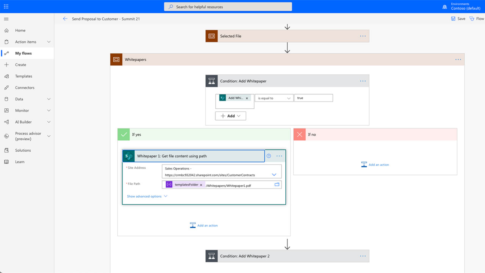

# Automazione dei documenti con Adobe Sign per Microsoft Power Platform

Informazioni su come attivare e utilizzare i connettori Adobe Sign e Adobe PDF Tools per Microsoft Power Apps. Creazione di flussi di lavoro che automatizzano i processi di approvazione e firma aziendali in modo rapido e sicuro senza codice. L&#39;esercitazione pratica è suddivisa in quattro parti, illustrate nei collegamenti seguenti:

<table style="table-layout:fixed">
<tr>
  <td>
    
    

    <a href="documentautomation.md#part1"><strong>Parte 1: Archivia contratto firmato in SharePoint con Adobe Sign</strong></a>
    

  </td>
  <td>
    
    

    <a href="documentautomation.md#part2"><strong>Parte 2: Processo di approvazione automatizzato per ottenere la firma elettronica con Adobe Sign</strong></a>
    

  </td>
  <td>
   
    

    <a href="documentautomation.md#part3"><strong>Parte 3: ACR per documenti automatizzati con Adobe PDF Tools</strong></a>
    

  </td>
  <td>
   
    

    <a href="documentautomation.md#part4"><strong>Parte 4: Assemblaggio automatico di documenti con Adobe PDF Tools</strong></a>
    

  </td>
</tr>
</table>

## Prerequisiti

* Familiarità con Microsoft 365 e Power Automate
* Conoscenza di Adobe Sign
* Account Microsoft 365 con accesso a SharePoint e Power Automate (Basic per Adobe Sign, Premium per Adobe PDF Tools)
* Adobe Sign per l&#39;account sviluppatore enterprise o Adobe Sign

**Esercizi 1 e 2**

* Account Adobe Sign con accesso all&#39;API. Account sviluppatore o account Enterprise.
* Sito di SharePoint accessibile da Power Automate per cui si dispone delle autorizzazioni di modifica. Si consiglia l&#39;accesso completo all&#39;amministratore.
* Documento di esempio per la richiesta di approvazione della firma e la firma.

**Esercizi 3 e 4**

Scarica materiali [qui](https://github.com/benvanderberg/adobe-sign-pdftools-powerautomate-tutorial)

## Parte 1: Archivia contratto firmato in SharePoint con Adobe Sign {#part1}

Nella prima parte verrà utilizzato un modello di flusso automatico di Power Automate per impostare un flusso di lavoro automatizzato che consente di salvare tutti i contratti firmati nel sito di SharePoint.

1. Passare a Automatizzazione alimentazione.
1. Search for Adobe Sign.

   

1. Scegliere **Salva un accordo di Adobe Sign completato nella libreria SharePoint**.

   

1. Esaminare la schermata e configurare le connessioni necessarie. Attivare la connessione Adobe Sign.
1. Fare clic sul simbolo blu `+`.

   

1. Immettere il messaggio di posta elettronica dell&#39;account di Adobe Sign e fare clic sul campo password nella nuova finestra.

   

   Aspettate un momento perché Adobe controlli il vostro account.

   >[!NOTE]
   >
   >Questo controllo consente di accedere al login appropriato se si utilizza un ID Adobe o il nostro SSO aziendale.

1. Accesso completo.
1. Fare clic su **Continua** per passare alla schermata di modifica Flusso.
1. Assegnare un nome al trigger.

   

1. Configurare le impostazioni di SharePoint.

   

   **Indirizzo sito:** Sito di SharePoint
   **Percorso cartella:** Percorso dei documenti condivisi che si desidera utilizzare
   **Nome file:** accettare l&#39;impostazione predefinita
   **Contenuto file:** accettare l&#39;impostazione predefinita

1. Salvare il flusso.

   

1. Passare alla schermata panoramica flusso con la freccia blu posteriore. Verificherete questo flusso nella parte 2.

   

Verificherete questo flusso nella parte successiva.

## Parte 2: Processo di approvazione automatizzato per ottenere la firma elettronica con Adobe Sign {#part2}

Nella seconda parte, costruiamo la prima parte con un flusso più robusto e testiamo entrambi i Flussi per vederli in azione.

1. Selezionare **Templates** sul lato sinistro dall&#39;interfaccia di Power Automate.

   

1. Cercare l&#39;approvazione del manager.
1. Selezionare **Approvazione del gestore richieste per un file selezionato**.

   

   Esaminare le connessioni e aggiungere le connessioni mancanti.

   >[!NOTE]
   >
   >Se si tratta del primo flusso che si sta effettuando con le approvazioni, verranno completamente configurati quando il flusso viene eseguito.

1. Fare clic su **Continua** per passare alla schermata di modifica del flusso.

   Questo flusso contiene molti passaggi preconfigurati, tra cui il controllo degli errori e i passaggi condizionali nidificati.

1. Configurare **Per un file selezionato** come segue:
   **Indirizzo sito:sito** di SharePoint
   **Nome libreria:repository** Documenti
1. Aggiungere un input come segue:
   **Tipo**: Posta elettronica
   **Nome**: Messaggio di posta elettronica del firmatario

   

1. Configurare **Ottieni proprietà file:** come segue:
   **Indirizzo sito:sito** di SharePoint
   **Nome libreria:repository** Documenti

1. Scorrere verso il basso e cercare **Se sì**.

   

1. Fare clic su **Aggiungi un&#39;azione** nella casella **Se sì** (non nella parte inferiore) per aggiungere i passaggi da inviare alla firma.

   

1. Cercare **SharePoint ottenere contenuto file** e scegliere **Ottieni contenuto file**.

   

1. Configurare **Ottieni contenuto file** come segue:

   

   **Indirizzo sito:** Sito di SharePoint.
   **Identificatore file:** cercare &quot;identificatore&quot; e scegliere Identificatore dalla fase  **Ottieni** delle proprietà del file.
1. Cercate &quot;Adobe&quot; e scegliete **Adobe Sign** per aggiungere un&#39;altra azione.

   

1. Immettere &quot;upload&quot; nella casella di ricerca per Adobe Sign e selezionare **Carica un documento e ottieni un ID documento**.
1. Cercare la variabile dinamica **Nome** per ottenere il nome dell&#39;elemento/documento selezionato nel trigger in **Nome file**.
1. Fare clic su **Espressione** nell&#39;assistente variabile in **Contenuto file**.

   

1. Aggiungere un singolo apostrofo, quindi fare clic di nuovo su **Contenuto dinamico**, eliminare l&#39;apostrofo, selezionare **Contenuto file** e quindi fare clic su **OK**.

   Assicuratevi che non vi siano apostrofi aggiuntivi e che assomigli al campione sottostante.

   

1. Cercate &quot;create&quot; nell&#39;area di ricerca di Adobe Sign per aggiungere un&#39;altra azione di Adobe Sign.
1. Selezionare **Crea e accetta da un documento caricato e invia la firma**.

   

1. Configurare le informazioni richieste:
Scegliere **Nome** dall&#39;assistente variabile dinamica in **Nome contratto**.
Scegliere **ID documento** dall&#39;assistente di variabile dinamica in **ID documento**.
Scegliere **Messaggio di posta elettronica del firmatario** dall&#39;assistente della variabile dinamica in **Posta elettronica partecipante**.
Immettere &quot;1&quot; in **Ordine partecipante**.
Scegliere **Firmatario** dall&#39;elenco a discesa in **Ruolo partecipante**.

   

1. **Salvate** il flusso.

### Prova il flusso

Andare al repository documenti del sito di SharePoint per verificarlo.

1. Selezionare il documento e scegliere **Automatizza** e **Flusso** appena creato.

   

1. Avviare il flusso per convalidare le connessioni (solo la prima esecuzione del flusso).
1. Immettere un messaggio descrittivo per l&#39;approvatore in **Messaggio**.
1. Immettere un messaggio di posta elettronica per il firmatario del documento in **Messaggio di posta elettronica del firmatario**.
1. Fare clic su **Esegui flusso**.

L&#39;approvatore configurato per l&#39;utente che avvia il flusso riceverà una richiesta di approvazione. È possibile approvare tramite posta elettronica o tramite il menu Power Automate Action Items.
Una volta approvato, firma il documento. A seconda dell&#39;utente e se sono connessi all&#39;accesso, potrebbe essere necessario aprire le finestre di firma in una finestra del browser privato.

Completare la firma, quindi tornare alla cartella di SharePoint.

## Parte 3: ACR per documenti automatizzati con Adobe PDF Tools {#part3}

Nella terza parte imparerai come automatizzare il riconoscimento in PDF quando vengono importati in Microsoft SharePoint. Si tratta di un problema che si verifica con documenti PDF digitalizzati che non sono ricercabili in SharePoint.

### Imposta una cartella in SharePoint

Passare a Microsoft SharePoint dove si desidera memorizzare i documenti.

1. Fare clic su **+ New** per creare una nuova cartella denominata &quot;Contratti elaborati&quot;.
1. Fare clic su **+ New** per creare una nuova cartella denominata &quot;Contratti precedenti&quot;.

   

Queste cartelle vengono ora utilizzate come parte del flusso di Power Automate.

### Creare un flusso da un modello

1. Accedi a https://flow.microsoft.com.
1. Fare clic su **Modelli** nella barra laterale.

   

1. Selezionare **Converti i nuovi file aggiunti in PDF ricercabile in SharePoint**.
1. Fare clic sul simbolo **+** accanto a Strumenti Adobe PDF.

   

1. Passare a https://www.adobe.com/go/powerautomate_getstarted in una nuova scheda.
1. Fare clic su **Get Started**.

   

1. Accedi con il tuo Adobe ID.

   

1. Immettere Nome credenziali e Descrizione credenziali e fare clic su **Crea credenziali**.

   

   Mantenere aperta la finestra con le credenziali. È necessario inserirli in Microsoft Power Automate.

   

1. Immettere le credenziali e fare clic su **Crea in Microsoft Power Automate**.

   

1. Fare clic su **Continua**.

   

   Ora è possibile visualizzare una visualizzazione del flusso di lavoro e configurare il flusso di lavoro per l&#39;ambiente.

1. Selezionare il campo Indirizzo sito e scegliere il sito di SharePoint utilizzato sotto il trigger **Quando un file viene creato in una cartella**.

   

1. Fare clic sull&#39;icona della cartella per passare alla cartella Contratti precedenti che si trova sotto ID cartella.

   

1. Modificare l&#39;azione **Crea file** nella parte inferiore del flusso:

   Modificare **Indirizzo sito** nell&#39;indirizzo del sito.
Specificare il percorso della cartella Contratti elaborati nel percorso cartella.

1. Fare clic su **Salva** nell&#39;angolo superiore destro.
1. Fare clic su **Test**.
1. Selezionare **Manualmente**.
1. Fare clic su **Test**.

   

### Prova il nuovo flusso

1. Passare alla cartella Contratti precedenti in SharePoint.
1. Passare a E03/Contratti precedenti nei file degli esercizi scaricati.
1. Copiare i file ReleaseFormXX.pdf nella cartella Contratti precedenti in SharePoint.

   

Ora, se si passa alla cartella Contratti elaborati, è possibile visualizzare i PDF disponibili dopo che il flusso ha ricevuto alcuni momenti da eseguire. Se si aprono i PDF, il testo è selezionabile.
Inoltre, SharePoint indicizza il documento, consentendo di cercare il contenuto dei documenti dalla barra di ricerca di SharePoint.

## Parte 4: Assemblaggio automatico di documenti con Adobe PDF Tools {#part4}

Nella quarta parte viene illustrato come unire più documenti in base alle informazioni fornite durante la selezione e l&#39;avvio di un flusso da Microsoft SharePoint. In questo scenario, il flusso:

* Chiedi informazioni per scegliere cosa includere in un pacchetto per un cliente.
* In base alle informazioni fornite, unisce molti documenti. Questi documenti includono una copertina e dei white paper opzionali.
* Il documento unito viene salvato in SharePoint.

### Importa file di esercizio in SharePoint

1. Aprire la cartella E04 nei file Esercizio.
1. Importare le cartelle Proposte, Modelli e Documenti generati in SharePoint.

   

Queste cartelle verranno utilizzate per riferimento. In particolare, per la proposta verrà utilizzato il file Proposta.docx.

Nella cartella Modelli è disponibile una cartella Copertina che include le copertine di città diverse. È inoltre disponibile una cartella Whitepapers contenente i white paper aggiuntivi facoltativi che verranno allegati all&#39;estremità se selezionata.

### Importare il flusso in Microsoft Power Automate

1. Accedere a Microsoft Power Automate (https://flow.microsoft.com).
1. Fare clic su **Flussi personali**.

   

1. Fare clic su **Importa**.

   

1. Fare clic su **Carica** e scegliere la cartella GenerateProposta_20210311231623.zip in E04/Flows/.

   

1. Fare clic su **Importa**.

1. Fare clic sull&#39;icona Chiave in Azione accanto a **Invia proposta al cliente**.

   

1. Selezionare **Crea come nuovo** in Setup.
1. Impostare il nome del flusso in Nome risorsa.
1. Fare clic su **Salva**.

   Ripetere l&#39;operazione per le altre risorse correlate e selezionare la connessione.

   

1. Fare clic su **Importa** dopo aver effettuato tutte le connessioni.

### Imposta per un file selezionato

Dopo aver creato il flusso, eseguire le operazioni seguenti:

1. Fare clic su **Modifica**.

   

1. Selezionare il trigger **Per un file selezionato**.

   Aggiungere il sito di SharePoint nell&#39;indirizzo del sito.
Aggiungere la libreria nella libreria.

   

### Imposta percorsoCartellaModello

1. Fare clic sulla variabile templateFolderPath.
1. Impostare il percorso in cui si trova la cartella Modelli all&#39;interno del sito di SharePoint importato.

### Imposta contenuto file recupero copertina

1. Fare clic sull&#39;azione **Copertura** per espandere l&#39;ambito.
1. Espandi **Copertura: Ottieni contenuto file**.

   Impostare l&#39;indirizzo del sito sul sito di SharePoint.

   

### Imposta file selezionato

1. Espandere l&#39;azione dell&#39;ambito **File selezionato**.

   Modificare l&#39;indirizzo del sito e il nome della libreria nel sito e nella libreria di SharePoint rispettivamente in **Ottieni proprietà file**.
Modificare l&#39;indirizzo del sito nel sito di SharePoint in **Ottieni contenuto file**.

   

### Imposta white paper

1. Fare clic sull&#39;azione **White paper**.
1. Espandi **Condizione: Aggiungi white paper**.

   

1. Espandi **White paper 1: Ottenere il contenuto del file utilizzando il percorso**.
Modificare l&#39;indirizzo del sito nel sito di SharePoint specificato.

Ripetere gli stessi passaggi per **Condizione: Aggiungi white paper 2**.

### Imposta Crea file

1. Espandere **Crea file**.

   Modificare l&#39;indirizzo del sito e il percorso della cartella nel sito e nel percorso di SharePoint in cui si trova la cartella Docs generati.

1. Fare clic su **Salva**.

### Prova il flusso

1. Passare alla cartella Proposta in SharePoint.
1. Selezionare la cartella Proposta.docx.

   

1. Selezionare il flusso dal menu **Automatizza**.

   

1. Fare clic su **Continua** per iniziare il flusso.

   

1. Scegli la copertura e i white paper che vuoi aggiungere.
1. Fare clic su **Esegui flusso**.

   

Passare alla cartella Genera docs. È ora necessario visualizzare il file PDF generato.

### Aggiunta di azioni di protezione e di altro tipo al flusso

Dopo aver creato correttamente un flusso, modificherete il flusso per crittografare il documento PDF con una password. Viene inoltre illustrato come utilizzare altre azioni.

1. Tornare alla fine del flusso.
1. Fare clic sul simbolo **+** tra **Unisci PDF** e **Crea file**.

   

1. Selezionare **Aggiungi un&#39;azione**.
1. Cercate &quot;Adobe PDF Tools&quot;.

   

1. Selezionare **Proteggi PDF dalla visualizzazione**.
1. Utilizzare il contenuto dinamico per impostare il campo Nome file su **Nome file PDF da Merge PDF**.

   

   Nel trigger è presente un campo Password che fa parte del modulo di avvio. Possiamo usarlo qui.

1. Cercare il campo **Password** utilizzando il contenuto dinamico e inserirlo nel campo Password.

   

1. Utilizzare il contenuto dinamico per impostarlo su **Contenuto file PDF da Merge PDF** nel campo Contenuto file.
1. Modificare il **Crea file** per ottenere il contenuto del file da Proteggi PDF anziché Unisci PDF.
1. Espandere **Crea file**.
1. Deselezionare il campo Contenuto file.
1. Utilizzare il contenuto dinamico per inserire **PDF File Content** da **Proteggi PDF dalla visualizzazione**.

### Prova il flusso

1. Passare alla cartella Proposta in SharePoint.
1. Selezionare Proposta.docx.

   

1. Selezionare **Automatizza** per scegliere il flusso.

   

1. Fare clic su **Continua** per iniziare il flusso.

   

1. Scegliere il Copertina e i white paper che si desidera aggiungere.
1. Impostare il campo Password sulla password che si desidera impostare.
1. Fare clic su **Esegui flusso**.

   

1. Passare alla cartella Genera docs.
Visualizzare il file PDF generato. Aprire il file PDF e viene richiesto di immettere la password PDF.

   
