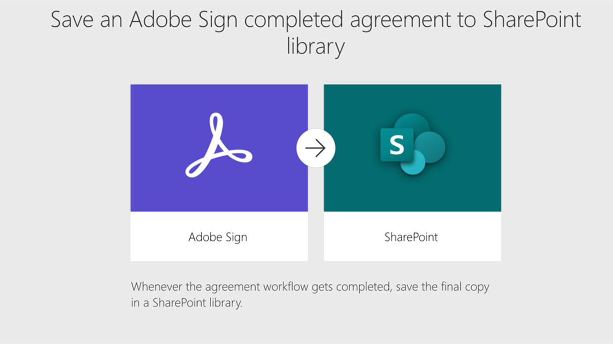
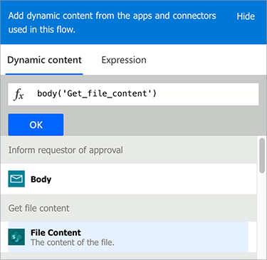
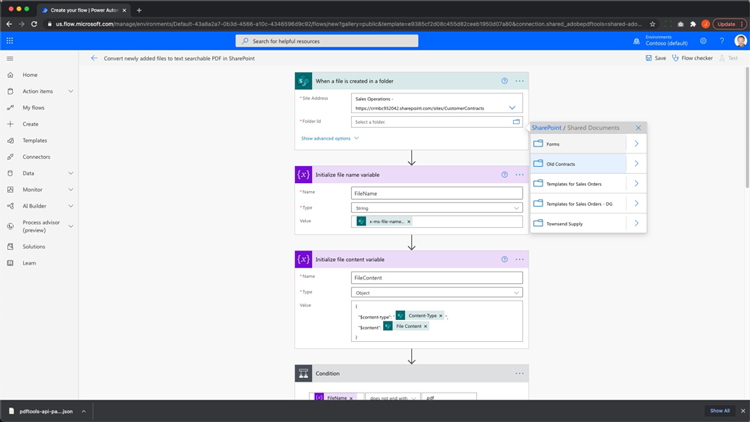

# Automazione dei documenti con Acrobat Sign per Microsoft Power Platform

Scopri come attivare e utilizzare i connettori Acrobat Sign e Adobe PDF Tools per Microsoft Power Apps. Crea flussi di lavoro che automatizzano i processi di approvazione e firma aziendali in modo rapido e sicuro, senza bisogno di codice. Questa esercitazione pratica è suddivisa in quattro parti, descritte nei collegamenti seguenti:

<table style="table-layout:fixed">
<tr>
  <td>
    
    

    <a href="documentautomation.md#part1"><strong>Parte 1: Archiviare gli accordi firmati in SharePoint con Acrobat Sign</strong></a>
    

  </td>
  <td>
    
    

    <a href="documentautomation.md#part2"><strong>Parte 2: Processo di approvazione automatizzato per ottenere la firma elettronica con Acrobat Sign</strong></a>
    

  </td>
  <td>
   
    

    <a href="documentautomation.md#part3"><strong>Parte 3: OCR automatico dei documenti con Adobe PDF Tools</strong></a>
    

  </td>
  <td>
   
    

    <a href="documentautomation.md#part4"><strong>Parte 4: Assemblaggio automatico dei documenti con Adobe PDF Tools</strong></a>
    

  </td>
</tr>
</table>

## Prerequisiti

* Microsoft 365 e familiarità con Power Automate
* conoscenza di Acrobat Sign
* Account Microsoft 365 con accesso a SharePoint e Power Automate (Basic per Acrobat Sign, Premium per Adobe PDF Tools)
* Account per sviluppatori Acrobat Sign for enterprise o Acrobat Sign

**Esercizi 1 e 2**

* Account Acrobat Sign con accesso all’API. Un account sviluppatore o un account Enterprise.
* SharePoint sito accessibile da Power Automate per il quale disponi delle autorizzazioni di modifica. Si consiglia l’accesso amministratore completo.
* Documento di esempio per la richiesta e la firma di approvazione della firma.

**Esercizi 3 e 4**

Download dei materiali [qui](https://github.com/benvanderberg/adobe-sign-pdftools-powerautomate-tutorial)

## Parte 1: Archiviare gli accordi firmati in SharePoint con Acrobat Sign {#part1}

Nella prima parte, userai un modello Power Automate Flow per configurare un flusso di lavoro automatizzato che salverà tutti gli accordi firmati nel tuo sito SharePoint.

1. Passa a Power Automate.
1. Cerca Acrobat Sign.

   

1. Scegli **Salvare un accordo Acrobat Sign completato nella libreria SharePoint**.

   

1. Rivedi la schermata e configura tutte le connessioni necessarie. Abilita la connessione Acrobat Sign.
1. Fate clic sul blu `+` simbolo.

   

1. Immetti il tuo indirizzo e-mail dell’account Acrobat Sign e fai clic sul campo password nella nuova finestra.

   

   Attendi un momento per un Adobe per controllare il tuo account.

   >[!NOTE]
   >
   >Questo controllo ti indirizzerà all&#39;accesso appropriato se utilizzi un Adobe ID o un SSO aziendale.

1. Accesso completo.
1. Fai clic su **Continua** per passare alla schermata di modifica del flusso.
1. Assegna un nome al trigger.

   

1. Configura le impostazioni di SharePoint.

   

   **Indirizzo del sito:** Sito SharePoint
   **Percorso cartella:** Percorso dei documenti condivisi da utilizzare
   **Nome file:** Accetta il valore predefinito
   **Contenuto file:** Accetta il valore predefinito

1. Salvare il flusso.

   

1. Passa alla schermata della panoramica del flusso con la freccia indietro blu. Questo flusso verrà provato nella parte 2.

   

Questo flusso verrà provato nella parte successiva.

## Parte 2: Processo di approvazione automatizzato per ottenere la firma elettronica con Acrobat Sign {#part2}

Nella seconda parte, si sviluppa la prima parte con un flusso più robusto e si provano entrambi i flussi per vederli in azione.

1. Seleziona **Modelli** sul lato sinistro dall’interfaccia di Power Automate.

   

1. Cerca &quot;approvazione manager&quot;.
1. Seleziona **Richiedi l’approvazione del Manager per un file selezionato**.

   

   Verifica le connessioni e aggiungi quelle mancanti.

   >[!NOTE]
   >
   >Se si tratta del primo flusso che si sta eseguendo con le approvazioni, queste verranno configurate completamente quando il flusso viene eseguito.

1. Fai clic su **Continua** per passare alla schermata di modifica del flusso.

   Questo flusso contiene molti passaggi preconfigurati, tra cui la verifica degli errori e passaggi condizionali nidificati.

1. Configura **Per un file selezionato** come segue:
   **Indirizzo del sito:** Il tuo sito SharePoint
   **Nome libreria:** Il repository dei documenti
1. Aggiungere un input nel modo seguente:
   **Tipo**: E-mail
   **Nome**: E-mail firmatario

   

1. Configura **Ottieni proprietà file:** come segue:
   **Indirizzo del sito:** Il tuo sito SharePoint
   **Nome libreria:** Il repository dei documenti

1. Scorri verso il basso e cerca **Se sì**.

   

1. Fai clic su **Aggiungere un’azione** nel **Se sì** per aggiungere i passaggi da inviare per la firma.

   

1. Cerca **SharePoint ottieni i contenuti dei file** e scegliere **Ottenere il contenuto del file**.

   

1. Configura il **Ottenere il contenuto del file** come segue:

   

   **Indirizzo del sito:** Il tuo sito SharePoint.
   **Identificatore file:** Cerca &quot;identifier&quot; e scegli Identifier dal menu **Ottieni proprietà file** passo.
1. Cerca &quot;Adobe&quot; e scegli **Acrobat Sign** per aggiungere un’altra azione.

   

1. Immetti &quot;upload&quot; nella casella di ricerca di Acrobat Sign e seleziona **Caricare un documento e ottenere un ID documento**.
1. Ricerca della variabile dinamica **Nome** per ottenere il nome dell’elemento/documento selezionato nel trigger in **Nome file**.
1. Fai clic su **Espressione** nell&#39;assistente variabile sotto **Contenuto file**.

   

1. Aggiungere un solo apostrofo, quindi fare clic di nuovo su **Contenuto dinamico**, eliminare l&#39;apostrofo, selezionare **Contenuto file** quindi fai clic su **OK**.

   Accertati che non siano presenti apostrofi aggiuntivi e che l’aspetto sia quello del campione sottostante.

   

1. Cerca &quot;create&quot; nell’area di ricerca di Acrobat Sign per aggiungere un’altra azione Acrobat Sign.
1. Seleziona **Creare e firmare un accordo da un documento caricato e inviarlo per la firma**.

   

1. Configura le informazioni richieste: Scegli **Nome** dall&#39;assistente variabile dinamica **Nome accordo**.
Scegli **ID documento** dall&#39;assistente variabile dinamica **ID documento**.
Scegli **E-mail firmatario** dall&#39;assistente variabile dinamica **E-mail partecipante**.
Immettere &quot;1&quot; in **Ordine partecipante**.
Scegli **Firmatario** dal menu a discesa **Ruolo partecipante**.

   

1. **Salva** il flusso.

### Prova del flusso

Accedi al repository di documenti del tuo sito SharePoint per testarlo.

1. Seleziona il documento e scegli **Automatizza** e la proprietà **Flusso** hai appena creato.

   

1. Avviate il flusso per convalidare le connessioni (solo la prima esecuzione del flusso).
1. Immetti un messaggio simpatico all’approvatore in **Messaggio**.
1. Immetti l’e-mail per il firmatario del documento **E-mail firmatario**.
1. Fai clic su **Flusso di esecuzione**.

L’approvatore configurato per l’utente che avvia il flusso riceve una richiesta di approvazione. Puoi approvare tramite e-mail o tramite il menu Power Automate Action Items.
Una volta approvato, firma il documento. A seconda dell’utente e se ha effettuato l’accesso a Sign, potrebbe essere necessario aprire le finestre di firma in una finestra del browser privata.

Completa la firma e riprova nella cartella SharePoint.

## Parte 3: OCR automatico dei documenti con Adobe PDF Tools {#part3}

Nella terza parte, imparerai come automatizzare l’OCR nei PDF quando vengono importati in Microsoft SharePoint. Ciò risolve un problema che si verifica con i documenti PDF acquisiti da scanner che non sono ricercabili in SharePoint.

### Impostare una cartella in SharePoint

Accedi a Microsoft SharePoint, dove desideri archiviare i documenti.

1. Fai clic su **+ Nuovo** per creare una nuova cartella denominata &quot;Contratti elaborati&quot;.
1. Fai clic su **+ Nuovo** per creare una nuova cartella denominata &quot;Contratti precedenti&quot;.

   

Queste cartelle sono ora indicate come parte del flusso di Power Automate.

### Creare un flusso da un modello

1. Accedete a https://flow.microsoft.com.
1. Fai clic su **Modelli** nella barra laterale.

   

1. Seleziona **Convertire i file appena aggiunti in PDF con testo ricercabile in SharePoint**.
1. Fate clic sul **+** accanto a Adobe PDF Tools.

   

1. Passate a https://www.adobe.com/go/powerautomate_getstarted in una nuova scheda.
1. Fai clic su **Guida introduttiva**.

   

1. Accedi con il tuo Adobe ID.

   

1. Immetti il nome e la descrizione delle credenziali e fai clic su **Crea credenziali**.

   

   Tenete aperta la finestra con le credenziali. Dovrai inserirli in Microsoft Power Automate.

   

1. Immetti le credenziali e fai clic su **Creare in Microsoft Power Automate**.

   

1. Fai clic su **Continua**.

   

   Ora puoi visualizzare il flusso di lavoro e dovrai configurarlo per il tuo ambiente.

1. Seleziona il campo Indirizzo sito e scegli il sito SharePoint che stai utilizzando sotto il trigger chiamato **Quando un file viene creato in una cartella**.

   

1. Fai clic sull’icona della cartella per accedere alla cartella Contratti precedenti, sotto l’ID cartella.

   

1. Modificare la proprietà **Crea file** azione in fondo al flusso:

   Cambiare **Indirizzo del sito** all&#39;indirizzo del sito.
Specificate la posizione della cartella Contratti elaborati nel percorso della cartella.

1. Fai clic su **Salva** in alto a destra.
1. Fai clic su **Test**.
1. Seleziona **Manualmente**.
1. Fai clic su **Test**.

   

### Prova il nuovo flusso

1. Accedi alla cartella Contratti precedenti in SharePoint.
1. Accedi a E03/Old Contracts nei file di esercizi scaricati.
1. Copia i file ReleaseFormXX.pdf nella cartella Old Contracts in SharePoint.

   

Ora, se passi alla cartella Contratti elaborati, puoi vedere i tuoi PDF disponibili dopo che il flusso ha avuto alcuni momenti di esecuzione. Se aprite i PDF, il testo è selezionabile.
Inoltre, SharePoint indicizza il documento, consentendo di cercare il contenuto dei documenti dalla barra di ricerca in SharePoint.

## Parte 4: Assemblaggio automatico dei documenti con Adobe PDF Tools {#part4}

Nella quarta parte, verrà illustrato come unire più documenti in base alle informazioni fornite durante la selezione e l&#39;avvio di un flusso da Microsoft SharePoint. In questo scenario, il flusso:

* Chiedi informazioni per scegliere cosa includere in un pacchetto per un cliente.
* In base alle informazioni fornite, unisce molti documenti. Questi documenti includono una copertina e white paper opzionali.
* Il documento unito viene salvato in SharePoint.

### Importare file di esercizi in SharePoint

1. Aprite la cartella E04 nei file Exercise.
1. Importa le cartelle Proposta, Modelli e Documenti generati in SharePoint.

   

Queste cartelle verranno utilizzate come riferimento. In particolare, utilizzerai il file Proposal.docx per la tua proposta.

Nella cartella Templates, è presente una cartella Covers che include i disegni delle copertine per diverse città. È inoltre presente una cartella Whitepapers che contiene altri white paper opzionali che, se selezionati, verranno allegati alla fine.

### Importare il flusso in Microsoft Power Automate

1. Accedi a Microsoft Power Automate (https://flow.microsoft.com).
1. Fai clic su **I miei flussi**.

   

1. Fai clic su **Importazione**.

   

1. Fai clic su **Carica** e scegli la cartella GenerateProposal_2021031231623.zip in E04/Flows/.

   

1. Fai clic su **Importazione**.

1. Fai clic sull’icona a forma di chiave inglese sotto Azione accanto a **Invia proposta al cliente**.

   

1. Seleziona **Crea come nuovo** in Configurazione.
1. Impostate il nome del flusso in Nome risorsa.
1. Fare clic su **Salva**.

   Ripeti questa operazione per altre risorse correlate e seleziona la connessione.

   

1. Fai clic su **Importazione** dopo aver stabilito tutte le connessioni.

### Imposta per un file selezionato

Dopo aver creato il flusso, effettuate le seguenti operazioni:

1. Fai clic su **Modifica**.

   

1. Seleziona il trigger **Per un file selezionato**.

   Aggiungete il sito SharePoint all&#39;indirizzo del sito.
Aggiungi la libreria nella libreria.

   

### Imposta templateFolderPath

1. Fare clic sulla variabile templateFolderPath.
1. Impostate il percorso in cui si trova la cartella Templates all&#39;interno del sito SharePoint importato.

### Imposta copertina Ottieni contenuto file

1. Fai clic su **Copertina** , che espande l&#39;area di validità.
1. Espandi **Copertina: Ottieni contenuto file**.

   Imposta l&#39;indirizzo del sito SharePoint.

   

### Imposta file selezionato

1. Espandere la proprietà **File selezionato** area di validità.

   Cambia l&#39;indirizzo del sito e il nome della libreria rispettivamente in SharePoint e Libreria in **Ottieni proprietà file**.
Cambiare l&#39;indirizzo del sito nel sito SharePoint in **Ottenere il contenuto del file**.

   

### Impostare I Documenti

1. Fai clic su **Documenti informativi** azione.
1. Espandi **Condizione: Aggiungi Whitepaper**.

   

1. Espandi **Whitepaper 1: Ottenere il contenuto del file utilizzando il percorso**.
Modificate l&#39;indirizzo del sito nel sito SharePoint specificato.

Ripeti gli stessi passaggi per **Condizione: Aggiungi Whitepaper 2**.

### Imposta Crea file

1. Espandi **Crea file**.

   Modificate l&#39;indirizzo del sito e il percorso della cartella nel sito e nel percorso di SharePoint in cui si trova la cartella Documenti generati.

1. Fare clic su **Salva**.

### Verifica del flusso

1. Accedi alla cartella Proposta in SharePoint.
1. Selezionate la cartella Proposal.docx.

   

1. Seleziona il flusso sotto il **Automatizza** menu.

   

1. Fai clic su **Continua** per iniziare il flusso.

   

1. Scegli la copertina e i white paper da aggiungere.
1. Fai clic su **Flusso di esecuzione**.

   

Accedi alla cartella Genera documento . A questo punto è necessario visualizzare il file PDF generato.

### Aggiunta di Protect e altre azioni al flusso

Ora che hai creato correttamente un flusso, modificherai il flusso per cifrare il documento PDF con una password. Questa procedura illustra anche come utilizzare altre azioni.

1. Torna alla fine del flusso.
1. Fate clic sul **+** simbolo tra **Unisci PDF** e **Crea file**.

   

1. Seleziona **Aggiungere un’azione**.
1. Cerca &quot;Adobe PDF Tools&quot;.

   

1. Seleziona **Protect PDF da visualizzazione**.
1. Usa contenuto dinamico per impostare il campo Nome file su **Nome file PDF da Merge PDF**.

   

   Nel trigger è presente un campo Password che fa parte del modulo di iniziazione. Possiamo usarlo qui.

1. Cerca **Campo Password** utilizzando il contenuto dinamico e inserirlo nel campo Password.

   

1. Usa contenuto dinamico per impostarlo su **Contenuto file PDF da PDF di unione** nel campo Contenuto file.
1. Cambiare la proprietà **Crea file** per ottenere il contenuto del file da Protect PDF anziché da Unisci PDF.
1. Espandi **Crea file**.
1. Cancella il campo Contenuto file.
1. Usa contenuto dinamico per inserire **Contenuto file PDF** da **Protect PDF da visualizzazione**.

### Verifica del flusso

1. Accedi alla cartella Proposta in SharePoint.
1. Selezionate Proposal.docx.

   

1. Seleziona **Automatizza** per scegliere il flusso.

   

1. Fai clic su **Continua** per iniziare il flusso.

   

1. Scegliete la copertina e i white paper da aggiungere.
1. Impostare il campo Password sulla password da impostare.
1. Fai clic su **Flusso di esecuzione**.

   

1. Accedi alla cartella Genera documento .
Il file PDF generato deve essere visualizzato. Aprite il file PDF e viene richiesto di immettere la password del PDF.

   
