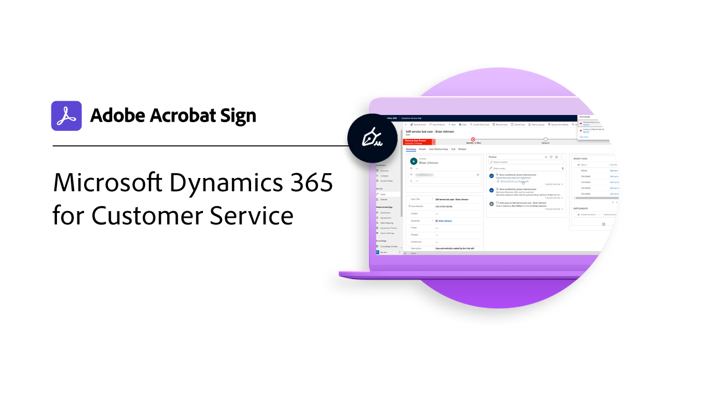

# Panoramica sulle integrazioni

Puoi utilizzare Acrobat Sign in altre applicazioni già utilizzate dalla tua organizzazione, ad esempio Microsoft, Salesforce, Workday e Marketo per citarne alcune. Scopri come semplificare i flussi di lavoro per firma elettronica in queste guide ed esercitazioni di integrazione.

>[!NOTE]
> Se hai problemi ad accedere a una di queste funzioni, verifica con l&#39;amministratore della tua organizzazione che l&#39;integrazione sia abilitata.

## Novità

* [Integrazione della scheda Documenti per [!DNL Microsoft Teams]](acrobat-sign-teams-documents-tab.md)
Scopri come inviare i documenti per la firma direttamente dalla scheda Documenti in [!DNL Microsoft Teams]
* [Live Sign in Adobe Acrobat Sign per [!DNL Microsoft Teams]](live-sign-microsoft-teams.md)
Scopri come creare un’esperienza di firma online simile alla firma di persona durante un [!DNL Microsoft Teams] riunione
* [Crea un flusso di lavoro avanzato con [!DNL Power Automate]](advanced-workflow-power-automate.md)
Scopri come creare un flusso di lavoro avanzato utilizzando [!DNL Power Automate] connettori

## Esercitazioni sulle integrazioni Microsoft

<table style="table-layout:fixed">
<tr>
  <td>
    
    

    <a href="fill-and-sign-doc-microsoft-outlook.md"><strong>Compilazione e firma in Microsoft Outlook</strong></a>
    

    <em>Compilare e firmare un modulo direttamente in Microsoft Outlook</em>
     
  </td>
  <td>
    
    

    <a href="send-for-signature-with-outlook.md"><strong>Inviare per la firma in Outlook</strong></a>
    

    <em>Inviare un documento per la firma direttamente in Microsoft Outlook</em>
     
  </td>
  <td>
    
    

    <a href="send-for-signature-with-sharepoint-online.md"><strong>Inviare per la firma in SharePoint Online</strong></a>
    

    <em>Inviare un documento per la firma direttamente in SharePoint Online</em>
     
  </td>
   <td>
    
    

    <a href="track-an-agreement-with-sharepoint-online.md"><strong>Tracciamento in SharePoint Online</strong></a>
    

    <em>Tenere traccia dell’avanzamento di un accordo direttamente in Microsoft Sharepoint</em>
     
  </td>
</tr>
<tr>
  <td>
    
    

    <a href="integrate-web-form-sharepoint-online.md"><strong>Integrare un modulo Web con [!DNL SharePoint Online]</strong></a>
    

    <em>Scopri come mappare i dati raccolti da un modulo Web in un [!DNL SharePoint] elenco</em>
     
  </td>
  <td>
    
    

    <a href="auto-archive-sharepoint-power-automate.md"><strong>Archiviazione automatica dei file in [!DNL SharePoint] con [!DNL Power Automate]</strong></a>
    

    <em>Scopri come archiviare automaticamente i documenti firmati in un [!DNL SharePoint] libreria che utilizza [!DNL Power Automate]</em>
     
  </td>
  <td>
    
    

    <a href="documentautomation.md"><strong>Automazione dei documenti con [!DNL Acrobat Sign for Microsoft Power Platform]</strong></a>
    

    <em>Scopri come attivare e utilizzare il [!DNL Acrobat Sign] e [!DNL Adobe PDF Tools] connettori [!DNL Microsoft Power] app</em>
     
  </td>
   <td>
    
    

    <a href="adobe-sign-teams-mortgage.md"><strong>Invia per firma in [!DNL Microsoft Teams]</strong></a>
    

    <em>Inviare documenti per la firma direttamente all’interno [!DNL Microsoft Teams]</em>
     
  </td>
</tr>
<tr>
  <td>
    
    

    <a href="live-sign-microsoft-teams.md"><strong>Live Sign in Adobe Acrobat Sign per [!DNL Microsoft Teams]</strong></a>
    

    <em>Scopri come creare un’esperienza di firma online simile alla firma di persona durante un [!DNL Microsoft Teams] riunione</em>
     
  </td>
   <td>
    
    

    <a href="acrobat-sign-teams-documents-tab.md"><strong>Integrazione della scheda Documenti per [!DNL Microsoft Teams]</strong></a>
    

    <em>Scopri come inviare i documenti per la firma direttamente dalla scheda Documenti in [!DNL Microsoft Teams]</em>
     
  </td>
 <td>
    
    

    <a href="simple-workflow-power-automate.md"><strong>Crea un flusso di lavoro semplice con [!DNL Power Automate]</strong></a>
    

    <em>Scopri come creare un flusso di lavoro semplice utilizzando [!DNL Power Automate] connettori</em>
     
  </td>
  <td>
    
    

    <a href="advanced-workflow-power-automate.md"><strong>Crea un flusso di lavoro avanzato con Power Automate</strong></a>
    

    <em>Scopri come creare un flusso di lavoro avanzato utilizzando [!DNL Power Automate] connettori</em>
     
  </td>
<tr>
  <td>
    
    

    <a href="dynamics-customer-service.md"><strong>Microsoft Dynamics 365 per il servizio clienti</strong></a>
    

    <em>Scopri come Acrobat Sign e [!DNL Microsoft Dynamics 365] per il servizio clienti vengono utilizzati per migliorare la soddisfazione dei clienti su un portale Web self-service per i clienti</em>
     
  </td>
  <td>
    
    

    <a href="dynamics-field-service.md"><strong>Microsoft Dynamics 365 per Field Service</strong></a>
    

    <em>Scopri come utilizzare Acrobat Sign, [!DNL Power Automate]e [!DNL Microsoft Dynamics 365] per l'assistenza sul campo vengono utilizzati per semplificare gli interventi in loco dei clienti</em>
     
  </td>
  <td>
    
    

    <a href="dynamics-sales.md"><strong>Microsoft Dynamics 365 for Sales</strong></a>
    

    <em>Scopri come Acrobat Sign e [!DNL Microsoft Dynamics 365] for Sales vengono utilizzati per automatizzare il processo di firma delle offerte di vendita</em>
     
  </td>
  <td>
    
    

     
  </td>
</tr>
</table>

## [!DNL Notarize] esercitazioni di integrazione

<table style="table-layout:fixed">
<tr>
  <td>
    
    

    <a href="send-document-notarize.md"><strong>Inviare documenti per l’autenticazione</strong></a>
    

    <em>Scopri come inviare un documento per l’autenticazione</em>
     
  </td>
  <td>
    
    

     
  </td>
  <td>
    
    

     
  </td>
  <td>
    
    

     
  </td>
</tr>
</table>

## Esercitazioni sulle integrazioni Salesforce

<table style="table-layout:fixed">
<tr>
  <td>
    
    

    <a href="create-an-agreement-template.md"><strong>Document Builder per [!DNL Salesforce]</strong></a>
    

    <em>Scopri come creare un modello di documento riutilizzabile utilizzando Document Builder per [!DNL Salesforce]</em>
     
  </td>
  <td>
    
    

    <a href="set-up-data-mapping.md"><strong>Impostazione della mappatura dati</strong></a>
    

    <em>Recupero dei dati in Salesforce dopo la firma di un accordo</em>
     
  </td>
  <td>
    
    

    <a href="set-up-merging-map.md"><strong>Impostazione della mappatura unione in Salesforce</strong></a>
    

    <em>Scopri come unire i dati da Salesforce direttamente in un documento Acrobat Sign</em>
     
  </td>
  <td>
    
    

    <a href="create-a-custom-button.md"><strong>Creazione di un pulsante personalizzato</strong></a>
    

    <em>Crea un pulsante personalizzato che avvia il processo di invio e inserisce automaticamente i dati in un accordo in Salesforce</em>
     
  </td>
</tr>
</table>

## Esercitazioni per l’integrazione di Workday

<table style="table-layout:fixed">
<tr>
 <td>
    
    

    <a href="acrobat-sign-workday-onboarding.md"><strong>Onboarding di Acrobat Sign + Workday per nuove assunzioni</strong></a>
    

    <em>Scopri come semplificare i flussi di lavoro di onboarding con Acrobat Sign + Workday</em>
     
  </td>
 <td>
    
    

     
  </td>
  <td>
    
    

     
  </td>
  <td>
    
    

     
  </td>
</tr>
</table>

## Esercitazioni di integrazione e guide alla configurazione di Marketo

<table style="table-layout:fixed">
<tr>
  <td>
    
    

    <a href="marketo-salesforce-sms.md"><strong>Inviare notifiche utilizzando Acrobat Sign per Salesforce e Marketo</strong></a>
    

    <em>Scopri come inviare un messaggio di testo, un’e-mail o una notifica push per informare il firmatario che è in arrivo un accordo</em>
     
  </td>
  <td>
    
    

    <a href="marketo-salesforce-reminder.md"><strong>Inviare promemoria utilizzando l’esercitazione video Adobe Sign for Salesforce e Marketo</strong></a>
    

    <em>Scopri come inviare un promemoria via e-mail da Marketo quando un accordo non viene firmato dopo un certo periodo di tempo</em>
     
  </td>
  <td>
    
    

    <a href="marketo-salesforce-reminder.md"><strong>Inviare promemoria utilizzando la guida alla configurazione di Acrobat Sign per Salesforce e Marketo</strong></a>
    

    <em>Leggi come inviare un promemoria via e-mail da Marketo quando un accordo non viene firmato dopo un certo periodo di tempo</em>
     
  </td>
   <td>
    
    

    <a href="marketo-dynamics-reminder.md"><strong>Inviare promemoria utilizzando Acrobat Sign per Microsoft Dynamics e Marketo</strong></a>
    

    <em>Scopri come inviare un promemoria e-mail quando un accordo non viene firmato dopo un certo periodo di tempo</em>
     
  </td>
</tr>
<tr>
  <td>
    
    

    <a href="marketo-dynamics-sms.md"><strong>Inviare notifiche utilizzando Acrobat Sign per Microsoft Dynamics e Marketo</strong></a>
    

    <em>Scopri come inviare un messaggio di testo, un’e-mail o una notifica push per informare il firmatario che è in arrivo un accordo</em>
     
  </td>
  <td>
    
    

     
  </td>
  <td>
    
    

     
  </td>
  <td>
    
    

     
  </td>
</tr>
</table>
