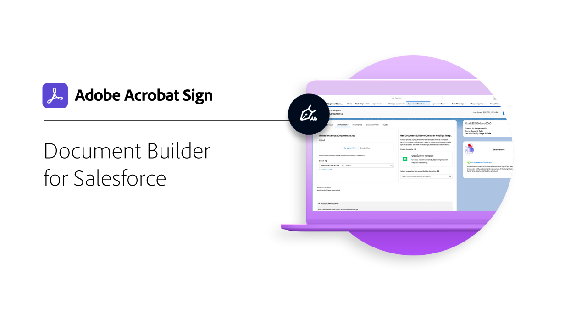

# Integrare panoramica

È possibile utilizzare Adobe Sign all&#39;interno di altre applicazioni già utilizzate dall&#39;organizzazione, ad esempio Microsoft, Salesforce, Workday e Marketo per nominarne alcune. Informazioni su come semplificare i flussi di lavoro di firma elettronica in queste guide e esercitazioni di integrazione.

>[!NOTE]
> Se si verificano problemi nell&#39;accesso a una di queste funzionalità, rivolgersi all&#39;amministratore dell&#39;organizzazione per verificare che l&#39;integrazione sia abilitata.

## Esercitazioni sulle integrazioni Microsoft

<table style="table-layout:fixed">
<tr>
  <td>
    
    

    <a href="fill-and-sign-doc-microsoft-outlook.md"><strong>Compilazione e firma di Microsoft Outlook</strong></a>
    

    <em>Compilare e firmare un modulo direttamente in Microsoft Outlook</em>
     
  </td>
  <td>
    
    

    <a href="send-for-signature-with-outlook.md"><strong>Invia per firma in Outlook</strong></a>
    

    <em>Invia un documento per la firma direttamente in Microsoft Outlook</em>
     
  </td>
  <td>
    
    

    <a href="send-for-signature-with-sharepoint-online.md"><strong>Invia per firma in SharePoint Online</strong></a>
    

    <em>Invia un documento per la firma direttamente all'interno di Sharepoint Online</em>
     
  </td>
</tr>
<tr>
  <td>
    
    

    <a href="track-an-agreement-with-sharepoint-online.md"><strong>Registrazione in SharePoint Online</strong></a>
    

    <em>Tenere traccia dello stato di avanzamento di un accordo direttamente all'interno di Microsoft Sharepoint</em>
     
  </td>
  <td>
    
    

    <a href="adobe-sign-teams-mortgage.md"><strong>Invio di documenti per la firma in [!DNL Microsoft Team]</strong></a>
    

    <em>Invia documenti per firma direttamente all'interno di [!DNL Microsoft Team]</em>
     
  </td>
  <td>
    
    

    <a href="documentautomation.md"><strong>Automazione dei documenti con Adobe Sign per Microsoft Power Platform</strong></a>
    

    <em>Informazioni su come attivare e utilizzare i connettori Adobe Sign e Adobe PDF Tools per Microsoft Power Apps</em>
     
  </td>
</tr>
</table>

## Esercitazioni sulle integrazioni di Salesforce

<table style="table-layout:fixed">
<tr>
  <td>
    
    

    <a href="create-an-agreement-template.md"><strong>Creazione di un modello di documento in Adobe Sign for Salesforce</strong></a>
    

    <em>Creare un modello di documento riutilizzabile per fornire velocità e coerenza</em>
     
  </td>
  <td>
    
    

    <a href="set-up-data-mapping.md"><strong>Impostazione della mappatura dei dati</strong></a>
    

    <em>Richiama i dati in Salesforce dopo la firma di un accordo</em>
     
  </td>
  <td>
    
    

    <a href="set-up-merging-map.md"><strong>Impostazione del mapping di unione</strong></a>
    

    <em>Unisci i dati da Salesforce direttamente in un accordo</em>
     
  </td>
</tr>
<tr>
  <td>
    
    

    <a href="create-a-custom-button.md"><strong>Creazione di un pulsante personalizzato</strong></a>
    

    <em>Crea un pulsante personalizzato che avvia il processo di invio e inserisce automaticamente un accordo all'interno di Salesforce</em>
     
  </td>
  <td>
    
    

     
  </td>
  <td>
    
    

     
  </td>
</tr>
</table>

## Esercitazioni sull&#39;integrazione dei giorni lavorativi

<table style="table-layout:fixed">
<tr>
  <td>
    
    

    <a href="workday.md"><strong>Configurazione di Adobe Sign con giorno lavorativo</strong></a>
    

    <em>Informazioni su come configurare Adobe Sign per l'utilizzo diretto in Workday per gestire in modo semplice tutti i documenti HR</em>
     
  </td>
  <td>
    
    

     
  </td>
  <td>
    
    

     
  </td>
</tr>
</table>

## Esercitazioni sull&#39;integrazione Marketo e guide alla configurazione

<table style="table-layout:fixed">
<tr>
  <td>
    
    

    <a href="marketo-salesforce-sms.md"><strong>Invia notifiche utilizzando Adobe Sign per Salesforce e Marketo</strong></a>
    

    <em>Informazioni su come inviare un messaggio di testo, un'e-mail o una notifica push per far sapere al firmatario che è in corso un accordo</em>
     
  </td>
  <td>
    
    

    <a href="marketo-salesforce-reminder.md"><strong>Invia promemoria utilizzando Adobe Sign per Salesforce e l'esercitazione Marketovideo</strong></a>
    

    <em>Informazioni su come inviare un promemoria tramite posta elettronica da Marketo quando un accordo rimane privo di firma dopo un periodo di tempo</em>
     
  </td>
  <td>
    
    

    <a href="marketo-salesforce-reminder.md"><strong>Invia promemoria utilizzando Adobe Sign per Salesforce e la guida di configurazione Marketo</strong></a>
    

    <em>Leggi come inviare un promemoria tramite posta elettronica da Marketo quando un contratto rimane senza firma dopo un periodo di tempo</em>
     
  </td>
</tr>
<tr>
  <td>
    
    

    <a href="marketo-dynamics-reminder.md"><strong>Invia promemoria utilizzando Adobe Sign per Microsoft Dynamics e Marketo</strong></a>
    

    <em>Informazioni su come inviare un promemoria tramite posta elettronica quando un contratto rimane privo di firma dopo un periodo di tempo</em>
     
  </td>
  <td>
    
    

    <a href="marketo-dynamics-sms.md"><strong>Invia notifiche utilizzando Adobe Sign per Microsoft Dynamics e Marketo</strong></a>
    

    <em>Informazioni su come inviare un messaggio di testo, un'e-mail o una notifica push per far sapere al firmatario che è in corso un accordo</em>
     
  </td>
  <td>
    
    

     
  </td>
</tr>
</table>
