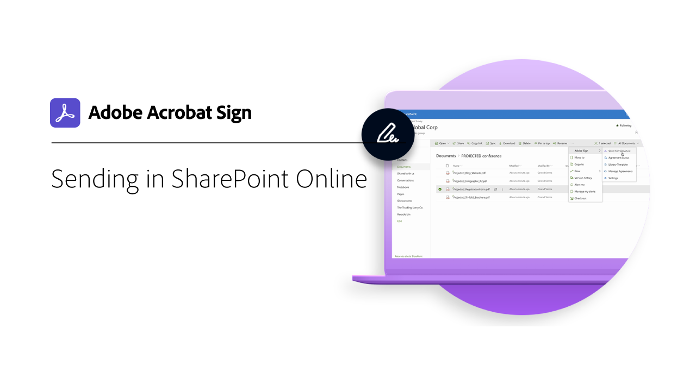
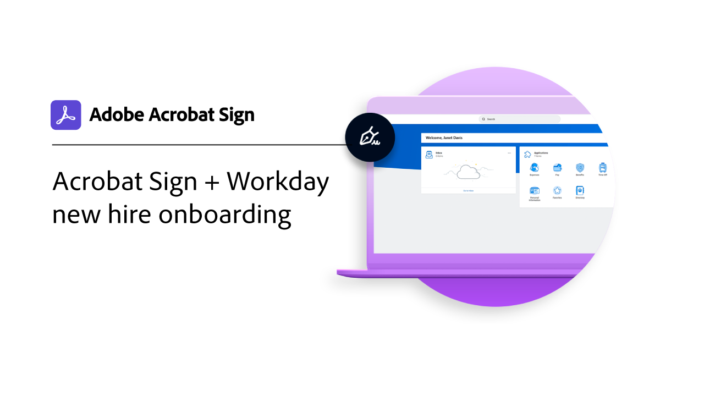

# Panoramica sulle integrazioni

Puoi utilizzare Acrobat Sign in altre applicazioni già utilizzate dalla tua organizzazione, ad esempio Microsoft, Salesforce, Workday e Marketo per nominarne alcune. Scopri come semplificare i flussi di lavoro di firma elettronica in queste guide ed esercitazioni di integrazione.

>[!NOTE]
> In caso di problemi di accesso a una di queste funzioni, rivolgiti all’amministratore dell’organizzazione per assicurarti che l’integrazione sia abilitata.

## Novità

* [Inviare documenti per l’autenticazione notarile](send-document-notarize.md)
In questa esercitazione in tre parti, scopri come inviare un documento per l’autenticazione notarile, visualizzare l’esperienza del firmatario e ricevere i risultati
* [Archiviazione automatica dei file in SharePoint con Power Automate](auto-archive-sharepoint-power-automate.md)
Scopri come archiviare automaticamente i documenti firmati in una libreria SharePoint utilizzando Power Automate

## Esercitazioni sulle integrazioni di Microsoft

<table style="table-layout:fixed">
<tr>
  <td>
    
    

    <a href="fill-and-sign-doc-microsoft-outlook.md"><strong>Compilazione e firma in Microsoft Outlook</strong></a>
    

    <em>Compilare e firmare un modulo direttamente in Microsoft Outlook</em>
     
  </td>
  <td>
    
    

    <a href="send-for-signature-with-outlook.md"><strong>Invia per la firma in Outlook</strong></a>
    

    <em>Inviare un documento per la firma direttamente in Microsoft Outlook</em>
     
  </td>
  <td>
    
    

    <a href="send-for-signature-with-sharepoint-online.md"><strong>Invia per la firma in SharePoint Online</strong></a>
    

    <em>Inviare un documento per la firma direttamente in SharePoint Online</em>
     
  </td>
   <td>
    
    

    <a href="track-an-agreement-with-sharepoint-online.md"><strong>Monitoraggio in SharePoint Online</strong></a>
    

    <em>Monitorare l’avanzamento di un accordo direttamente in Microsoft SharePoint</em>
     
  </td>
</tr>
<tr>
  <td>
    
    

    <a href="adobe-sign-teams-mortgage.md"><strong>Invia per firma in [!DNL Microsoft Teams]</strong></a>
    

    <em>Invia documenti per la firma direttamente all'interno di [!DNL Microsoft Teams]</em>
     
  </td>
  <td>
    
    

    <a href="auto-archive-sharepoint-power-automate.md"><strong>Archiviazione automatica dei file [!DNL SharePoint] con [!DNL Power Automate]</strong></a>
    

    <em>Scopri come archiviare automaticamente i documenti firmati in un [!DNL SharePoint] libreria mediante [!DNL Power Automate]</em>
     
  </td>
  <td>
    
    

    <a href="documentautomation.md"><strong>Automazione dei documenti con [!DNL Acrobat Sign for Microsoft Power Platform]</strong></a>
    

    <em>Scoprite come attivare e utilizzare il metodo [!DNL Acrobat Sign] e [!DNL Adobe PDF Tools] connettori per [!DNL Microsoft Power] app</em>
     
  </td>
</tr>
</table>

## [!DNL Notarize] tutorial sull&#39;integrazione

<table style="table-layout:fixed">
<tr>
  <td>
    
    

    <a href="send-document-notarize.md"><strong>Inviare documenti per l’autenticazione notarile</strong></a>
    

    <em>Scopri come inviare un documento per l’autenticazione</em>
     
  </td>
  <td>
    
    

     
  </td>
  <td>
    
    

     
  </td>
  <td>
    
    

     
  </td>
</tr>
</table>

## Esercitazioni sulle integrazioni Salesforce

<table style="table-layout:fixed">
<tr>
  <td>
    
    

    <a href="create-an-agreement-template.md"><strong>Document Builder per [!DNL Salesforce]</strong></a>
    

    <em>Scopri come creare un modello di documento riutilizzabile utilizzando Document Builder per [!DNL Salesforce]</em>
     
  </td>
  <td>
    
    

    <a href="set-up-data-mapping.md"><strong>Configurazione della mappatura dati</strong></a>
    

    <em>Riportare i dati in Salesforce dopo la firma di un accordo</em>
     
  </td>
  <td>
    
    

    <a href="set-up-merging-map.md"><strong>Impostazione della mappatura unione in Salesforce</strong></a>
    

    <em>Scopri come unire i dati da Salesforce direttamente in un documento Acrobat Sign</em>
     
  </td>
  <td>
    
    

    <a href="create-a-custom-button.md"><strong>Creazione di un pulsante personalizzato</strong></a>
    

    <em>Crea un pulsante personalizzato che avvia il processo di invio e compila automaticamente un accordo in Salesforce.</em>
     
  </td>
</tr>
</table>

## Esercitazioni sull&#39;integrazione con Workday

<table style="table-layout:fixed">
<tr>
  <td>
    
    

    <a href="acrobat-sign-workday-onboarding.md"><strong>Configurazione di Acrobat Sign con Workday</strong></a>
    

    <em>Scopri come configurare Acrobat Sign per lavorare direttamente in Workday per gestire senza problemi tutti i documenti relativi alle risorse umane</em>
     
  </td>
  <td>
    
    

    <a href="acrobat-sign-workday-onboarding.md"><strong>Iscrizione a nuovi assunti Acrobat Sign + Workday</strong></a>
    

    <em>Scoprite come semplificare i flussi di registrazione con Acrobat Sign + Workday</em>
     
  </td>
  <td>
    
    

     
  </td>
  <td>
    
    

     
  </td>
</tr>
</table>

## Esercitazioni e guide di configurazione per l&#39;integrazione con Marketo

<table style="table-layout:fixed">
<tr>
  <td>
    
    

    <a href="marketo-salesforce-sms.md"><strong>Inviare notifiche utilizzando Acrobat Sign per Salesforce e Marketo</strong></a>
    

    <em>Scopri come inviare un messaggio di testo, un’e-mail o una notifica push per informare il firmatario che un accordo è in arrivo</em>
     
  </td>
  <td>
    
    

    <a href="marketo-salesforce-reminder.md"><strong>Inviare promemoria con l’esercitazione video Adobe Sign per Salesforce e Marketo</strong></a>
    

    <em>Scopri come inviare un promemoria e-mail da Marketo quando un accordo rimane non firmato dopo un periodo di tempo</em>
     
  </td>
  <td>
    
    

    <a href="marketo-salesforce-reminder.md"><strong>Inviare promemoria utilizzando la guida alla configurazione di Acrobat Sign per Salesforce e Marketo</strong></a>
    

    <em>Leggi come inviare un promemoria e-mail da Marketo quando un accordo rimane non firmato dopo un periodo di tempo</em>
     
  </td>
   <td>
    
    

    <a href="marketo-dynamics-reminder.md"><strong>Inviare promemoria con Acrobat Sign per Microsoft Dynamics e Marketo</strong></a>
    

    <em>Scopri come inviare un promemoria e-mail quando un accordo rimane non firmato dopo un periodo di tempo</em>
     
  </td>
</tr>
<tr>
  <td>
    
    

    <a href="marketo-dynamics-sms.md"><strong>Inviare notifiche utilizzando Acrobat Sign per Microsoft Dynamics e Marketo</strong></a>
    

    <em>Scopri come inviare un messaggio di testo, un’e-mail o una notifica push per informare il firmatario che un accordo è in arrivo</em>
     
  </td>
  <td>
    
    

     
  </td>
  <td>
    
    

     
  </td>
  <td>
    
    

     
  </td>
</tr>
</table>
