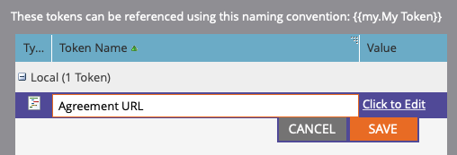
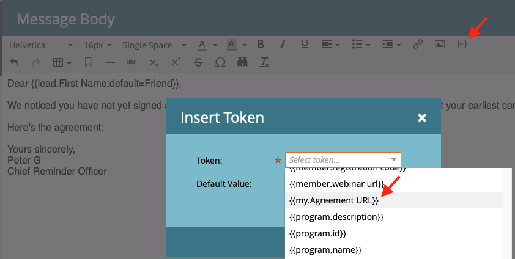
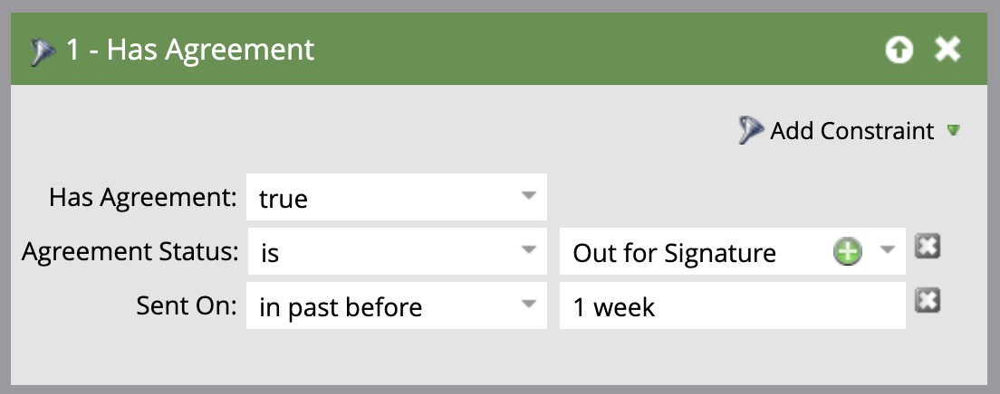
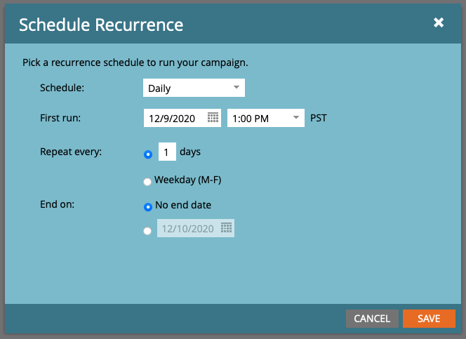

# Inviare promemoria con Acrobat Sign per Microsoft Dynamics 365 e Marketo

Scopri come inviare un promemoria e-mail quando un accordo rimane non firmato dopo un periodo di tempo. Questa integrazione utilizza Acrobat Sign, Acrobat Sign per Microsoft Dynamics, Marketo e Marketo Microsoft Dynamics Sync.

## Prerequisiti

1. Installa Marketo Microsoft Dynamics Sync.

   Sono disponibili informazioni e il plug-in più recente per Microsoft Dynamics Sync [qui.](https://experienceleague.adobe.com/docs/marketo/using/product-docs/crm-sync/microsoft-dynamics/marketo-plugin-releases-for-microsoft-dynamics.html)

1. Installa [Acrobat Sign per Microsoft Dynamics](https://appsource.microsoft.com/it-it/product/dynamics-365/adobesign.f3b856fc-a427-4d47-ad4b-d5d1baba6f86).

   Informazioni su questo plug-in sono disponibili [qui.](https://helpx.adobe.com/ca/sign/using/microsoft-dynamics-integration-installation-guide.html)

## Trovare l’oggetto personalizzato

Al termine delle configurazioni Marketo Microsoft Dynamics Sync e Acrobat Sign for Dynamics, nel Terminale di amministrazione di Marketo vengono visualizzate due nuove opzioni.


1. Fai clic su **[!UICONTROL Sincronizzazione delle entità Dynamics]**.

   La sincronizzazione deve essere disattivata prima di sincronizzare le entità personalizzate. Fai clic su **Sincronizza schema** se questa è la tua prima volta. Altrimenti, fai clic su **Aggiorna schema**.

   

## Sincronizzare l’oggetto personalizzato

1. A destra, individua [!UICONTROL Piombo], [!UICONTROL Contatti]e [!UICONTROL Account]oggetti personalizzati basati su -.

   * **Attiva sincronizzazione** per gli oggetti sotto **[!UICONTROL Piombo]** se si desidera inviare un promemoria quando un evento [!UICONTROL Piombo] non ha firmato un accordo in Dynamics.

   * **Attiva sincronizzazione** per gli oggetti sotto **[!UICONTROL Contatti]** se si desidera inviare un promemoria quando un evento [!UICONTROL Contatti] non ha firmato un accordo in Dynamics.

   * **Attiva sincronizzazione** per gli oggetti sotto **[!UICONTROL Account]** se si desidera inviare un promemoria quando un evento [!UICONTROL Account] non ha firmato un accordo in Dynamics.

   * **Attiva sincronizzazione** per l&#39;oggetto accordo sotto il **[!UICONTROL Genitore]** ([!UICONTROL Piombo], [!UICONTROL Contatti]o [!UICONTROL Account]).

   

1. Nella nuova finestra, seleziona le proprietà desiderate in Accordo, quindi abilita le caselle in **Vincolo** e **Trigger** per esporli alle tue attività di marketing.

   

   

1. Riattiva la sincronizzazione dopo aver attivato la sincronizzazione sugli oggetti personalizzati.

   Torna al Terminale di amministrazione, fai clic su **Microsoft Dynamics**, quindi fai clic su **Attiva sincronizzazione**.

   

   

## Creare il programma e il token

1. Nella sezione Attività di marketing di Marketo, fai clic con il pulsante destro del mouse su **Attività di marketing** sulla barra a sinistra.

   Seleziona **Nuova cartella delle campagne** e assegnargli un nome.

   

1. Fai clic con il pulsante destro del mouse sulla cartella creata, seleziona **Nuovo programma** e assegnargli un nome.

   Lascia tutto il resto come predefinito, quindi fai clic su **Crea**.

   

   

1. Fai clic su **I miei token**, quindi trascinate **Script e-mail** sull&#39;area di lavoro.

   

1. Assegna un nome, quindi fai clic su **Fai clic per modificare**.

   

1. Espandi **[!UICONTROL Oggetti personalizzati]** sul lato destro, quindi espandere la proprietà **[!UICONTROL Accordo]** oggetto.

   Ricerca e trascinamento [!UICONTROL Nome], Stato accordo, Inviato e Url firmatario corrente nell’area di lavoro.

1. Scrivete uno script Velocity utilizzando questi token per visualizzare l’URL dell’accordo di un accordo che non viene firmato per una settimana. Di seguito è riportato un esempio che confronta la data corrente con Inviato attivo:

   ```
   #foreach($agreement in $adobe_agreementList)
       #if($agreement.adobe_esagreementstatus == "Out for Signature")
           #set($todayCalObj = $date.toCalendar($date.toDate("yyyy-MM-dd",$date.get('yyyy-MM-dd'))) )
           #set($dateSentCalObj = $date.toCalendar($date.toDate("yyyy-MM-dd",$agreement.adobe_datesent)) )
           #set($dateDiff = ($todayCalObj.getTimeInMillis() - $dateSentCalObj.getTimeInMillis()) / 86400000 )
   
           #if($dateDiff >= 7)
               #set($agreementName = $agreement.adobe_name)
               #set($agreementURL = $agreement.adobe_currentsignerurl.substring(8))
               #break
           #else
           #end
       #else
       #end
   #end
   
   #if(${agreementName})
       <a href="https://${agreementURL}">${agreementName}</a>
   #else
       Please contact us. 
   #end
   ```

1. Fare clic su **[!UICONTROL Salva]**.

## Crea il promemoria e aggiungi la personalizzazione

Esempi di personalizzazione includono: il nome del firmatario, il nome dell’accordo, un collegamento all’accordo e così via.

1. Fai clic con il pulsante destro del mouse sul programma creato e fai clic **[!UICONTROL Nuova risorsa locale]**, quindi seleziona **[!UICONTROL E-mail]**.

   

1. Nella nuova scheda, immettere un valore **[!UICONTROL Nome]** e **[!UICONTROL Descrizione]** per il messaggio e-mail e selezionare un modello dal selettore modelli.

   

1. Fare clic su **[!UICONTROL Crea]**.

1. Impostare la proprietà **[!UICONTROL Da nome]** e **[!UICONTROL Da indirizzo]**.

   

1. Fai clic sul corpo del messaggio per attivare l’Editor.

   Fai clic sul **[!UICONTROL Inserisci token]** trova il token URL accordo personalizzato creato, quindi fai clic su **[!UICONTROL Inserisci]**. Termina la personalizzazione dell’e-mail e fai clic su **[!UICONTROL Salva]**.

   

1. Visualizza l’anteprima utilizzando un profilo a cui è assegnato un accordo.

   Dovresti visualizzare un collegamento all’URL con il nome dell’accordo come etichetta.

   

## Impostare il filtro Campagna avanzata

1. Fai clic con il pulsante destro del mouse sul programma creato, quindi fai clic **[!UICONTROL Nuova campagna intelligente]**.

   

1. Assegna un nome a scelta, quindi fai clic su **[!UICONTROL Crea]**.

   

1. Cerca, quindi fai clic e trascina **[!UICONTROL Ha accordo]** all&#39;elenco avanzato.

   

   I campi esposti al trigger devono essere disponibili in **[!UICONTROL Aggiungi vincolo]**.

1. Seleziona **[!UICONTROL Stato accordo]** e tutti gli altri campi che desideri filtrare.

   Per ogni campo aggiunto, definire i valori da filtrare. In questo caso, viene attivato solo quando la proprietà **[!UICONTROL Stato accordo]** è *Inviato per firma* e **[!UICONTROL Inviato]** è *in passato prima di 1 settimana*.

   

   >[!NOTE]
   >
   > Aggiungete un identificatore univoco ai vincoli, come **Nome**, se desideri che questa campagna venga eseguita solo per determinati accordi.

1. Confermate il pubblico della campagna e verificate chi si qualificherà nella scheda Pianificazione.

   

## Impostare il flusso delle campagne avanzate

Perché il filtro Campagna **Giorni alla scadenza** utilizzata, è possibile utilizzare una ricorrenza pianificata per la campagna.

1. Fate clic sul **[!UICONTROL Flusso]** nella [!UICONTROL Campagna intelligente].

   Cercare e trascinare il **Invia e-mail** passa all’area di lavoro e seleziona l’e-mail di promemoria creata nella sezione precedente.

   

1. Fate clic sul **[!UICONTROL Pianificazione]** nella Campagna avanzata. Assicurati che il flusso delle campagne sia limitato a una sola volta per persona nel **Impostazioni Campagne Avanzate**. Quindi, fai clic sul **Pianifica ricorrenza** tab.

   

1. Impostare la proprietà **Pianificazione** a _Quotidiano_. Se necessario, scegli un giorno di inizio e una data di fine per la campagna.

   

>[!TIP]
>
>Questo tutorial fa parte del corso [Accelera i cicli di vendita con Acrobat Sign per Microsoft Dynamics e Marketo](https://experienceleague.adobe.com/?recommended=Sign-U-1-2021.1) disponibile gratuitamente ad Experience League!