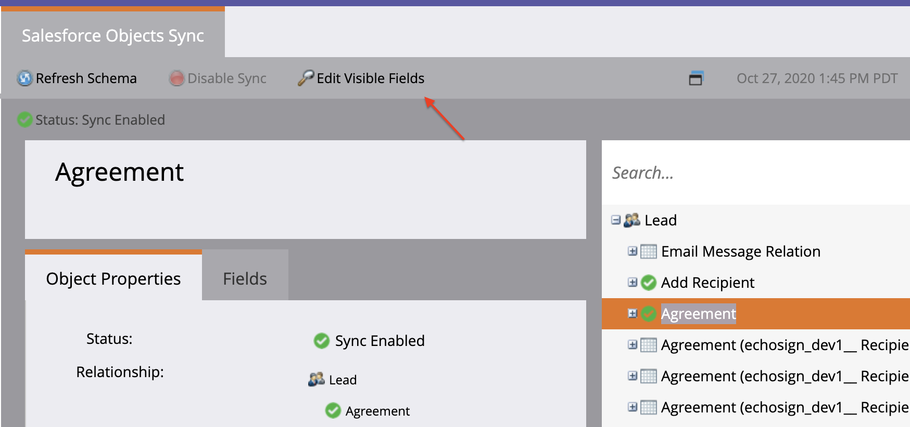
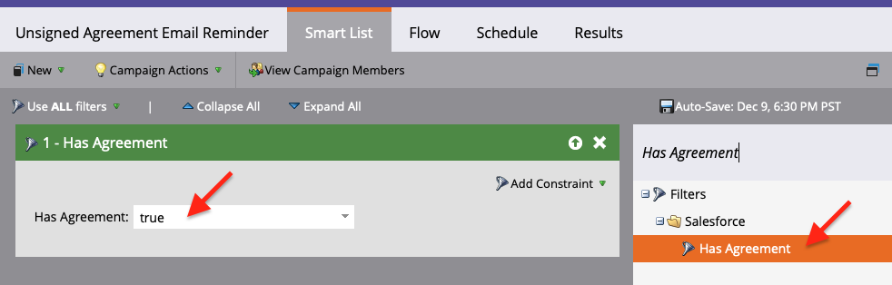
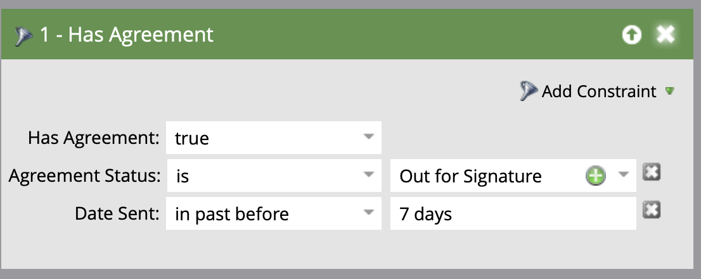

# Inviare promemoria utilizzando Acrobat Sign per Salesforce e la Guida alla configurazione di Marketo

Scopri come inviare un promemoria e-mail da Marketo quando un accordo rimane non firmato dopo un periodo di tempo. Questa integrazione utilizza Acrobat Sign, Acrobat Sign per Salesforce, Marketo e Marketo e Salesforce Sync.

## Prerequisiti

1. Installa Marketo Salesforce Sync.

   Sono disponibili informazioni e l’ultimo plug-in per Salesforce Sync [qui.](https://experienceleague.adobe.com/docs/marketo/using/product-docs/crm-sync/salesforce-sync/understanding-the-salesforce-sync.html)

1. Installare Acrobat Sign for Salesforce.

   Informazioni su questo plug-in sono disponibili [qui.](https://helpx.adobe.com/ca/sign/using/salesforce-integration-installation-guide.html)

## Trovare l’oggetto personalizzato

Al termine delle configurazioni Marketo Salesforce Sync e Acrobat Sign per Salesforce, nel Marketo Admin Terminal vengono visualizzate diverse nuove opzioni.


1. Fai clic su **Sincronizza schema** se questa è la tua prima volta. Altrimenti, fai clic su **Aggiorna schema**.

   

1. Se è in esecuzione la sincronizzazione globale, disattiva facendo clic su **Disattiva sincronizzazione globale**.

   

1. Fai clic su **Aggiorna schema**.

   

## Sincronizzare l’oggetto personalizzato

Sul lato destro, consultate Oggetti personalizzati Lead, Contact e Account.

**Attiva sincronizzazione** per gli oggetti in Lead se desideri inviare un promemoria quando un lead non ha firmato un accordo in Salesforce.

**Attiva sincronizzazione** per gli oggetti in Referente se desideri inviare un promemoria quando un Referente non ha firmato un accordo in Salesforce.

**Attiva sincronizzazione** per gli oggetti in Account se desideri inviare un promemoria quando un account non ha firmato un accordo in Salesforce.

1. **Attiva sincronizzazione** per la **Accordo** visualizzato sotto l’elemento principale desiderato (lead, contact o account). Esegui questa operazione per gli altri oggetti personalizzati da sincronizzare.

   

1. Le seguenti risorse mostrano come **Attiva sincronizzazione**.

   

   

## Esporre i campi oggetto personalizzati ai trigger

1. Quando la sincronizzazione globale è disattivata, seleziona l’oggetto personalizzato Accordo per cui hai attivato la sincronizzazione, quindi **Modifica campi visibili**.

1. Seleziona il campo &quot;Nome accordo&quot; nella colonna del trigger per esporlo ai trigger di azione di Campaign. Seleziona gli altri campi da filtrare, quindi **Salva**.

   

   

1. Al termine dell’attivazione della sincronizzazione sugli oggetti personalizzati e dell’esposizione dei valori di trigger, ricordati di riattivare la sincronizzazione:

   

## Creare il programma e il token

1. Nella sezione Attività di marketing di Marketo, fai clic con il pulsante destro del mouse su **Attività di marketing** sulla barra a sinistra, seleziona **Nuova cartella delle campagne** e assegnargli un nome.

   

1. Fai clic con il pulsante destro del mouse sulla cartella creata, seleziona **Nuovo programma** e assegnargli un nome. Lascia tutto il resto come predefinito, quindi fai clic su **Crea**.

   

   

1. Fai clic su **I miei token**, quindi trascinate  **Script e-mail** sull&#39;area di lavoro.

   

1. Assegna un nome, quindi fai clic su **Fai clic per modificare**.

   

1. Espandi **Oggetti personalizzati** sul lato destro, quindi espandere la proprietà **Accordo** oggetto. Trova e trascina il nome dell’accordo, lo stato dell’accordo, la data di firma e l’URL di firma nell’area di lavoro.

1. Scrivete uno script Velocity utilizzando questi token per visualizzare l’URL dell’accordo di un accordo che non viene firmato per una settimana. Di seguito è riportato un esempio che confronta la data corrente con Data inviata:

   ```
   #foreach($agreement in $echosign_dev1__SIGN_Agreement__cList)
       #if($agreement.echosign_dev1__Status__c == "Out for Signature")
           #set($todayCalObj = $date.toCalendar($date.toDate("yyyy-MM-dd",$date.get('yyyy-MM-dd'))) )
           #set($dateSentCalObj = $date.toCalendar($date.toDate("yyyy-MM-dd",$agreement.echosign_dev1__DateSent__c)) )
           #set($dateDiff = ($todayCalObj.getTimeInMillis() - $dateSentCalObj.getTimeInMillis()) / 86400000 )
   
           #if($dateDiff >= 7)
               #set($agreementName = $agreement.Name)
               #set($agreementURL = $agreement.echosign_dev1__Signing_URL__c.substring(8))
               #break
           #else
           #end
       #else
       #end
   #end
   
   #if(${agreementName})
       <a href="https://${agreementURL}">${agreementName}</a>
   #else
       Please contact us. 
   #end
   ```

1. Fai clic su **Salva**.

## Crea il promemoria e aggiungi la personalizzazione

Esempi di personalizzazione includono: il nome del firmatario, il nome dell’accordo, un collegamento all’accordo e così via.

1. Fai clic con il pulsante destro del mouse sul programma creato e fai clic **Nuova risorsa locale**, quindi seleziona **E-mail**.

   

1. Nella nuova scheda, immettere un valore **Nome** e **Descrizione** per il messaggio e-mail e selezionare un modello dal selettore modelli. Fai clic su **Crea**.

   

1. Impostare la proprietà **Da nome** e **Da indirizzo**.

   

1. Fai clic sul corpo del messaggio per attivare l’Editor. Fai clic sul **Inserisci token** trova il token URL accordo personalizzato creato, quindi fai clic su **Inserisci**. Termina la personalizzazione dell’e-mail e fai clic su **Salva**.

   

1. Visualizza l’anteprima utilizzando un profilo a cui è assegnato un accordo. Dovresti visualizzare un collegamento all’URL con il nome dell’accordo come etichetta.

   

## Impostare il filtro Campagna avanzata

1. Fai clic con il pulsante destro del mouse sul programma creato, quindi fai clic **Nuova campagna intelligente**.

   

1. Assegna un nome a scelta, quindi fai clic su **Crea**.

   

1. Cerca, quindi fai clic e trascina **Ha accordo** all&#39;elenco avanzato.

   

1. I campi esposti al trigger dovrebbero ora essere disponibili in **Aggiungi vincolo**. Seleziona **Stato accordo** e tutti gli altri campi che desideri filtrare. Per ogni campo aggiunto, definire i valori da filtrare. In questo caso, viene attivato solo quando la proprietà **Stato accordo** è Inviato per firma e **Data di invio** non è più di 7 giorni.

   

   >[!NOTE]
   >
   > d un identificatore univoco dei vincoli, come **Nome accordo**, se desideri che questa campagna venga eseguita solo per determinati accordi.

1. Confermate il pubblico della campagna e verificate chi si qualificherà nella scheda Pianificazione.

   

## Impostare il flusso delle campagne avanzate

Perché il filtro Campagna **Giorni senza firma** utilizzata, è possibile utilizzare una ricorrenza pianificata per la campagna.

1. Fai clic sul **Flusso** nella Campagna avanzata. Cercare e trascinare il **Invia e-mail** passa all’area di lavoro e seleziona l’e-mail di promemoria creata nella sezione precedente.

   

1. Fai clic sul **Pianificazione** nella Campagna avanzata. Assicurati che il flusso delle campagne sia limitato a una sola volta per persona nel **Impostazioni Campagne Avanzate**. Quindi, fai clic sul **Pianifica ricorrenza** tab.

   

1. Impostare la proprietà **Pianificazione** su Giornaliero, scegli un giorno e un&#39;ora di inizio e, se necessario, una data di fine della campagna.

   

>[!TIP]
>
>Questo tutorial fa parte del corso [Accelera i cicli di vendita con Acrobat Sign per Salesforce e Marketo](https://experienceleague.adobe.com/?recommended=Sign-U-1-2021.1) disponibile gratuitamente ad Experience League!
