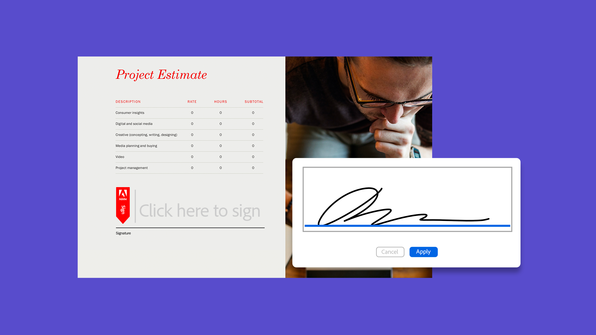
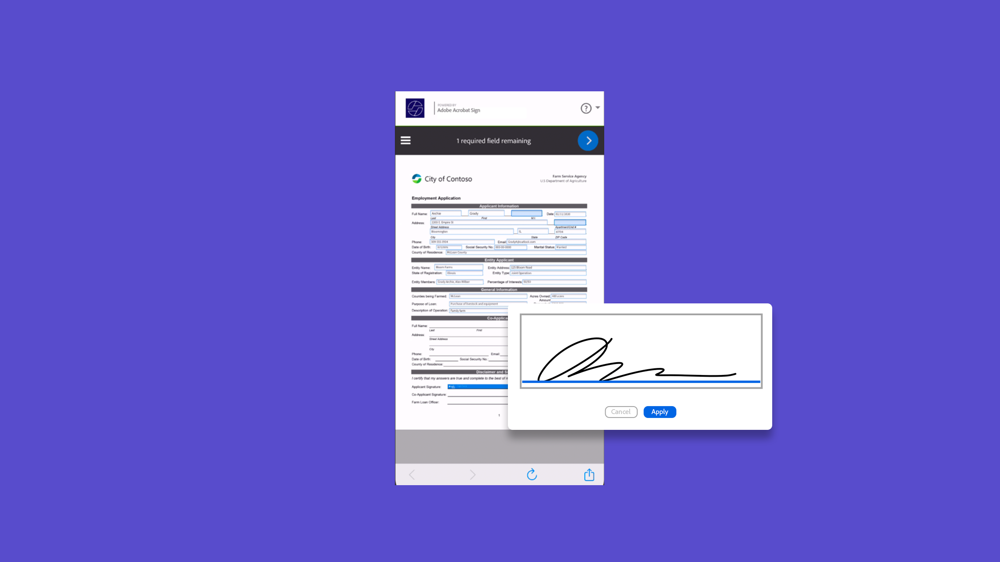

# Esercitazioni per Acrobat Sign

Acrobat Sign, una soluzione Adobe Document Cloud, è scalabile per soddisfare le esigenze della tua organizzazione con integrazioni, API, autenticazione avanzata, funzionalità di amministrazione aggiuntive e altro ancora. Qui puoi trovare un&#39;ampia gamma di esperienze di apprendimento progettate per portare rapidamente sia i principianti che gli amministratori alla velocità su Acrobat Sign.

## Percorsi di apprendimento

<table style="table-layout:fixed">
<tr>
  <td>
    
    

      <a href="sign-beginner-tutorials/beginner-users-overview.md"><strong>Per iniziare</strong></a>
      

      Scopri come inviare, firmare e monitorare i documenti
       
  </td>
  <td>
    
    

      <a href="sign-advanced-users/advanced-users-overview.md"><strong>Attività avanzate</strong></a>
      

      Oltre le nozioni di base con attività e automazione specifiche
       
  </td>  
  <td>
    
    

      <a href="admin/intro-admin-overview.md"><strong>Amministrazione</strong></a>
      

      Suggerimenti di base e avanzati per la configurazione dell'organizzazione
       
  </td>
  <td>
    
     

      <a href="digitalid/digitalid-overview.md"><strong>ID digitale</strong></a>
      

      Scopri come utilizzare gli ID digitali in tutto il mondo in Acrobat Sign
       
  </td>
</tr>
<tr>
  <td>
    
    

      <a href="integrations/integrations-overview.md"><strong>Integrazioni</strong></a>
      

      Aggiungere Acrobat Sign direttamente in altre applicazioni già utilizzate dall’organizzazione
       
  </td>
  <td>
    
    

      <a href="sign-usecase/expand-inspire-overview.md"><strong>Settori e dipartimenti</strong></a>
      

      Esplora i casi d'uso del settore e dei reparti del mondo reale
       
  </td>
  <td>
    
    

      <a href="develop/develop-overview.md"><strong>Sviluppo</strong></a>
      

      Ottieni risorse di sviluppo su Acrobat Sign I/O
       
  </td>
   <td>
    
    

      <a href="deploy-overview.md"><strong>Distribuzione</strong></a>
      

      Informazioni dettagliate e best practice per l’implementazione di Acrobat Sign all’interno dell’organizzazione
       
  </td>
</tr>
<tr>
  <td>
    
    

      <a href="mobile/mobile-overview.md"><strong>Dispositivi mobili</strong></a>
      

      Invia, firma e ricevi aggiornamenti in tempo reale sul tuo dispositivo mobile
       
  </td>  
</tr>
</table>
