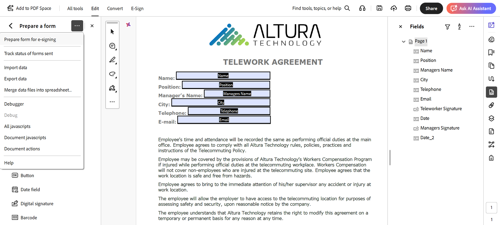
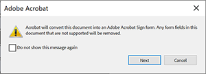

# Applicazione di tag al testo in Acrobat Sign

Scopri come creare campi modulo di Acrobat Sign con tag di testo. I tag di testo possono essere aggiunti direttamente agli strumenti di creazione come Microsoft Word, Adobe InDesign o, se disponi di un PDF, in Acrobat. Essi possono ridurre in modo significativo lo sforzo richiesto per preparare i documenti utilizzati in Acrobat Sign. Dopo aver caricato un documento con tag in Acrobat Sign, può essere configurato come modello, eliminando la necessità di aggiungere campi ai documenti.

## Guida introduttiva

I tag di testo sono parti di testo formattate in modo univoco inserite in qualsiasi punto di un documento che vengono riconosciute automaticamente come campi quando vengono caricate in Acrobat Sign.

I tag di testo possono essere aggiunti direttamente agli strumenti di creazione come Microsoft Word, Adobe InDesign o se disponi di un PDF, Acrobat. I tag di testo riducono notevolmente il lavoro di preparazione dei documenti utilizzati in Acrobat Sign.

### Aggiungere tag in Microsoft Word

Per aggiungere tag di testo a un documento di Microsoft Word, consultate questa [esercitazione video](text-tagging-word.md).

### Aggiungere tag in Acrobat

Adobe Acrobat dispone di un solido ambiente di authoring con trascinamento della selezione. L’applicazione di tag di testo in Acrobat consente di sfruttare le funzionalità aggiuntive disponibili in Acrobat Sign.

1. Apri il modulo in Acrobat.

1. Seleziona **[!UICONTROL Prepara un modulo]** dal pannello **[!UICONTROL Tutti gli strumenti]**.

1. Seleziona **[!UICONTROL Crea modulo]**.

1. Seleziona **[!UICONTROL Prepara modulo per firma elettronica]** dal menu a discesa del pannello **[!UICONTROL Opzioni]**.

   

1. Seleziona **[!UICONTROL Avanti]** per confermare.

   

1. Fare doppio clic su un campo per visualizzare la finestra di dialogo **[!UICONTROL Proprietà]**.

   Utilizza la sintassi descritta nella [Guida ai tag di testo di Acrobat Sign](https://helpx.adobe.com/it/sign/using/text-tag.html) per modificare il nome del campo modulo.

1. Ad esempio, puoi digitare *OInt_es_:signer1:optinitials* nel nome del campo per rendere facoltativo un campo iniziale.

   

   I tag di testo vengono aggiunti al nome del campo modulo e, a differenza della sintassi utilizzata in Microsoft Word (o in altri strumenti di creazione), le parentesi graffe non sono incluse.

   I tag di testo possono essere aggiunti nel pannello Campi semplicemente rinominando il campo modulo.

   

1. Salvate e chiudete il file.

1. Carica il file in Acrobat Sign e crea un modello riutilizzabile come descritto nella sezione successiva.

### Creare un modello da riutilizzare

Dopo aver creato un documento con tag, configuralo come modello da riutilizzare, eliminando la necessità di aggiungere campi ai documenti.

Per creare un modello riutilizzabile, consulta questa [esercitazione video](../sign-advanced-users/create-a-template.md).
