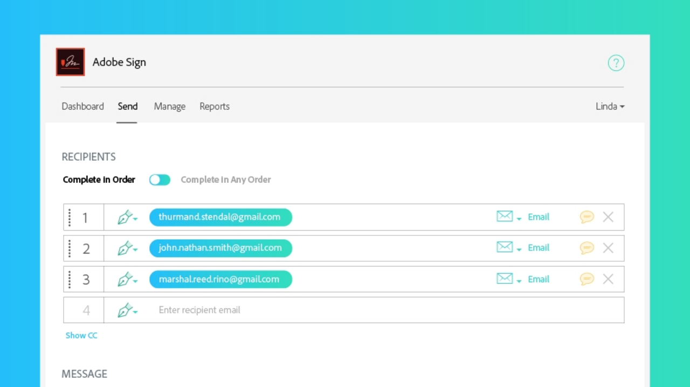

# Panoramica sulle attività avanzate

Scopri come inviare un documento per la firma a 100 destinatari contemporaneamente, configurare un documento pronto per la firma per il tuo sito Web, gestire le transazioni di firma e creare e gestire modelli di documento. Queste esercitazioni sono destinate a tutti coloro che hanno già familiarità con le nozioni di base relative all&#39;invio e alla richiesta di firme e desiderano scoprire altri modi in cui Adobe Sign può lavorare per loro.

## Invio in corso

<table style="table-layout:fixed">
<tr>
  <td>
    
    

    <a href="setting-up-routing.md"><strong>Impostazione dell'ordine di indirizzamento</strong></a>
    

    <em>Impostare l’ordine di indirizzamento per più firmatari</em>
     
  </td>
  <td>
      
    

    <a href="delegate-signature.md"><strong>Delega a un altro utente</strong></a>
    

    <em>Utilizzare il ruolo di delegante per inviare un documento a un intermediario che può quindi indirizzare il documento per la firma</em>
     
  </td>
  <td>
    
    

    <a href="add-an-approver.md"><strong>Aggiunta di un approvatore</strong></a>
    

    <em>Aggiungere un ruolo di approvatore al processo di approvazione del contratto</em>
     
  </td>
</tr>
<tr>
  <td>
    
    

    <a href="megasign.md"><strong>Raccolta di firme in blocco</strong></a>
    

    <em>Raccogli centinaia di firme alla volta per qualsiasi documento in pochi passaggi</em>
     
  </td>
  <td>
    
    

    <a href="webform.md"><strong>Configurazione di un modulo Web</strong></a>
    

    <em>Creare un documento che può essere firmato elettronicamente direttamente sul sito Web</em>
     
  </td> 
  <td>
    
    

    <a href="adobe-sign-text-tagging.md"><strong>Adobe Sign tag di testo</strong></a>
    

    <em>Creare campi modulo Adobe Sign mediante l’assegnazione di tag di testo con Adobe Acrobat</em>
     
  </td> 
</table>

## Gestione

<table style="table-layout:fixed">
<tr>
  <td>
    
    

    <a href="edit-a-template.md"><strong>Gestione dei modelli di documento</strong></a>
    

    <em>Modificare o eliminare un modello dalla libreria</em>
     
  </td>  
  <td>
    
    

     
  </td>
  <td>
    
    

     
  </td>
</tr>
</table>
