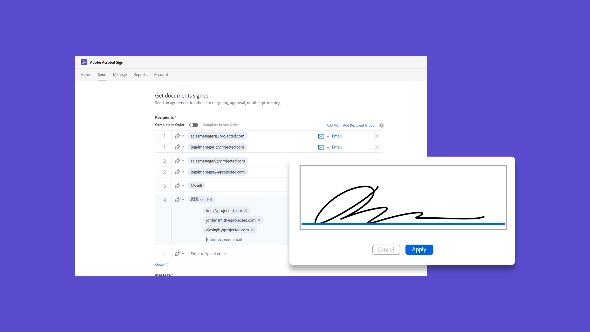

# Panoramica delle attività avanzate

Scopri come inviare un documento per la firma a 100 destinatari contemporaneamente, impostare un documento pronto per la firma per il tuo sito Web, gestire le transazioni di firma e creare e gestire i modelli di documento. Questi tutorial sono rivolti a chiunque abbia già familiarità con le nozioni di base sull’invio e la richiesta di firme e desideri scoprire altri modi in cui Acrobat Sign può funzionare per loro.

## Novità

>[!BEGINTABS]

>[!TAB Invia in modalità collettiva]

Scopri come [raccogliere migliaia](megasign.md) di firme contemporaneamente per qualsiasi documento in pochi semplici passaggi.

>[!TAB Metodi di autenticazione in Acrobat Sign]

Informazioni sull&#39;intervallo di metodi disponibili in Acrobat Sign per [autenticare](authentication-methods.md) l&#39;identità di un utente che firma un documento.

>[!ENDTABS]

## Invia

<table style="table-layout:fixed">
<tr>
  <td>
    
    

    <a href="setting-up-routing.md"><strong>Impostazione dell'ordine di firma</strong></a>
    

    <em>Impostare l’ordine di firma per più firmatari</em>
     
  </td>
  <td>
      
    

    <a href="delegate-signature.md"><strong>Utilizzo del ruolo di delegante</strong></a>
    

    <em>Utilizzare il ruolo di delegante per inviare un documento a un intermediario che potrà quindi indirizzare il documento per la firma</em>
     
  </td>
  <td>
    
    

    <a href="add-an-approver.md"><strong>Utilizzo del ruolo approvatore</strong></a>
    

    <em>Aggiungere un ruolo approvatore al processo di approvazione del contratto</em>
     
  </td>
  <td>
    
    

    <a href="authentication-methods.md"><strong>Metodi di autenticazione in Acrobat Sign</strong></a>
    

    <em>Informazioni sull'intervallo di metodi di autenticazione dell'identità disponibili in Acrobat Sign</em>
     
  </td>
</tr>
<tr>
  <td>
      
      

      <a href="manage-form-data.md"><strong>Gestire i dati del modulo</strong></a>
      

      <em>Scopri come consolidare i dati dei moduli dai tuoi documenti</em>
       
    </td>
  <td>
    
    

    <a href="set-up-online-payments.md"><strong>Configurazione dei pagamenti online</strong></a>
    

    <em>Scopri come impostare e accettare pagamenti online nei tuoi documenti</em>
     
  </td>
  <td>
      
      

      <a href="megasign.md"><strong>Invia in modalità collettiva</strong></a>
      

      <em>Raccogliere centinaia di firme contemporaneamente per qualsiasi documento in pochi passaggi</em>
       
  </td>
 <td>
      
      

      <a href="webform.md"><strong>Creazione di un modulo Web</strong></a>
      

      <em>Scopri come creare un documento che può essere firmato elettronicamente direttamente sul tuo sito Web</em>
       
  </td>
</tr>
<tr>
  <td>
      
      

      <a href="adobe-sign-text-tagging.md"><strong>Tag di testo Acrobat Sign</strong></a>
      

      <em>Compilare i campi modulo di Acrobat Sign tramite tag di testo con Adobe Acrobat</em>
       
    </td>
  <td>
    
    

    <a href="text-tagging-word.md"><strong>Utilizzo dei tag di testo in [!DNL Microsoft Word]</strong></a>
    

    <em>Scopri come creare un modello di documento riutilizzabile aggiungendo tag di testo Acrobat Sign in [!DNL Microsoft Word]</em>
     
  </td>
  <td>
    
    

     
  </td>
  <td>
    
    

     
  </td>
</tr>
</table>

## Gestisci

<table style="table-layout:fixed">
<tr>
<td>
    
    

    <a href="creating-a-report.md"><strong>Segnalazione e utilizzo delle transazioni</strong></a>
    

    <em>Informazioni sulla generazione di report e sull'utilizzo delle transazioni</em>
     
  </td>
  <td>
    
    

    <a href="edit-a-template.md"><strong>Gestire i modelli di documento</strong></a>
    

    <em>Modificare o eliminare un modello dalla libreria</em>
     
  </td>
  <td>
    
    

    <a href="modify-webform.md"><strong>Modificare un modulo Web esistente</strong></a>
    

    <em>Scopri come disattivare, modificare e riattivare un modulo Web esistente</em>
     
  </td>  
  <td>
    
    

    <a href="manage-webform-data.md"><strong>Gestione dei dati dei moduli Web</strong></a>
    

    <em>Scopri come monitorare, gestire ed esportare i dati da un modulo Web</em>
     
  </td>  
</tr>
</table>