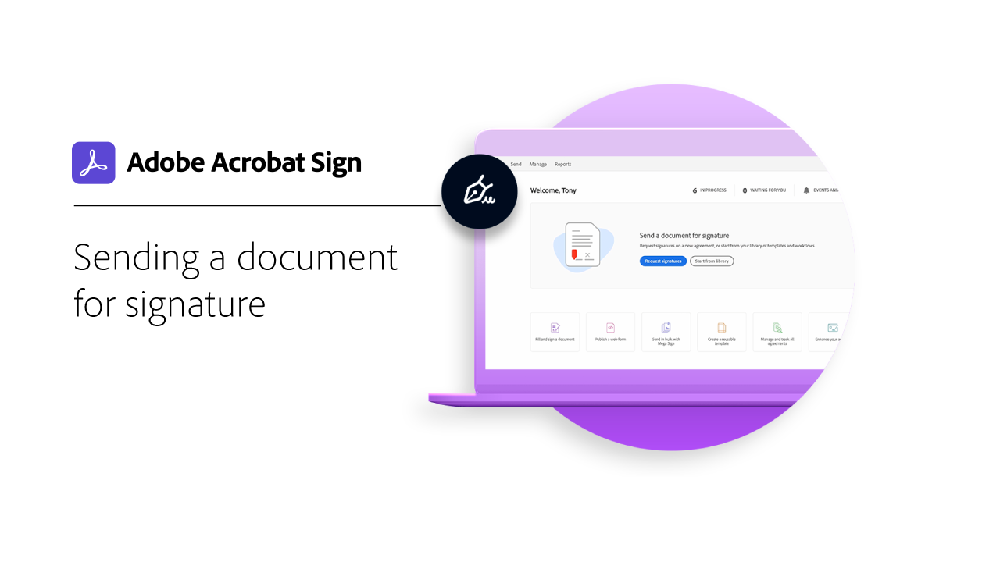
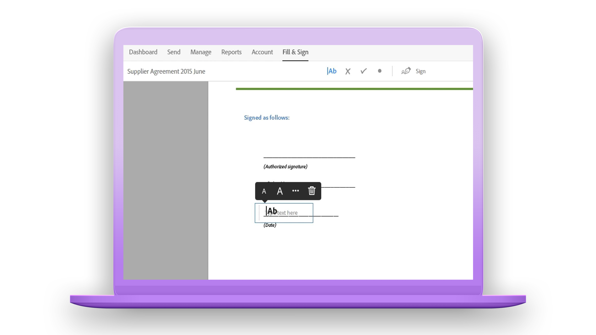

# Panoramica introduttiva

Impara a inviare, firmare e monitorare i documenti con questi brevi tutorial passo passo. Accedi a una breve panoramica di Acrobat Sign e inizia subito a inviare un documento a una o più persone. Questo contenuto è progettato per facilitare l’accesso ai flussi di lavoro di firma elettronica.

## Invio in corso

<table style="table-layout:fixed">
<tr>
 <td>
    
    

    <a href="quick-tour.md"><strong>Nozioni di base sull’area di lavoro</strong></a>
    

    <em>Panoramica rapida dell'area di lavoro di Acrobat Sign per iniziare a utilizzarla</em>
     
  </td>
  <td>
    
    

    <a href="send-to-single-recipient.md"><strong>Invio a un singolo destinatario</strong></a>
    

    <em>Scopri come inviare un documento per la firma in tutta semplicità</em>
     
  </td>
  <td>
    
    

    <a href="send-to-multiple-recipients.md"><strong>Invio a più destinatari</strong></a>
    

    <em>Inviare un documento per la firma elettronica a più persone nell’ordine desiderato</em>
     
  </td>
</tr>
<tr>
  <td>
    
    

    <a href="new-sender.md"><strong>Guida introduttiva ad Acrobat Sign per nuovi mittenti</strong></a>
    

    <em>Questa esercitazione completa è il punto di partenza ideale per i nuovi mittenti in Acrobat Sign</em>
     
  </td>
 <td>
    
    

    <a href="modify-in-flight.md"><strong>Modifica di un documento dopo l’invio</strong></a>
    

    <em>Modificare un documento già in corso</em>
     
  </td>
 <td>
    
    

    <a href="replace-signer.md"><strong>Sostituzione di un firmatario</strong></a>
    

    <em>Scopri come modificare il firmatario di un documento già in corso</em>
      
  </td>
</tr>
</table>

## Signing

<table style="table-layout:fixed">
<tr>
  <td>
    
    

    <a href="electronically-sign-a-document.md"><strong>Firma elettronica di un documento</strong></a>
    

    <em>Scopri com’è facile firmare un documento che ti è stato inviato con Acrobat Sign</em>
     
  </td>
  <td>
    
    

    <a href="fill-and-sign.md"><strong>Compilazione e firma di un documento</strong></a>
    

    <em>Compilare moduli e aggiungere la firma elettronica ai documenti</em>
     
  </td>
  <td>
    
    

    <a href="sign-in-person.md"><strong>Ottenere una firma di persona</strong></a>
    

    <em>Ottieni la firma di persona di un altro utente utilizzando l'app mobile Acrobat Sign</em>
     
  </td>
</tr>
<tr>
  <td>
    
    

    <a href="sign-with-a-digital-signature.md"><strong>Cos'è una firma digitale</strong></a>
    

    <em>Scopri di più sulle firme digitali basate su certificati</em>
     
  </td>
  <td>
    
    

    <a href="sign-with-a-stamp.md"><strong>Firma mediante un timbro</strong></a>
    

    <em>Utilizzare timbri per contrassegnare un documento approvato o completato</em>
      
  </td> 
  <td>
    
    

     
  </td>
</tr>  
</table>

## Gestione

<table style="table-layout:fixed">
<tr>
  <td>
    
    

    <a href="manage-and-track.md"><strong>Gestione e monitoraggio degli accordi</strong></a>
    

    <em>Scopri come gestire e monitorare gli accordi inviati per la firma</em>
     
  </td>
  <td>
    
    

    <a href="../sign-advanced-users/create-a-template.md"><strong>Creazione di un modello di documento</strong></a>
    

    <em>Crea un modello di documento riutilizzabile per fornire velocità e coerenza alla tua organizzazione</em>
     
  </td>
  <td>
    
    

     
  </td>
</tr>
</table>
